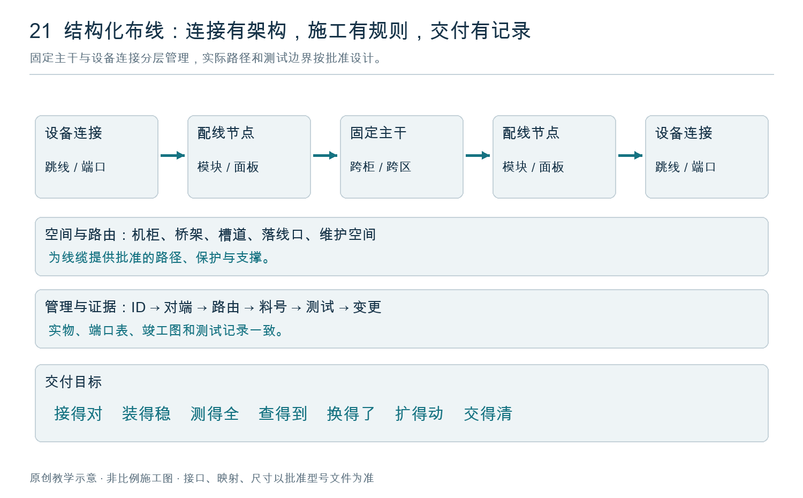

# 北美 AI 数据中心施工与布线管理手册

## 中文培训版 · V1.6 · 2026-10-01

**新增配套实训册：** [结构化布线图文实操培训手册](结构化布线图文实操培训手册.html)，包含 33 课、32 张原创图、17 个编号模拟案例及九个新增排障情景，重点训练光纤识别、Y／Shuffle、U 形余长、魔术贴、配线架、测试与换线，并增加贴标签、卡扣锁止、展线、端接、拉线的施工与验收检查卡。

**适用对象：** 在美国、加拿大 AI 数据中心工作的华人施工人员、领班、布线主管、QA/QC、网络实施工程师和项目经理。

**适用工作：** 机房布置、桥架与光纤槽道、机柜定位、结构化布线、机柜内布线、Leaf–Spine 网络物理实施、AI 集群网络调试协调、验收和移交。

**文件性质：** 企业施工管理与新人培训基线。文中的“必须”是本手册建议纳入项目制度的要求；只有明确注明法规、合同或厂家依据的条款，才按对应依据认定。它不是 Dell、NVIDIA 或 Oracle 发布的官方施工规范，也不代表取得这些厂商的认证。

**正式使用条件：** 项目经理组织设计责任工程师（EOR）、业主网络负责人、总包和质量负责人，将本手册转化为本项目批准版。桥架结构、抗震、锚固、配电、消防和液冷设计，由相应专业及当地要求的持证人员负责。缺少项目参数时，相关工序处于待放行状态，不由新人自行补值。

**资料范围：** 结合截至编写日期可访问的官方公开资料；厂家门户会更新，开工时必须保存所采用文件的版本、日期和适用 SKU。未获取 Dell／Oracle 客户专属安装包、内部验收规范及本项目合同附件。

---

## 阅读方法与章节索引

新人首先学习第 1、3、4、10、11、12、13、21 章；领班重点掌握第 2、5—9、14、18—20 章；网络工程师重点掌握第 14—18、22 章。

1. 基础概念：认识五类网络与四种编号
2. 项目组织、职责和施工放行流程
3. 北美规范体系与双语现场管理
4. 安全、洁净、成品保护与作业边界
5. 需求调查与设计输入冻结
6. 机房平面、机柜排布和液冷接口
7. 桥架、吊架与光纤槽道设计
8. 桥架安装、接地与隐蔽验收
9. 材料送审、采购、收货和仓储
10. 端口计划、标签及线缆数据库
11. 光纤敷设、清洁、极性和连接
12. 铜缆及管理网布线
13. 机柜内布线与维护空间
14. Leaf–Spine 网络设计与布线算例
15. InfiniBand 实施与检查
16. RoCE／Spectrum-X 实施与检查
17. Dell／NVIDIA NVL72 与 Oracle 案例应用
18. 分层测试、集群验收与故障定位
19. 每日施工管理、变更和不合格项
20. 竣工交付、运维移交和扩容
21. 新人培训、实操考核和授权
22. 现场表单与英文沟通模板
23. 项目参数确认单
24. 官方资料与版本管理

---

## 编制说明

### 编制背景与目的

北美 AI 数据中心的结构化布线工作，从桥架与光纤槽道、机柜和配线柜，到主干、跳线、分支组件及网络端口，涉及多个工种和连续工序。一条线能够连通，并不代表身份、路由、机械保护、端接和测试记录全部符合交付要求。施工质量需要在过程中形成，在交接时能够复核。

本手册根据编者对机房建设、机柜排布、Leaf–Spine 网络、光纤与铜缆施工的培训需求编制，重点回应现场反复遇到的问题：光纤类型与接口容易混淆，Y 形和 Shuffle 分支难以核对；展线扭结、牵引受力、绑带过紧和 U 形余长容易处理不当；标签与实物不一致，连接器假到位，端接缺陷被封闭，测试结果缺少明确边界和可追溯记录。

编制目标是把这些问题转化为新人能够学习、师傅能够示范、领班能够检查、质量人员能够验收的操作步骤。全书强调理论与实践结合，让施工人员既知道如何操作，也理解为什么要这样做，以及遇到异常何时必须停止。

### 读者、语言与适用范围

主要读者为服务北美 AI 数据中心的华人施工人员、带教师傅、领班、布线主管及质量管理人员。正文以中文解释关键动作，保留 Cable ID、P2P、Trunk、Patch Cord、Shuffle、OLTS 等现场常见英文术语，方便与图纸、物料标签、测试仪和英文工作包对照。

内容覆盖施工准备、认料识图、展线、临时标识、拉线敷设、正式贴标、端接与插接、绑线、U 形余长、检查测试、整改及移交。结构承载、电气、消防和液冷等专业工作由对应授权人员按批准文件执行；本手册说明与布线的接口，不能代替这些专业设计。

### 编制方法与技术依据

采用“认识部件—理解链路—分解动作—设置检查点—模拟故障—完成记录”的编排方式。主手册用于项目管理和专业协调，图文实操册用于班组训练和现场工艺检查，两册配套使用。

技术资料选取公开可核查的厂家安装说明和测试资料，涉及 NVIDIA、Dell、Oracle 相关架构时，分别说明网络设计背景与具体产品施工条件。公开案例不能替代客户内部规范；一种型号的数值也不能推广到另一种型号。引用来源在相应章节给出，建议项目在开工前登记实际采用的文件版本。

本手册中的流程、表单、验收建议及模拟案例属于培训与管理编排，不宣称为厂家官方施工标准。实际项目应先核对适用法律与主管机构要求，再对齐合同、批准图纸、项目质量计划及具体型号说明；文件冲突、型号不符或限值缺失时，由授权工程和质量人员澄清，不由施工人员自行选一个数值继续作业。

### 工序、规则与示例的使用方法

每项作业都应明确六件事：输入文件和材料、人员与工具、操作顺序、过程检查、停止或返工条件、交付记录。身份核对贯穿全流程；临时标签在展线前建立，正式标签在最终位置核验，不能到完工时才猜线号。

本书将“端接”区分为现场制作接续点与工厂预端接组件的现场连接，将“U 线”区分为 U 形余长整理与现场俗称的捋线。班前交底时先统一术语，避免口令相同而动作不同。

图示为原创教学示意；案例为模拟场景；示例中的命名、数量和数值用于解释方法，不作为真实项目的批准参数。任何实际牵引力、弯曲半径、剥切长度、余长、束带间距和测试限值，均应填写在项目工艺卡中，并注明依据。

### 文件管理与持续修订

领班使用现场批准版本交底，质量人员保留样板、首件、测试和不符合项记录。新增型号、路由变更或重复发生的缺陷，应反馈到工艺卡和下一次培训；已批准的现场做法如有变化，重新确认相关样板和检查点。

本版修订日期为 2026-09-28。编者履历依据本人提供的信息整理；施工教学内容依据本项目需求与公开技术资料编排。手册不补写未经提供的客户名称、项目规模、岗位资格或认证经历。

## 编者介绍｜SHENGDONG WU

**SHENGDONG WU，深圳自然一度科技有限公司创始人。** 拥有 10 余年软件、硬件开发及运营经验，工作涉及物联网、大数据、云计算、服务器运维和区块链等领域。

在美国多个 AI 数据机房施工现场积累了结构化布线经验。既往软硬件开发及运维工作，使其在关注现场安装工艺的同时，也重视线缆身份、网络连接关系、运行维护和故障排查之间的联系。

本手册体现了编者理论与实践结合的工作思路：从实际施工问题出发，把展线、贴标、拉线、端接、绑线、U 形余长及测试等环节整理成便于理解、示范和检查的流程，帮助华人班组新人建立正确的操作习惯，为领班和施工管理人员提供可执行的培训与质量检查参考。

## 入门导读｜结构化布线的概念、目的与交付目标

### 什么是结构化布线

结构化布线（Structured Cabling）是按统一架构、接口、标识和管理规则建设的通信布线基础设施。它把光纤或铜缆、主干与设备跳线、配线架和模块、机柜内理线及连接管理组织成可识别、可测试、可维护的系统，并与桥架、槽道、机房空间及相关保护设施协调。

可以把它理解为：设备之间既有明确的“连接道路”，也有完整的“地址和档案”。每条线从哪里来、到哪里去、经过什么位置、支持哪种应用、如何测试和更换，都能从实物与记录中核对。

常见做法是将较长期使用的固定主干与较频繁调整的设备跳线分开管理。模块化配线可支持设备迁移和扩容，但复用仍取决于纤型、损耗、接口、映射和目标应用。不能因为铺了主干，就承诺以后任何速率都不用换线。[Corning 数据中心结构化布线介绍](https://www.corning.com/data-center/worldwide/en/home.html)

### 为什么要做：解决六个实际问题

1. **连接关系清楚。** 避免凭颜色或记忆插线，让设备、端口、线缆、分支和路由逐一对应。
2. **性能有依据。** 把距离、连接点、损耗、极性和介质兼容性纳入设计与测试，减少“能亮灯但不稳定”。
3. **维护可执行。** 留出可读标签、操作锁扣、抽拉托盘和更换单根线的空间，降低扰动相邻链路的机会。
4. **扩容有准备。** 记录桥架和机柜容量、预留端口、暗纤及损耗余量，让扩容前能够判断是否需要改路由或增配线设施。
5. **故障有证据。** 通过唯一身份关联原始测试、施工批次、变更和故障记录，帮助分段定位。
6. **交付可持续。** 安装者离场后，运维人员仍能找到、理解和维护系统，减少对某个人记忆的依赖。

### 与理线、网络拓扑及设备直连是什么关系

**理线是其中一个施工环节。** 线束整齐不能证明端口正确、极性正确或测试合格；把错误连接绑得整齐，仍是不合格链路。

**Leaf–Spine 是网络连接架构。** 结构化布线负责把设计连接落实到实际路径、介质、配线节点和端口。MDA、HDA、EDA 等是配线功能区概念，不与 Spine、Leaf、服务器一一等同；规模和架构不同，区域可能采用不同布局与组合，按批准设计识图。

**设备直连可以是批准方案的一部分。** 柜内 DAC、ACC、AOC 或短光纤直连也要纳入标识、路由、机械保护和适用验证。是否增加配线节点，应权衡维护、连接损耗、空间及兼容性，不追求每条链路都经过同样数量的配线架。集成 NVLink 等机架内部互联系统依厂家受控设计管理，不由布线人员擅自改造。

### 系统由什么组成：新人先认清五层

- **空间与路由：** 房间、列、柜、配线区、桥架段、槽道、落线口和穿越点，决定线走在哪里及能否维护。
- **固定布线：** 主干、水平布线及适用的固定端接，形成较长期保留的连接基础。
- **配线节点：** ODF、配线柜、机箱、面板、适配器及模块盒，组织和保护连接；其接口与映射需要逐项管理。
- **设备连接：** 跳线、Harness、批准的 Shuffle、光模块及高速直连组件，把固定布线与具体设备端口衔接。
- **管理与证据：** P2P、BOM、标签、路由记录、测试、变更和备件，共同说明系统实际状态。

**示例：** 交换机端口 → 设备跳线 → 配线架 → 主干 → 配线架 → 设备跳线 → 另一交换机端口。更换近端跳线时，先识别其独立 Cable ID 和所归属的 Circuit ID；主干原有记录保留，同时更新受影响通道的测试和变更记录。

### 最终目标怎样验收

以下为本手册建议的交付目标，项目应将范围、指标和责任人写入质量计划。

1. **接得对：** 交付范围内的所有端点、分支、极性及网络平面符合批准表，无未处置的错接。证据是实物核对和适用映射测试。
2. **装得稳：** 无未关闭的机械损伤、超限或锁止缺陷；支撑、弯曲和维护行程合格。证据是过程记录及完工检查。
3. **测得全：** 每条交付链路按适用介质和边界完成规定测试，失败已整改复验，未测项不能记为 PASS。DAC／AOC 不套用裸光纤或普通双绞线的认证方法。
4. **查得到：** 每个交付对象均能关联两端、路由、料号、测试及变更；备用线和暗纤也有身份和状态。不得以其他链路报告顶替。
5. **换得了：** 批准样板证明锁扣可操作、单根可拆换、抽屉能完成规定行程；在运系统只在授权条件下验证维护动作。
6. **扩得动：** 有分段实际占用、预留位置、可用端口与纤芯记录；扩容仍需重新核查空间、连接损耗和故障域。
7. **交得清：** 实物、竣工图、测试库和台账一致，未完事项明确列出并按项目流程处置。

**培训指标示例：** 可在离线演练中要求学员在约定时间内查出任一端口的对端、路由和测试记录；“5 分钟”可作为项目自定训练目标，不是统一行业验收门槛。首次通过率用于发现工艺问题，不能通过删除失败数据提高指标。

### AI 数据中心为什么更需要这些规则

高密度端口和多平面布线增加了分支、映射和维护空间的管理难度；高速应用对实际介质组合和连接质量有明确要求；液冷、供电和风道又会限制走线路径。布线问题可能影响集群运行，因此需要清晰的隔离、定位和变更流程。结构化布线的交付目标是为批准的网络应用提供可靠、可维护的物理连接基础；训练性能仍需结合设备、配置和系统测试判断。

## 第 1 章　基础概念：先弄清楚连接的是什么

### 1.1 五类网络

- **带外管理网 OOB Management：** 连接 BMC／iDRAC、交换机管理口及获准接入的设施管理设备。生产网故障时，仍应按设计保留诊断能力。不得把 BMC 直接接入普通业务网。
- **前端／业务网 Front-end Network：** 承载用户访问、业务入口和南北向流量。带内管理可能共享其物理网络，但须按设计隔离。
- **存储网 Storage Network：** 承载训练数据读取、检查点和存储访问；可能独立，也可能按批准架构与其他流量共用设备。
- **后端计算网 Back-end／Compute Fabric：** 承载跨节点 GPU 通信，可能采用 InfiniBand 或 Ethernet RoCE。
- **NVLink 域 Scale-up Fabric：** GB200／GB300 NVL72 等系统内部 GPU 互联。其专用组件、端口及维护流程不能按普通 Ethernet 跳线操作。

NVIDIA 的 GB200 SuperPOD 参考架构分别描述 NVLink、计算、存储与管理网络，这种分层是理解 AI 机房的起点。[NVIDIA Network Fabrics](https://docs.nvidia.com/dgx-superpod/reference-architecture-scalable-infrastructure-gb200/latest/network-fabrics.html)

### 1.2 四组容易混淆的概念

1. **A/B 供电**表示电源故障域；**A/B 通信路径**表示路由分离。两者不能仅靠颜色或名称认定独立。
2. **Rail**是按服务器 NIC／GPU 连接关系划分的网络轨道；**Plane**是架构定义的网络平面。编号和含义以本项目图纸为准，不能把 Rail 0 自动等同 Plane A。
3. **物理插笼 Cage、逻辑端口 Port、分支端口 Breakout、光纤芯 Fiber**不是同一个计数单位。一个插笼可能承载多个逻辑链路。
4. **机柜位置 Rack、设备安装位 U／OU、托盘编号 Tray、NIC／RDMA 名称**必须分别记录。19 英寸机柜的 U 与 OCP 系统的 OU 不得混用。

### 1.3 新人识图顺序

先找机房及机柜坐标，再找设备与安装位，再辨认设备前后视图，然后核对物理端口、分支口及最终目的端。最后沿路线图确认中途经过的配线架、槽道和穿墙点。

**考核：** 随机指定一条链路，学员能口述“从哪台设备的哪个口，经哪几个连接点，到哪台设备的哪个口，属于哪个网络、Rail 和 Plane”。说不清不得插接。

## 第 2 章　项目组织、职责和施工放行流程

### 2.1 职责分工

- **业主 Owner：** 批准需求、可用性目标、维护窗口及最终验收。
- **设计责任工程师 EOR／设计团队：** 对设计、专业计算及设计变更负责；回答设计 RFI。
- **总包 GC／施工经理 CM：** 组织作业面移交、跨专业协调、许可证及进度。
- **项目经理 PM：** 管理范围、合同、材料、资源和批准文件；不得以赶工为由跳过停检点。
- **施工主管／领班 Superintendent／Foreman：** 分派经批准的工作包、做班前交底、控制作业范围。
- **施工技术员 Technician：** 按图操作、自检、记录异常；不得自行改变拓扑、接头类型或结构构件。
- **质量负责人 QA/QC：** 检查实物与记录一致性，签发不合格项并见证复验。
- **网络工程师 Network Engineer：** 批准端口表、软件基线、配置与网络性能验收。
- **设施团队 Facilities／厂家 OEM：** 批准机柜供电、冷却、搬运与整机操作条件。
- **调试负责人 CxA：** 按合同组织功能与综合测试，记录跨系统缺陷。

施工员自检不能替代 QA/QC；厂家确认不能替代 AHJ 检查；GC 协调不能代替设计签认。

### 2.2 十个放行节点

以下编号是本手册的项目管理建议，不是行业统一的 L1—L5 定义。

1. **G0 需求冻结：** 项目范围、机柜规模、网络类型和验收方法有书面依据。Owner＋PM 放行。
2. **G1 设计放行：** IFC 图、批准 Shop Drawing、BOM、端口表和专业协调图一致。设计团队＋网络负责人放行。
3. **G2 材料／样板放行：** Submittal 获批；完成一段桥架、一组标签及一套代表性链路样板。QA/QC＋业主代表放行。
4. **G3 路径放行：** 桥架、支吊架、接地、穿墙条件及隐蔽检查通过，才能放线。QA/QC＋相关专业放行。
5. **G4 场地／机柜放行：** 搬运、承载、定位、供电和冷却准备符合设备要求。Facilities＋OEM／授权代表放行。
6. **G5 无源布线放行：** 标签、极性、铜缆认证、光纤测试及整改完成，才能按计划连接有源设备。QA/QC 放行。
7. **G6 有源网络放行：** 速率、拓扑、端口身份、版本和配置符合批准基线。网络负责人放行。
8. **G7 集群调试放行：** 单节点、跨节点 RDMA、集群性能和故障场景通过。网络团队＋OEM＋CxA 放行。
9. **G8 试运行放行：** 观察期、告警和缺陷关闭满足合同。业主运维放行。
10. **G9 移交关闭：** 竣工资料、原始测试文件、培训、备件与资产记录完整。Owner＋PM 签收。

**停检点 Hold Point：** 未获得指定责任人书面放行，后续关联工序不得开始。可继续其他已放行、互不影响的工作。

### 2.3 每个工作包必须包含

区域和机柜清单；图纸版本；线缆／材料清单；P2P 端口表；路线；操作方法 MOP；风险分析 JHA；人员与工具；检查点；允许的作业窗口；回退方法；完成记录。

## 第 3 章　北美规范体系与双语现场管理

### 3.1 建立 Code & Standards Register

美国项目登记当地采用的建筑、消防、电气规范及修订；加拿大项目登记所在省／地区采用的建筑、消防、电气规范及职业安全要求。**出版最新版不等于当地执行版。** NFPA 已列出 2026 NEC，但实际工程采用版仍需按所在地、许可证及 AHJ 确认。[NFPA 70](https://www.nfpa.org/codes-and-standards/nfpa-70-standard-development/70)；[NEC 执行情况](https://www.nfpa.org/education-and-research/electrical/nec-enforcement-maps)

标准台账至少逐项列出：名称、版次、适用范围、当地采用情况、合同是否引用、负责专业、文件存放位置。

重点核对以下体系：

- **美国：** 当地采用的 NEC／NFPA 70；OSHA 联邦或 State Plan 要求；项目适用的建筑消防规范。NFPA 70E、NFPA 75 等按适用性和合同列入。
- **加拿大：** 所在省／地区采用的 Canadian Electrical Code／CSA C22.1 及地方修订；当地职业健康安全制度。CSA Z462 等按项目要求列入；不直接把 OSHA 当加拿大法规。
- **数据中心：** ANSI/TIA-942-C；合同指定的 ANSI/BICSI 002、009。BICSI 公布了 002-2024 与 009-2024，分别覆盖设计和运营。[TIA](https://tiaonline.org/products-and-services/tia942certification/)；[BICSI](https://shop.bicsi.org/standards/data-center)
- **通信布线：** 合同适用版本的 TIA-568 系列、TIA-569 路径空间、TIA-606 标识、TIA-607 等电位联结；ISO/IEC 体系按合同使用，不能混选测试限值。
- **桥架和结构：** 适用的 NEMA VE 1／VE 2、CSA 要求、厂家载荷表及结构工程师设计。
- **防火封堵：** 美国项目核对 UL 1479／ASTM E814 对应认证系统；加拿大核对适用的 CAN/ULC-S115 体系及当地要求。[UL 对不同体系的说明](https://www.ul.com/thecodeauthority/knowledge/product-certification-marks-firestop-systems)

本手册不宣称已经逐条复核上述所有付费标准全文。正式施工版由项目合规／设计负责人用合法取得的完整文件建立条款符合性清单。

### 3.2 文件冲突如何处理

法规与 AHJ 要求必须满足，同时满足设备列名／认证条件、厂家说明和合同要求。发现冲突时发 RFI，由设计及相关责任方形成书面处置；不能机械地用“哪个更严格就执行哪个”代替协调，因为两种要求可能根本不兼容。

### 3.3 北美现场常用文件

- **IFC — Issued for Construction：** 发供施工图，不与 BIM 格式 IFC 混淆。
- **Shop Drawing：** 施工深化图；批准后才能按其安排端口和路线。
- **Submittal：** 材料／设备送审；同品牌不代表同型号已获批。
- **RFI — Request for Information：** 信息澄清；回复需要改图时同步修订。
- **ITP — Inspection and Test Plan：** 检查测试计划，注明 Hold／Witness Point。
- **NCR — Nonconformance Report：** 不合格报告；记录隔离、整改和复验。
- **Punch List：** 尾项清单；不能把关键安全或性能缺陷转成普通尾项放行。
- **Redline／As-built：** 现场红线修改／最终竣工图。
- **MOP／SOP／EOP：** 作业方法／标准操作程序／应急程序。

### 3.4 双语与单位规则

讲解、实操演示和考核用员工能理解的语言；安全培训不能只让不懂英文的工人签英文签到表。OSHA 明确强调培训语言与词汇必须可被员工理解。[OSHA 培训要求](https://www.osha.gov/training/compliance)

图纸、标签和正式报验沿用项目英文标识；中文解释另列，不能私自翻译设备名或端口号。每天指定双语领班，检查员工能复述当日任务、停止条件和疏散路线。

尺寸以批准图纸的主单位为准；换算值注明括号并保留适当精度。扭矩不可混淆 lb-in 与 lb-ft，压力不可混淆 psi 与 kPa，承载不可混淆 lb/ft 与 lb/ft²。所有测量记录必须有单位。

## 第 4 章　安全、洁净、成品保护与作业边界

### 4.1 开工前五项确认

1. 作业许可证、JHA、施工范围和领班已明确。
2. 高处作业平台、梯具、搬运设备和操作人员资格符合项目要求。
3. 活电、吊装、压力系统、激光和在运设备边界已标识。
4. 防尘隔离、工具清点、废料容器和临时封堵已准备。
5. 紧急联系人、停止口令、集合点与报告路径已讲清楚。

### 4.2 布线班组的边界

普通布线人员不得操作母排、Power Shelf 内部、电源鞭线终端或液冷压力回路。设施人员按批准程序实施隔离和验证；布线人员不能以“设备灯灭了”判定无电。美国施工阶段电路停用和挂牌要求见 OSHA 1926.417；具体能源隔离制度由本项目 EHS 按工作性质编制。[OSHA 1926.417](https://www.osha.gov/laws-regs/regulations/standardnumber/1926/1926.417)

插拔光纤前确认链路状态；不得直视光口或光纤端面。端面检查使用适合该接口并具备相应安全措施的检测设备，执行获批的光源关闭／安全检查程序。[NVIDIA 光连接安全说明](https://networking-docs.nvidia.com/cablemanagfaq/frequently-asked-questions-faq)

### 4.3 洁净与成品保护

- 金属切割、钻孔、打磨在获准区域进行；IT 设备附近确需作业时，先完成专项防尘和成品保护。
- 线盘上架放线，接头加保护套；线缆不得在地面拖行或被车轮碾压。
- 光纤碎屑放入专用密闭容器，不能用手捡或混入普通垃圾。
- 未用光口和接头及时加洁净防尘帽；帽子不落地复用。
- 每班清点螺丝、工具和耗材，机柜内不留包装、扎带尾或标签底纸。
- 桥架不作为行走平台或攀爬支撑；承载表中有集中载荷也不构成人员踏踩许可。

**停止条件：** 身份不明的线缆／端口、渗漏、结构松动、受损线缆、未批准带电边界、图纸与现场不符。记录位置、照片和工单，交领班处理。

## 第 5 章　需求调查与设计输入冻结

### 5.1 必须取得的输入

机房区域及交付批次；初装与终期机柜数；设备 SKU 与整柜配置；每柜工作重量及搬运重量；电力和残余风冷负荷；液冷接口；每类网络端口数和速率；Rail／Plane 架构；故障域目标；当前及扩展带宽；允许链路损耗与长度；消防分区；可维护空间；检测和性能验收标准。

### 5.2 现场勘查步骤

1. 核对建筑轴线、标高和测量基准，照片标注拍摄方向。
2. 测量卸货区至安装位的完整路线，包括门洞、转角、坡道、升降机和临时平台。
3. 由结构专业检查楼板、架空地板、支脚集中荷载和运输点载荷；不得仅用整柜重量除以占地面积判断安全。
4. 检查顶部空间：母线槽、消防、风管、液冷管、桥架、传感器及维修通道。
5. 核对设备维护抽出长度、门扇运动范围、CDU／歧管维修和交换机光模块散热空间。
6. 找出 A/B 路径的共同点：共享桥架、共享支架、同一穿墙孔、同一配线架、同一机柜或同一电源故障域。
7. 实测代表性端到端路径，记录垂直段、弯头、配线架内段及合理维护余量。

### 5.3 设计必须交付的图纸

平面与机柜坐标图；机柜正背面立面图；桥架平面和剖面；支吊架与抗震图；综合管线协调图；接地联结图；防火封堵索引；逻辑拓扑；物理 P2P 表；配线架端口图；光纤极性图；材料表；测试计划；分期扩容图。

**放行标准：** 相互关联的文件版本一致；端口和材料数量可勾稽；未决问题不影响当前工作包。采购长交期材料也必须走明确的提前采购批准流程。

## 第 6 章　机房平面、机柜排布和液冷接口

### 6.1 排布原则

先满足结构、供电、散热、消防和维护条件，再优化线缆长度。按计算区、网络区、存储区、配线区及 CDU 等设施区划分责任边界；位置以批准的可扩展单元 SU／Pod 为组织单位。

液冷机柜仍可能有需要空气冷却的电源、网络或其他部件。不得以“液冷”为理由取消厂家要求的气流与环境条件。机柜朝向按实际设备进出风及接口方向确认，不能只看端口在哪一面。

### 6.2 机柜定位 SOP

**输入：** 批准坐标图、设备搬运手册、重量／重心资料及搬运方案。

1. 在地面标出基准线、机柜轮廓和永久 Rack ID。
2. 检查结构放行、路线净空和搬运设备额定能力。
3. 按厂家允许的运输状态移动；安装附件、冷却液或线缆可能改变重量和重心。
4. 定位、调平、并柜或锚固，按具体机架说明操作，保留扭矩记录。
5. 检查前后门、侧板、托盘、模块和阀门的完整维护行程。
6. 由设施专业确认供电与冷却连接，施工领班确认线缆不会侵占相关空间。
7. 拍摄正面、背面、顶部接口和机柜标签。

**验收：** 坐标、朝向、安装位、锚固、联结和维护空间与批准文件一致。偏差数值在项目参数单内定义。

### 6.3 液冷与布线的接口

不将通信线缆绑在管路、软管、快接或阀门上；线缆不得跨压接头或阻碍漏液检测。液冷检漏、冲洗、水质、流量、压力、温度、露点防结露及联动测试由设施／OEM 按系统要求执行，并交付签字记录。

如存在渗漏滴落路径，应在协调图中处理，不以现场随意加防水布代替设计。上电顺序、供液条件和停机联锁按具体设备文件，不能编造通用 NVL72 数值。

## 第 7 章　桥架、吊架与光纤槽道设计

### 7.1 三种路径分别设计

- 光纤槽道 Fiber Raceway：控制转弯半径、出口、盖板和接头保护。
- 通信铜缆／高速线缆桥架 Cable Tray：校核重量、空间、弯曲及维护。
- 电力路径 Power Pathway：由电气专业设计，与通信路径的隔离及交叉处理按批准图纸和适用规范执行。

槽道不兼作消防、风管或液冷管支架。A/B 路由如有物理独立性要求，应核对共享支撑和穿墙点，不能仅把同一桥架左右两边称为双路径。

### 7.2 空间与重量分别算

**初步空间估算：** 圆形线缆等效截面积总和为 Σ[n × πd²/4]；再按实际堆放、有效内宽／内高、连接器、弯头、分支和厂家容量表校核。截面积比只是估算指标，不等同所有桥架的法规填充率。

**培训算例：** 200 根外径 3 mm 线缆，面积约 1,414 mm²；槽道有效内截面 100 × 50 mm，几何比例约 28.3%。这个结果并不能直接证明可用：实际瓶颈可能是出口、弯头、盘留或盖板闭合。

**载荷初算：** 每米需求 = 本期线缆重量＋明确的终期预留线缆重量＋由该支撑承担的桥架及附件自重。结构设计进一步考虑集中荷载、抗震、连接件、锚固、挠度和荷载组合。核对厂家载荷表是否已经包含自重及安全系数，避免遗漏或重复处理。

Eaton 的公开载荷资料按不同跨距给出不同允许载荷，说明“同一型号桥架”并非任何吊架间距下承载都相同。[Eaton 桥架目录](https://www.eaton.com/content/dam/eaton/products/support-systems/cable-management/cable-tray-management-catalog.pdf)

### 7.3 深化图必须标明

型号与有效尺寸；标高基准；支撑类型和间距；设计线荷载；锚栓及基材；弯头／三通／变径支撑；抗震支撑；伸缩处理；联结做法；落线出口；穿墙系统；允许填充与扩展目标；检修空间；路由编号。

**禁止通用化：** 不把“吊杆统一 1.5 m”“桥架统一 40%”“所有线缆统一 10 倍直径”写成跨项目强制值。具体构件、线缆状态、规范和厂家要求可能不同。

### 7.4 扩容预留

将预留拆成槽道容量、支撑承载、配线架端口、光纤芯数、交换机端口、光模块、电力和冷却七项；必须同时成立。预留比例由终期设计确定，不能用一个百分比覆盖全部系统。

## 第 8 章　桥架安装、接地与隐蔽验收

### 8.1 安装 SOP

**开工条件：** G1/G2 已放行；作业面交付；结构与其他专业接口明确。

1. 测量放线，标出桥架中心线、标高和吊点。
2. 在批准位置施工锚固；按项目要求完成基材扫描、锚固检查及必要试验。
3. 安装支吊架，核对垂直、水平、紧固及抗震构造。
4. 安装直段、弯头、三通及变径，连接件使用批准产品；不能用现场钻孔随意削弱构件。
5. 切口去毛刺并按要求恢复表面保护，安装护口和端盖。
6. 处理伸缩与移动接口，核对连续性和允许位移。
7. 安装联结导体／跨接件，按批准设计完成等电位联结，不假设涂层金属接触即满足要求。
8. 安装落线口与转弯保护，确认最不利线缆的弯曲要求。
9. 清洁、贴路径编号并报验；放线前拍照留存。

### 8.2 接地与联结检查

接线端子、导体规格、连接位置、接触面处理和紧固扭矩按批准文件。不得现场自创独立“洁净地”或随意串接不同接地系统。连续性测量方法、仪表和判定值由电气／通信设计定义；不把任何固定欧姆数作为所有项目通用值。

### 8.3 防火封堵 SOP

核对穿越墙／楼板的结构、耐火等级、孔洞尺寸、线缆类型和填充状态，选择获批的完整认证系统。施工时记录系统编号、材料批次、深度、背衬、环形间隙、安装人及照片；工程判断 EJ 仅按项目和 AHJ 接受的程序使用。

**必须避免：** 看到“防火胶”就任意填孔；线缆增加后不复查认证系统范围；只拍外观而没有隐蔽施工记录。UL 对穿透系统强调按经过测试的组合实施。[UL 防火封堵应用指南](https://www.ul.com/sites/default/files/2024-10/Firestop-and-Joint-application-guide-final-draft-4-29-24pm-1.pdf)

### 8.4 报验与放行

提交桥架检查单、扭矩／锚固记录、联结测试、现场偏差、封堵记录和红线图。发现不合格时标记区域并隔离，未关闭之前禁止用线缆遮盖缺陷。

## 第 9 章　材料送审、采购、收货和仓储

### 9.1 材料匹配清单

每种线缆及模块核对：厂商、完整 PN、长度、外径、重量、介质、速率、接口、极性、光纤数量、波长／光学标准、损耗预算、机械保护和环境等级；同时核对设备 HCL、固件、主机端／交换机端兼容性、FEC 和 breakout 支持。

**OSFP／QSFP 的外形不是协议保证；同为 400G／800G 也不保证互通。** 核对插笼散热结构、模块功耗、端口模式和每条 lane 的映射。

北美线缆的燃烧等级、列名和适用空间由当地采用规范与设计决定；LSZH 不自动等同 CMP，不能用国内证书替代项目要求的北美认可证明。加拿大项目也不能仅凭美国标记认定适用。

### 9.2 收货 SOP

1. 对照采购单和批准 Submittal，检查 PN、数量、序列号和版本。
2. 检查包装、冲击／倾斜指示及运输损坏；整柜按 OEM 收货流程执行。
3. 光模块和高速线缆按项目计划核验身份与功能，保留批次和测试关联。
4. 缺损或替代型号贴隔离标识，开 NCR，不进入已验收库存。
5. 线缆按长度、协议和用途分区，接头密封保护，模块按 ESD 要求保管。

### 9.3 发料和追溯

按工作包或机柜形成 Kits：线缆、模块、标签、端口表和保护耗材配套发放。余料退库登记。备用材料需保持同等兼容性，替代须再次送审；不能以接口能插入作为批准依据。

## 第 10 章　端口计划、标签及线缆数据库

### 10.1 一个事实来源

施工前建立唯一受控 P2P 数据库，由网络负责人签认，施工导出批准版。现场变更先批准、再更新主数据；不得多份表格各自修改。

采用三个不同标识：**Circuit ID**标识端到端业务链路，**Cable ID**标识一根实物线缆，**Segment Index**标识链路中的顺序段。中间经过两个配线架时不能让整条电路和每一段线缆共用含义不明的编号。

### 10.2 必填字段

项目／站点／Data Hall／SU；网络类型；Fabric／Rail／Plane；Circuit ID；Cable ID；段号；两端 Rack ID；设备名；U／OU／Tray；物理端口；breakout 分支；配线架及模块盒端口；介质；PN／SN；长度；芯数／极性；路由；文件版本；安装／复核人；测试编号；状态。

主机还需维护 NIC 物理口、PCI 地址、操作系统接口和 RDMA 设备名的映射。不能假设重新安装或升级后 `mlx5_0` 永远是同一物理口。

NVIDIA CVT 2.0.1 的公开 P2P 格式已区分 Nodes、Links、Patch、机房布局与 Server Profile。企业主数据可以借鉴这些维度；实际导入必须使用工具对应版本的原始模板，不能把本手册字段直接冒充工具兼容格式。[NVIDIA CVT P2P](https://networking-docs.nvidia.com/cablevalidationtool/2.0.1/p2p-file)

### 10.3 标签示例

实物线缆 ID：`SITE1-DH01-SU01-C000123`。

两端标签都包括相同 Cable ID，并注明 `FROM`／`TO` 端点；例如 `FROM R01/LEAF01/P33 — TO R20/SPINE01/P01`。端口写法仅为教学示例，实际沿用设备手册及项目端口表。

标签位置、材质和字高通过样板确定：可读、不挡插拔拉环、不遮序列号、不压迫光纤。主干在必要的转向、穿墙及分支处增加路径标识，备用端同样标识。

颜色用于辅助辨认，不替代文字和数据库；光纤本身颜色有既有含义，不应随意换色制造冲突。机柜前、后视图应显式标明观察方向。

### 10.4 插接的双人复核

操作员读出 Cable ID、源端和目的端；复核员逐项对 P2P 表确认；连接后核查端口身份；两人记录。完成一条闭环一条，不在班后靠记忆补录。

**质量目标：** 范围内实物链路、端口表和测试文件 100% 对应；没有孤立报告、重号、漏号或未批准跳接。

## 第 11 章　光纤敷设、清洁、极性和连接

### 11.1 放线前检查

**输入：** 已批准路线、P2P、线缆 PN、牵引和弯曲限制、端面清洁工具、测试计划。

确认 OS2／OM4／OM5 等介质与光模块要求一致；确认 LC／MPO／其他接口及 UPC／APC 研磨形式；MPO 的针脚公母、芯数、Key 方向与极性必须逐段核对。不得根据护套颜色或“看起来一样”认定兼容。

OS2 不意味着可接任意单模模块，OM5 也不能自动升级链路速率。光学标准、波长、通道数、最大距离和允许连接点数量需要一起验证。

### 11.2 敷设 SOP

1. 复测路径，核对长度包含垂直段、配线架段及设计余量；短线不能硬拉，长线不能塞满维护区。
2. 检查外护套、标签、接头保护和线盘，按计划做铺设前测试。
3. 在弯头、出口及高差处安排人员，设置保护和沟通口令。
4. 使用批准的受力部位／牵引组件；不得拉接头、模块或尾套放线。
5. 按具体 PN 的最大牵引力、动态弯曲半径和操作温度施工。
6. 完成后按静态弯曲要求布置，单独支撑垂直段和大束重量；软质绑带不得压扁护套。
7. 接头先保护、后整理，再在洁净条件下检测和插接。
8. 余长放入设计盘留位置，保证可维护、不拥堵且不超半径。
9. 逐根登记路线、长度、材料批次和安装记录。

NVIDIA 将连接器附近的弯曲与线身弯曲分别讨论；具体限制应查线缆规格。不能用普通光纤的弯曲经验替代 DAC／ACC／AEC／AOC 组件限制。[NVIDIA 线缆安装指南](https://networking-docs.nvidia.com/cablemanagfaq/cable-installation-and-management-guidelines)

### 11.3 端面“检查—必要时清洁—复检—连接”

1. 确认光源和检查设备符合安全程序。
2. 使用匹配的端面检测探头检查两侧，包括适配器后的端口。
3. 合格端面保持洁净；不合格时用厂家认可的工具清洁。
4. 再次检查，清洁动作本身不代表合格；不合格不得连接。
5. 合格后及时连接；再次暴露或发现污染时重新检查。
6. 保存要求范围内的端面图片及判定结果，关联 Cable／Port ID。

避免手摸、吹气、衣物擦拭和通用清洁剂。新拆封接头也需检查。不可把 AOC 的封装端拆开当可插拔光口清洁。端面判定采用项目规定版本的 IEC 61300-3-35 及适用设备方法。[Fluke 端面检查与认证说明](https://www.flukenetworks.com/edocs/white-paper-standard-compliant-certification-amp-best-practices)

### 11.4 MPO／并行光极性

设计人员输出端到端 lane／fiber 映射，逐段标明主干、模块盒、适配器和跳线的类型。A／B／C 极性名称只描述相应部件／方法，不能凭“全用 Type B”推定整个复杂通道一定正确。

施工人员逐条核对收发方向、有效芯和分支编号。测试覆盖全部已安装芯，包括备用芯；不得只测“当前亮灯的那一对”。发现极性错误先定位哪一段不符，不随意翻转接头或现场改组件。

### 11.5 插入损耗预算

设计估算：`链路损耗 = 纤长 × 衰减系数 + 各连接对损耗 + 各熔接损耗 + 其他无源器件损耗`。

验收同时检查批准的布线链路限值和具体应用通道限值；测试所覆盖范围必须一致，并满足设计预留裕量。还要考虑反射／回波、发射条件及光模块技术要求，不能用一个总损耗数字代替全部应用条件。

**纯教学算例：** 假设 0.1 km 单模纤、0.4 dB/km、4 个连接对各 0.25 dB、2 个熔接各 0.1 dB，则估计损耗为 1.24 dB；若再预留 0.5 dB，设计需要的预算为 1.74 dB。这里每个系数均为假设，不是标准或厂家承诺。若具体模块不支持该通道，仍不得使用。

### 11.6 禁止事项

把 APC 与 UPC 混接；让粗铜缆压住光纤；用紧扎带压束；只用红光笔判定性能；把模块 DOM 接收功率当成无源链路认证；不检查就反复插拔；把备用纤直接留在地面。

## 第 12 章　铜缆及管理网布线

### 12.1 适用范围

本章主要用于 RJ45 结构化布线、BMC／iDRAC 等管理连接。高速 DAC／ACC／AEC 是完整组件，不能按普通双绞线现场剪裁压头；它们的规格和验收按设备兼容矩阵及高速链路计划执行。

### 12.2 施工 SOP

1. 核对线缆类别、屏蔽形式、消防等级、模块与配线架兼容性。
2. 确认采用永久链路、通道或经批准的 MPTL 等测试模型。
3. 按路由布放，保持厂家规定的弯曲、牵引、支撑和束缆条件。
4. 端接按批准的 T568A 或 T568B 系统一致执行；保留尽可能多的原有绞距，具体开绞长度按器件说明。
5. 屏蔽系统按完整设计联结，不现场自行决定“只接一端”或“都不接地”。
6. 贴标、整理、认证、整改和复测。
7. 使用独立通过认证的设备跳线完成最终通道，更新端口记录。

普通平衡铜缆结构化布线常见基准为永久链路 90 m、通道 100 m；温度、细径跳线、PoE 和特定应用可能要求长度修正，不能机械套用。测试必须使用匹配的适配器和限值。[Fluke 永久链路与通道测试](https://regression.flukenetworks.com/blog/cabling-chronicles/dumb-thing-1-specifying-channel-testing-when-installing-permanent-links)

### 12.3 验收项目

线序 Wire Map；长度；插入损耗；NEXT／PSNEXT；ACR-F／PSACR-F；回波损耗；延迟／时延偏差；以及选定标准和应用要求的电阻、屏蔽连续性或其他指标。涉及 PoE、外部串扰等要求时按批准测试计划增加检测。

必须保存原始认证报告与仪表编号、校准状态、适配器、测试限值和测试人。简单通断仪不能代替类别认证；现场常见 split pair 即使看似导通，也会影响性能。

### 12.4 管理网专项检查

核对 BMC、交换机管理口和 Console 口，RJ45 外形相同不代表电气定义相同。按批准网络与安全配置确认 IP／VLAN、访问控制和远程管理可达性；管理账号由授权团队管理，不印在线缆标签上。

## 第 13 章　机柜内布线与维护空间

### 13.1 先做样板柜

按一种真实配置制作代表性样板，由业主／OEM／网络／QA/QC 联合确认。至少覆盖柜顶入口、垂直理线、配线架、服务器接口、交换机高密端口、A/B 路径及液冷维护空间。不同机柜配置不能照搬同一个样板。

### 13.2 布线顺序

先安装获批的理线附件并核对 U／OU 图，再按工作包布置主干与跳线。通常先固定路径和大束承重，再接易损接口；具体次序以整柜厂家工序为准。高密机架厂内线束不得因“看着不整齐”重做。

布线后逐项检查：

- 电源、铜缆、光纤按设计分区，互不压迫。
- 接头不承担整束线缆重量，端口附近没有急弯和侧向拉力。
- 拉环、锁扣、序列号和状态灯可见、可操作。
- 风扇、电源、托盘和光模块可按厂家方法更换。
- 门能关闭，线缆不夹在门缝；柜后母排、歧管、阀门和漏液检测可访问。
- 余长可管理；不在热风出口堆大圈线，不把线束绑到散热器或液冷软管。

### 13.3 维护行程验证

在设备允许的状态下，由授权人员模拟指定可维护模块的拆装，观察弯曲和张力。服务器是否可带线抽出、是否使用理线臂按厂家说明决定；不要为验证维护空间而擅自拉出运行中的液冷计算托盘。

### 13.4 完成标准

正／背／顶部照片齐全；端口标签无遮挡；双人端点复核完成；实物与立面图一致；维护验证及异常关闭。视觉整齐不能掩盖过紧、受力、极性错误和故障域混接。

## 第 14 章　Leaf–Spine 网络设计与布线算例

### 14.1 基本原理

Leaf 连接服务器或下级接入设备；Spine 连接 Leaf。在本章的典型两层 Clos 示例里，每台 Leaf 连接每台 Spine，使不同 Leaf 下设备经 Spine 通信。特殊多平面、分组或多级架构应按相应参考设计，不能用本章示例强制套用。

仅有外形类似“树”的图不代表无阻塞。必须检查端口速率、上行容量、交换芯片能力、故障场景、路由与真实流量分布。

### 14.2 端口容量的算式

`下行总带宽 D = 下行逻辑端口数 × 每端口速率`。

`上行总带宽 U = 所有上行逻辑端口速率之和`。

`超卖比 = D / U`，采用相同方向和单位计算。结果 1 表示本级配置带宽比 1:1，并不单独证明所有业务条件下无阻塞。

### 14.3 可核算的教学示例

假设采用 **4 台 Leaf＋2 台 Spine，每台均有 64 个独立的 400G 逻辑端口**；无 breakout；各端口模式可同时使用；这是教学网络，不是 NVL72 厂家 BOM。

- 每台 Leaf：1—32 接服务器，共 32 × 400G＝12.8 Tb/s。
- 每台 Leaf：33—48 共 16 口接 Spine-1；49—64 共 16 口接 Spine-2。
- 每台 Leaf 上行：32 × 400G＝12.8 Tb/s，本级带宽比 1:1。
- 每台 Spine：4 台 Leaf 各占 16 口，合计 64 口，用满。
- 合计服务器连接为 128 条，Leaf–Spine 连接为 128 条，共 256 条逻辑链路。
- 如每条链路都使用独立可插拔光模块和一条直连光缆，则需 512 个模块与 256 条光缆；这不含任何备件、配线段或其他网络。采用 AOC／DAC／分支组件时计数方法不同。

映射方法：Leaf-i 接 Spine-1 的 16 个端口，落在 Spine-1 的 `(i−1)×16＋1` 至 `i×16`；Spine-2 同理。生成完整 P2P 后检查端口无重复和遗漏。

**故障分析：** 一台 Spine 退出后，每台 Leaf 的上行变为 6.4 Tb/s，配置带宽比变成 2:1。存在冗余路径不代表故障时性能不下降。此示例 Spine 已无余口，增加第五台 Leaf 必须重新规划。

### 14.4 AI Rail／Plane 专项

对每个计算节点，确定 GPU／NIC 拓扑和 Rail 对应关系；对每个 Rail／Plane 分别做端口、线缆、路径和带宽预算。来自不同 Rail 的线缆不能只按长度就近插入剩余端口。

最新版平台可能采用多 Plane；具体 NIC 拆分、平面数和负载分担取决于型号及软件组合。NVIDIA Spectrum-X 的公开文档已区分单平面及多平面方案，不能将旧版单平面映射直接套到所有 GB300 配置。[NVIDIA Spectrum-X 架构说明](https://docs.nvidia.com/networking/display/kubernetes2670/spectrum-x/spectrum-x.html)

### 14.5 物理施工顺序

冻结逻辑拓扑 → 生成 P2P → 计算长度／BOM → 做代表性链路样板 → 安装 OOB → 分批完成 Spine–Leaf → 分批完成计算节点 → 核对 Rail／Plane → 自动发现拓扑 → 对比批准表 → 整改并重新测试。

不要为了“整齐”私自更换端口。高密端口的分支顺序和光纤 shuffle 应在图纸及台账显式表示。

## 第 15 章　InfiniBand 实施与检查

### 15.1 开工输入

交换机与 HCA SKU；固件／软件兼容基线；每端口速率和宽度；分支方式；P2P 和 Rail；Subnet Manager（SM）部署与冗余方案；分区 P_Key；路由、拥塞控制、自适应路由／SHARP 等适用设置；测试工具与性能基线。

### 15.2 实施 SOP

1. 完成设备 OOB 管理、序列号与管理地址核对。
2. 按批准端口模式安装线缆和模块，确认主机端／交换机端匹配。
3. 由网络工程师部署批准的 SM／UFM 等管理组件，确认作用范围与主备状态。
4. 读取端口 GUID、拓扑、状态、速率、宽度和错误计数。
5. 与 P2P 比较，逐项关闭缺失、错接、重复、降速及 Rail 错位。
6. 按批准流程验证分区、路由及功能设置。
7. 从代表性双节点推进到跨 Leaf、跨机柜、跨 SU 的 RDMA 及集群测试。

### 15.3 验收关注点

端口应达到批准的 Active 状态、速率和宽度；物理 Link Up 不能代替完整 fabric 就绪。验证链路恢复、错误增量、拥塞和预定故障行为，排除错误的 SM 范围或分区配置。

常见只读检查工具包括 `ibstat`、`ibv_devinfo`、`iblinkinfo`、`ibnetdiscover` 及相应 UFM 工具；是否适用及参数以设备版本为准。不得让新人复制来源不明的配置命令。

**常见错误：** 将 Ethernet VLAN／LACP 的做法直接套入 IB；只检查端口亮灯；忽略 split port；用操作系统接口排序替代物理映射；未签认就修改 P_Key 或 SM 优先级。

## 第 16 章　RoCE／Spectrum-X 实施与检查

### 16.1 三层分别确认

1. **物理层：** 速率、光学标准、模块兼容、分支、FEC、端口错误与拓扑。
2. **IP／转发层：** 地址、路由、邻居、ECMP、MTU 和网络隔离。
3. **RDMA／拥塞层：** NIC 配置、QoS 分类、ECN／CNP、所选架构的 PFC 或其他机制、缓冲与遥测。

RoCEv2 承载在 Ethernet／IP 网络上；Ping 成功不能证明 GPU RDMA 路径正确。

### 16.2 配置前冻结的项目

NIC 与交换机版本组合；Rail／Plane；IP 及路由模式；MTU 含义与数值；信任 PCP／DSCP 的策略；优先级至队列映射；ECN 与 CNP 策略；是否启用 PFC、启用哪些优先级；看门狗与恢复策略；负载分担；接收乱序能力及相关平台特性。

NVIDIA Cumulus 文档区分 lossy 与 lossless RoCE，并提醒 ASIC 之间不能照搬配置。因此本手册不规定“所有 RoCE 都开 PFC”或统一 QoS 阈值；项目采用厂家验证的配置基线。[NVIDIA Cumulus RoCE](https://docs.nvidia.com/networking-ethernet-software/cumulus-linux/Layer-1-and-Switch-Ports/Quality-of-Service/RDMA-over-Converged-Ethernet-RoCE/)

### 16.3 联调 SOP

1. 备份基础配置并记录版本；确认 OOB 回退能力。
2. 核对物理拓扑、端口及双端速率／FEC。
3. 验证路由与路径、预期 MTU 的端到端传输，处理厂商对 MTU 字段口径的差别。
4. 由网络工程师部署已验证的 QoS 和拥塞控制，记录差异。
5. 进行双节点 RDMA 测试，确认走指定 NIC／Rail，排除退回 TCP。
6. 做跨 Leaf、多对多和 incast 场景，观察吞吐、尾延迟、队列、ECN、CNP、PFC（如启用）、丢包及重传。
7. 扩大到集群集合通信，再执行获批故障测试。

### 16.4 不可简化的验收判定

不能把“PFC 计数非零”直接判定故障；拥塞时 ECN／CNP 可能是正常反馈。重点分析触发原因、持续时间、业务影响、是否出现风暴／死锁或异常丢弃，并与批准基线比较。

不能为消除告警随意关闭 FEC 或流控。不得默认生产前端的 MLAG／LACP 设计同样适合 AI 后端；按所选厂家的 RDMA 网络方案执行。

## 第 17 章　Dell／NVIDIA NVL72 与 Oracle 案例应用

### 17.1 先纠正产品名称和使用边界

通常所说的是 **NVL72**。它不是完整的采购型号。设计输入必须包含 OEM、GB200／GB300 等代际、服务器型号、机架平台、网络卡和交换机配置。

NVIDIA DGX 机架文档不能自动替代 Dell 的安装文件；Oracle 云实例端口信息也不能反推任意 Dell 整柜的物理 BOM。

### 17.2 NVIDIA：把整柜与网络分层验收

NVIDIA DGX GB 文档列出的 NVL72 示例包含 72 GPU、18 个计算托盘和 9 个 NVLink Switch 托盘；机柜包含专用 NVLink 铜缆背板、供电及液冷结构。它说明此类产品需要按整柜系统管理。[NVIDIA DGX GB 硬件](https://docs.nvidia.com/dgx/dgxgb200-user-guide/hardware.html)

**本手册据此提出的施工要求：**

- 收货核对 Rack／Tray 身份，保留厂家整柜测试与运输资料。
- 将厂内 NVLink 组件、现场外部计算网络、前端和管理网络分别列入工作范围。
- 不改变厂家预装内部线束、计算托盘位置或连接器组件，除非 OEM 明确授权。
- 将运输后检查、现场连接测试与集群测试分开记录。
- 整柜 NVLink 健康通过不代表跨柜 IB／RoCE 通过；反之也一样。

### 17.3 Dell：确认整柜平台与服务边界

Dell 官方 IRSS 资料强调现场评估、集成及整系统验证；其 Info Hub 资料将 IR7000 与 IR9000 分列，并把 XE9712／NVL72 归入其所述 IR9000 方案。因此不能把 IR7000、IR9000 和所有 NVL72 型号混称为一种机柜。[Dell IRSS](https://www.dell.com/en-us/shop/storage-servers-and-networking-for-business/sf/integrated-rack-scalable-systems)；[Dell 平台说明](https://infohub.delltechnologies.com/en-ca/p/dell-integrated-rack-scalable-systems-simplified-reliable-efficient-liquid-cooling-for-modern-data-centers/)

**向 Dell／集成商取得的项目资料：**

完整配置与 Rack Elevation；当前 SKU 的 Site Planning／Install Guide；搬运重量及设施要求；电力接口与冗余方式；液冷参数和责任分界；内外部 cabling map；模块／线缆 HCL；固件矩阵；现场验收脚本和合格阈值；保修与授权服务范围。

**施工落地：** 先完成场地准备核查，再接收整柜；厂内已验部分保留可追溯证据，现场新增、拆接及运输可能影响的部分按验收计划复验。厂家公开案例可支持方法学习，不足以替代实际订单的安装包。

### 17.4 Oracle：按实际形态分清 Scale-up 与 Scale-out

OCI 文档把 GPU Memory Fabric／Cluster 与跨 fabric 的计算集群区分开，跨 fabric 可涉及 RoCE 或 InfiniBand。[Oracle GPU Memory Fabric](https://docs.oracle.com/en-us/iaas/Content/Compute/Concepts/gpu-memory-fabric.htm)

OCI 的 GB200 Quick Start 按不同 Shape 列出配置，因此不能以“Oracle 全部只用某一种网络”作为施工前提。应冻结实际 Shape／平台及版本；云客户通常接触的是实例和集群配置，物理施工仍受机房业主工作包控制。[Oracle GB200 Quick Start](https://docs.oracle.com/en-us/iaas/Content/Compute/gpu-quick-start/nvidia/GB200/README-GB200.htm)

**可借鉴的方法：** 同时维护机柜／节点／GPU 的物理位置和集群成员关系；版本、网络隔离及验证用例随交付一起受控。不要从营销规模或峰值带宽推算具体桥架尺寸、光模块数量和施工验收阈值。

### 17.5 厂家资料转成项目标准的流程

每个厂家要求建立一条记录：来源文件＋版本＋适用 SKU＋相关页／章节＋本项目图纸＋施工步骤＋验收证据＋责任人。资料间出现差异，提交 RFI；由 OEM／设计负责人澄清后再更新本项目文件。

### 17.6 两个公开案例如何用于培训

**案例一：Dell 向 CoreWeave 交付 XE9712／GB300 NVL72。** Dell 官方客户案例页面确认了这一交付。培训时可据此讲解整柜集成交付的责任划分：厂内验证报告、运输与收货检查、现场接口连接和现场集群验收各自形成证据。本手册提出这些检查步骤；公开案例并未披露 CoreWeave 的完整施工工法或内部验收限值。[Dell CoreWeave 案例入口](https://www.dell.com/en-us/shop/storage-servers-and-networking-for-business/sf/integrated-rack-scalable-systems)

**案例二：Oracle 于 2026 年 6 月公布 GB200 NVL72 的 NVIDIA Exemplar Cloud 验证。** 其案例强调在参考工作负载上获得可重复性能，并列出该具体 Shape 的每节点 4 张 ConnectX-8、每张 2 × 400G 的 RDMA 配置，即 8 条 400G、合计 3.2 Tb/s。它适合训练新人区分“网卡数、逻辑链路数和带宽”，不能据此推断任意 GB200 机柜都采用相同端口配置。[Oracle 官方案例，2026-06-23](https://blogs.oracle.com/cloud-infrastructure/oci-achieves-nvidia-exemplar-cloud-nvidia-gb200)

本手册从案例二提炼的验收做法是：保存相同节点规模、相同版本和相同测试参数下的基线，再比较现场结果。该认证的判定条件属于其特定验证范围，不自动成为本项目合同指标。

## 第 18 章　分层测试、集群验收与故障定位

### 18.1 测试总则

先批准测试计划，再施工和调试。计划注明范围、工具、限值、方向、波长／速率、流量模型、运行时长、抽样或全检规则、见证人、失败处置及复验条件。

建议将被动链路认证、端点身份、标签、极性和已安装纤芯测试设为 100% 覆盖；这属于本手册的质量建议，应写入项目 ITP，不能冒充所有标准均要求的统一范围。

### 18.2 第一级：外观与记录

检查桥架／机柜／路径合格；受力与弯曲正确；标签与 P2P 一致；模块型号正确；保护与封堵完整；所有变更获批。随机抽查不能替代施工员逐条自检。

### 18.3 第二级：无源链路

**铜缆：** 选择正确永久链路／通道模型、类别及限值，按第 12 章认证。记录完整频域结果和最差余量，不只保留 PASS 截图。

**光纤基本认证：** 用 OLTS 等符合计划的仪表验证插入损耗、长度和极性；按纤型、应用与合同规定的波长和方向测试。多模测试采用适当的 Encircled Flux 条件，参考设置与参考线必须符合测试方法。

**光纤扩展检测：** OTDR 用于查看事件、熔接、弯曲和连接器异常；使用适合短距离及目标事件分辨率的设置，并按计划配备 launch／receive fiber。需要双向评估的事件按批准方法处理。

OTDR 不能替代插入损耗认证；红光笔也不能替代 OLTS。Fluke 对基本与扩展测试明确区分了用途。[Fluke 光纤测试说明](https://www.flukenetworks.com/blog/cabling-chronicles/tips-taking-top-tier-fiber-testing)

**MPO：** 逐芯核对极性与性能；**AOC／DAC／ACC／AEC：** 按有源组件兼容及链路验证计划测试，不拆开做无源主干纤芯认证。

### 18.4 第三级：有源链路

核对设备身份、模块 PN／SN、逻辑端口、分支、速率、宽度（适用时）、FEC、DOM 和链路波动。Ethernet 可结合 LLDP；IB 使用 GUID 及 fabric 发现；LLDP 不能用于代替 IB 拓扑检测。

采集测试前后计数和持续时间，分析增量。PAM4 链路的可纠正 FEC 计数不必为零，需按厂商阈值及增长速率判定；不可纠正错误、CRC 或频繁 flap 超出批准条件时开缺陷单。不能用累计值大或小直接判断这次施工质量。

### 18.5 第四级：Fabric 与 RDMA

自动发现结果与 P2P 比较，确认所有预期端点与路径。使用适用的 RDMA 测试工具，覆盖同 Leaf、跨 Leaf、跨机柜、跨 SU 和每个 Rail／Plane。测试期间记录 CPU／GPU／NIC 亲和性及 NUMA 情况，防止把主机绑定问题误认为光纤故障。

### 18.6 第五级：GPU 集群应用

授权工程师运行批准的 GPU 健康工具及 NCCL 等集合通信测试，覆盖单节点、整柜和多柜。固定节点数、GPU 数、软件版本、消息大小、精度、绑定方式和测试时长，记录算法带宽／总线带宽等指标的定义。

确认实际使用预期 RDMA 网络；性能与**相同配置、相同工作负载**的批准基线比较。不能承诺所有项目达到理论线速某个固定百分比，也不能将 All-Reduce 的 bus bandwidth 简单等同端口速率总和。

### 18.7 第六级：故障与综合测试

按批准 MOP，在指定维护窗口测试链路、Leaf／Spine、管理路径、供电或冷却故障场景；设施故障由对应专业执行。提前定义预期结果：可能是不中断、降级、任务重试、检查点恢复或安全停机，不能一律假定无感。

测量影响范围、告警、收敛／恢复时间、带宽变化和数据完整性；故障恢复后重新核对拓扑与性能。单 Rail、单 NIC 节点失联与 Spine 故障的容错能力不能混为一谈。

### 18.8 第七级：试运行

观察期按合同和设备要求确定；如项目选择 24／48／72 小时，应在 ITP 明确其依据、负载、统计方法和允许中断条件。期间保存性能、端口错误、光模块温度、链路变化及电力冷却告警。发现关键缺陷后是否重新起算，由批准规则决定。

### 18.9 现场排障顺序

**不亮／不通：** 工单和端点身份 → 端口管理状态与模式 → HCL／PN → 污染和物理损伤 → 极性／分支 → 速率／FEC → 配置。

**能通但慢：** 确认实际走 RDMA → 比对拓扑／Rail → 降速或错误增量 → 路由及 MTU → 拥塞与队列 → 主机绑定／版本 → 应用设置。

一次只改变一个可追溯变量；换线、换模块要记录原／新 PN、SN、时间及结果。禁止同时乱换多条线后宣布故障消失。

## 第 19 章　每日施工管理、变更和不合格项

### 19.1 每日节奏

**班前：** 确认区域、图纸版本、工作包、人员资格、材料、工具、风险和交叉作业。做双语交底，抽问施工员复述。

**施工中：** 一条线一个状态；每批完成后自检与交叉检查；变更和缺料立即登记；不得偷借其他工作包的已分配端口。

**收工：** 对账安装量、测试量、合格量和未决项；保护开放端口；清点工具；上传照片、红线和记录；交接暂未插接的线缆及临时状态。

### 19.2 进度按“合格交付量”统计

分别记录已敷设、已端接、已贴标、已测试通过、已验收的数量。不得把“已拉完”当成“已交付”。一次通过率以同一检查范围内首次合格数量／首次受检数量计算；区分首次结果与返工结果，不为指标删除失败报告。

同时跟踪错接率、标签准确率、返工工时、关键缺陷关闭时长、测试覆盖率和资料完整率。追溯到工序与原因，用于培训和改进。

### 19.3 变更流程

发现问题 → 保护现场 → 记录 RFI／变更单 → 网络／设计／相关专业评估 → 批准施工与回退方法 → 更新图纸和 P2P → 实施 → 重测受影响范围 → 更新竣工记录。

涉及在运设备的插拔必须确认服务影响及业主许可窗口；“只是理线”也可能中断集群。线缆重排改变张力、弯曲或连接状态时，应按影响重新验证。

### 19.4 NCR 关闭

记录缺陷描述、证据、要求来源、位置及影响；给出返工、更换或设计认可的处置；明确责任人和期限。未经授权的“按现状接受 Use As Is”不得由领班自行批准。整改后由约定责任人复验关闭。

### 19.5 常见错误及处置

- 标签正确但插错端口：拓扑对比发现；按 MOP 纠正并更新测试记录。
- 线缆太短：换批准长度，禁止硬拉或临时增加未预算连接点。
- 一侧光功率正常却有误码：检查双向、各 lane、FEC、反射及组件兼容，不能只看单个 DOM 值。
- A/B 同路：回查路由和故障域要求，交设计处置。
- 机柜门关不上：复核模块伸出、弯曲和理线设计，不强压柜门。
- 防火封堵因扩容被打开：按既定恢复程序和认证系统范围重新封堵并检查。

## 第 20 章　竣工交付、运维移交和扩容

### 20.1 交付包

1. 已批准的最终规范、图纸、计算及变更记录。
2. 机房平面、桥架、支吊架、接地和封堵竣工图。
3. 机柜立面、设备／模块资产及完整 P2P 数据。
4. 铜缆认证、光纤插损／极性／OTDR（适用时）及端面原始记录。
5. 有源拓扑、端口状态、错误基线、配置和版本清单。
6. RDMA、GPU、集合通信、故障及试运行报告。
7. 问题单、复验、批准偏差与尾项状态。
8. 保修、备件、清洁工具、专用工具和厂家支持信息。
9. 运维 MOP／SOP／EOP、培训签到与实操考核。
10. 业主最终签收、责任分界、数据存放权限及备份位置。

凭据通过企业获批的密码保管系统交接，不写进通用测试包或公开文档。

### 20.2 签收条件

身份、标签、路径、测试和资产记录互相一致；关键安全与性能缺陷全部关闭；允许延后的小尾项有业主书面接受、负责人和期限；运维人员能根据台账定位任意目标链路。

### 20.3 运维与扩容

扩容前复核桥架空间和载荷、光预算、配线端口、Spine 容量、供电冷却及封堵余量。新设备进入后重新核对拓扑、版本和故障行为。按风险和厂家要求制定巡检周期，不为巡检而无目的地拔插洁净、稳定运行的光口。

## 第 21 章　新人培训、实操考核和授权

### 21.1 建议十个训练单元

这些单元可安排为十天或更长；完成培训不自动取得电气、高处作业或 OEM 专项资质。

1. 现场安全、停止工作权、洁净、单位与英文口令。
2. 机房坐标、机柜立面、U／OU、设备前后视图。
3. 网络类型、Leaf／Spine、Rail／Plane、端口与分支。
4. 桥架／光纤槽道识别、护口、支撑和弯曲要求。
5. 物料 PN、收发、标签、P2P 和资产追溯。
6. 光纤保护、端面检查清洁、极性及损耗基础。
7. 铜缆端接、类别认证与管理口识别。
8. 样板柜布线、受力和维护空间检查。
9. 无源／有源测试报告阅读与常见故障定位。
10. 模拟工作包、RFI、NCR、交接和综合实操。

### 21.2 三阶段授权

- **见习：** 只在带教监督下操作；不得独立连接生产端口。
- **合格操作员：** 可完成已授权的标准工序，重要连接仍按双人复核。
- **复核员／领班：** 通过图纸、记录、问题处置和带教考核，并由项目正式授权。

网络配置、测试签发、电气操作、吊装或液冷操作须另外满足岗位资格，不因“会布线”自动获得权限。

### 21.3 实操考试

给出一个测试机柜、批准 P2P 和含有缺陷的材料包，要求学员：识别错误 PN；核对前后端口；制作标签；完成清洁与连接；发现预设极性／弯曲问题；关联测试报告；填写异常工单；做班后交接。

建议评分：安全与边界 25 分、端点及标签 25 分、工艺 20 分、测试与排障 20 分、记录 10 分；总分至少 85 分且无否决项，作为企业自定考核示例。

**否决项：** 直视有源光口、攀踩桥架、越权触碰活电／液冷系统、未经许可拔插生产链路、隐瞒错接、伪造记录。失败后针对性再培训和复考。

### 21.4 每个新人应能回答的五题

1. 为什么 NVLink 检查通过不代表跨柜网络通过？
2. 为什么端口亮灯、Ping 通、红光笔通都不足以完成验收？
3. 为什么一个 800G 插笼不能直接算成一个任意可用的 800G 链路？
4. 遇到图纸与现场不符，应该停哪部分、报给谁、留下什么记录？
5. 如何从一张标签找到批准图纸、端口映射和原始测试报告？

## 第 22 章　现场表单与英文沟通模板

以下表单是可复制的项目模板；空项填入批准值，不凭经验补齐。每张表统一附 Project、Document ID、Revision、Date、Prepared／Checked／Approved、Attachment 等页头。

### F01　设计／参数冻结单 Design Release

填写：项目地址与州／省；AHJ；采用规范及版次；Owner 标准；设备 SKU；机柜规模；网络类型／Rail／Plane；图纸／P2P／BOM 版本；验收基线；未决项；批准范围；批准人和时间。

### F02　桥架报验单 Pathway Inspection

填写：区域与 Route ID；图纸；材料 PN；尺寸／标高；支撑间距；设计载荷；锚固；接缝／边缘保护；弯头／落线口；抗震；联结；穿墙系统；照片编号；检查结果；整改和复验；G3 放行。

### F03　收货与隔离单 Receiving／Quarantine

填写：PO／Submittal；厂商；PN／SN／批次；长度／数量；认证／等级；包装状况；功能核验；差异；隔离位置；NCR；最终处置和批准。

### F04　链路主数据 Link Register

一条 Circuit 记录：Fabric／Rail／Plane、A/Z 端设备与物理口、逻辑分支、设计速率、路径、批准版本。

每段 Cable 记录：Cable ID、Circuit ID、Segment Index、A/Z 配线端口、PN／SN、介质、芯数、极性、长度、实物标签、安装人与复核人、测试 ID、状态。

### F05　光纤安装与清洁记录 Fiber Installation

填写：Cable ID；敷设前状况；PN 允许牵引／弯曲要求及来源；路径；极性；各端面检查结果／图片；清洁次数；连接时间；异常及处置；最终复核。

### F06　测试记录 Test Record

填写：Circuit／Cable ID；测试范围和方法；标准／限值版本；仪表／适配器／校准；参考设置；波长／方向／速率；结果及最差余量；原始文件；测试前后状态；测试人与见证人；失败与复测关联。

### F07　机柜完工清单 Rack Completion

检查：定位／锚固、联结、设备位置、供电／冷却接口签收、入口和理线、接口无受力、弯曲、标签、端点、维护行程、风道、门、漏液检测空间、洁净、照片及关联测试。

### F08　RFI／变更单

填写：现状；图纸／规格依据；冲突描述；受影响区域／数量／业务；建议方案及替代方案；安全／工期／成本／性能影响；所需答复；批准人；实施版本；复测范围。

英文示例：

> Subject: RFI — Cable length conflict at Rack R12
>
> The approved cable schedule specifies a 10 m assembly for Circuit C00123. The coordinated route requires a longer assembly after allowing for the specified bend radius and service access. Please confirm the approved cable part number and revised route. Work on this circuit is on hold pending clarification. Refer to the attached route markup and measurements.

### F09　MOP 作业方法

填写：目的与范围；设备／端口；当前状态；业务影响；工作窗口；人员和沟通；前置检查；逐步动作及每步预期结果；停止条件；回退步骤和触发条件；验证；恢复确认；签字。

### F10　NCR 与复验

填写：缺陷 ID；发现时间；位置／端口；要求依据；实际偏差；照片／测试证据；临时隔离；根因；处置方案；批准；整改；复验结果；关闭人。

### F11　班前与班后交接

班前：版本、范围、风险、许可、材料和人员。班后：已安装／已测试／通过数量、未完成端口、临时封堵、隔离缺陷、设备状态、工具清点、下一班注意事项、双方签字。

### F12　最终移交清单

按第 20 章逐项登记文件版本、存储位置、完整性、审查人、未决项和最终签收，不用“资料已发邮件”代替可检索移交。

### 现场口令：读回确认

- “Stop work.” — 停止作业。
- “Confirm the cable ID and both endpoints.” — 确认线号和两端位置。
- “Read back the port number.” — 复述端口号。
- “Do not disconnect. This is a live circuit.” — 不要拔插，这是在运链路。
- “Hold point. Inspection release is required.” — 停检点，需要检查放行。
- “The installed route does not match the approved drawing.” — 现场路线与批准图不符。
- “The connector inspection failed. Clean and reinspect.” — 端面检查失败，清洁后复检。
- “The test failed. Isolate the circuit and open an NCR.” — 测试失败，隔离链路并开不合格报告。

## 第 23 章　项目参数确认单

以下参数未确认，不得将本手册直接作为相关工序的最终施工文件。

### A. 法规与场地

所在地／AHJ；采用规范和修订；消防分区与空间属性；线缆列名和燃烧等级；结构承载、地震设计条件；搬运路径；单位体系；职业资格和作业许可。

### B. 桥架与机柜

桥架型号、承载表和设计跨距；支吊架／锚固／抗震；填充计算方法及目标；A/B 路由要求；间距与交叉处理；机柜坐标／重量／维护空间；接地联结设计；扭矩来源；封堵系统。

### C. 线缆与模块

批准 PN／长度；OS2／OM 类别；接口／研磨／针脚／Key／极性；牵引及动态／静态／连接器附近弯曲要求；连接点数量；光损耗和反射限值；HCL；FEC／breakout；标签格式。

### D. 网络与性能

拓扑／SU；端口速率与数量；Rail／Plane；主机物理映射；版本组合；IB SM／分区或 Ethernet IP／路由；RoCE 模式和 QoS；RDMA 测试范围；GPU 应用基线；容错预期；观察期与允许偏差。

### E. 责任与记录

每个 G 节点签字人；全检／抽检范围；仪表校准；记录命名；数据存放；变更授权；生产窗口；OEM 服务边界；最终签收人。

**最终确认：** PM 确认范围；EOR 确认设计；网络负责人确认端口与性能；Facilities／OEM 确认整柜条件；QA/QC 确认检验计划；Owner 确认交付标准。

## 第 24 章　官方资料与版本管理

### 24.1 使用原则

下列链接支持手册中的事实说明；详细工序和表单为本手册提出的项目管理基线。发布版必须保存所采用的具体文件及修订号，不让日后网页更新改变已批准施工依据。链接资料不能代替客户专属安装图纸和受控合同文件。

### 24.2 NVIDIA

- [DGX GB Rack Scale Systems User Guide](https://docs.nvidia.com/dgx/dgxgb200-user-guide/index.html)：整柜组成、网络与操作边界。
- [DGX GB 硬件组成](https://docs.nvidia.com/dgx/dgxgb200-user-guide/hardware.html)：NVL72 机柜和计算托盘。
- [GB200 SuperPOD 参考架构](https://docs.nvidia.com/dgx-superpod/reference-architecture-scalable-infrastructure-gb200/latest/index.html)：本次读取页面列示 RA-11338-001 V01，发布日 2025-06-16。
- [Network Fabrics](https://docs.nvidia.com/dgx-superpod/reference-architecture-scalable-infrastructure-gb200/latest/network-fabrics.html)：网络分层。
- [GB200／GB300 南北向网络部署指南 2.3.0](https://docs.nvidia.com/mission-control/docs/ext-north-south-network-gb200-deploy-guide/2.3.0/ext-north-south-network-gb200-intro.html)：其适用系统的前端与管理接口。
- [Cable Installation and Management Guidelines](https://networking-docs.nvidia.com/cablemanagfaq/cable-installation-and-management-guidelines)：高速线缆安装原则。
- [Cable Management FAQ](https://networking-docs.nvidia.com/cablemanagfaq/frequently-asked-questions-faq)：光口安全及组件相关注意事项。
- [UFM Cable Validation Tool 2.0.1 P2P](https://networking-docs.nvidia.com/cablevalidationtool/2.0.1/p2p-file)：页面标注更新日 2026-08-27，注意与旧格式区分。
- [Spectrum-X／Network Operator 26.7.0](https://docs.nvidia.com/networking/display/kubernetes2670/spectrum-x/spectrum-x.html)：Rail／Plane 与平台适用性；页面标注更新日 2026-09-09。
- [Cumulus RoCE](https://docs.nvidia.com/networking-ethernet-software/cumulus-linux/Layer-1-and-Switch-Ports/Quality-of-Service/RDMA-over-Converged-Ethernet-RoCE/)：模式与拥塞控制，需锁定实际使用版本。

### 24.3 Dell 与 Oracle

- [Dell Integrated Rack Scalable Systems](https://www.dell.com/en-us/shop/storage-servers-and-networking-for-business/sf/integrated-rack-scalable-systems)：整柜交付与服务说明。
- [Dell IRSS 平台及液冷说明](https://infohub.delltechnologies.com/en-ca/p/dell-integrated-rack-scalable-systems-simplified-reliable-efficient-liquid-cooling-for-modern-data-centers/)：平台区分，实际配置以订单和安装包为准。
- [Oracle GPU Memory Cluster and Memory Fabric](https://docs.oracle.com/en-us/iaas/Content/Compute/Concepts/gpu-memory-fabric.htm)：物理与逻辑集群概念。
- [Oracle NVIDIA GB200 Quick Start](https://docs.oracle.com/en-us/iaas/Content/Compute/gpu-quick-start/nvidia/GB200/README-GB200.htm)：按实例 Shape 区分配置。
- [Oracle GB200 NVL72 Exemplar Cloud 案例](https://blogs.oracle.com/cloud-infrastructure/oci-achieves-nvidia-exemplar-cloud-nvidia-gb200)：2026-06-23，特定配置与可重复性能验证。

### 24.4 北美规范、质量与测试

- [NFPA 70](https://www.nfpa.org/codes-and-standards/nfpa-70-standard-development/70) 与 [NEC 执行地图](https://www.nfpa.org/education-and-research/electrical/nec-enforcement-maps)：区分出版版与执行版。
- [TIA-942](https://tiaonline.org/products-and-services/tia942certification/)：数据中心通信基础设施及认证范围。
- [BICSI 数据中心标准](https://shop.bicsi.org/standards/data-center)：设计和运营标准。
- [OSHA 施工阶段电路挂牌](https://www.osha.gov/laws-regs/regulations/standardnumber/1926/1926.417)；[培训语言要求](https://www.osha.gov/training/compliance)。
- [UL 防火封堵体系说明](https://www.ul.com/thecodeauthority/knowledge/product-certification-marks-firestop-systems)；[UL 应用指南](https://www.ul.com/sites/default/files/2024-10/Firestop-and-Joint-application-guide-final-draft-4-29-24pm-1.pdf)。
- [Eaton 桥架目录](https://www.eaton.com/content/dam/eaton/products/support-systems/cable-management/cable-tray-management-catalog.pdf)：具体型号载荷与跨距关系。
- [Fluke 光纤基本／扩展测试](https://www.flukenetworks.com/blog/cabling-chronicles/tips-taking-top-tier-fiber-testing)；[端面认证](https://www.flukenetworks.com/edocs/white-paper-standard-compliant-certification-amp-best-practices)；[铜缆永久链路／通道测试](https://regression.flukenetworks.com/blog/cabling-chronicles/dumb-thing-1-specifying-channel-testing-when-installing-permanent-links)。

---

## 班组随身页：每天记住这十二件事

1. 只拿当前批准版图纸和 P2P 开工。
2. 先核对线号、端口、网络、Rail 和 Plane。
3. 型号匹配必须看完整 PN，不能只看接口和速率。
4. 桥架先验收再放线，结构参数不能凭经验改。
5. 不拉接头，不勒线束，不压光纤，不挡维护空间。
6. 光口检查，必要时清洁，复检合格再连接。
7. 新线也要检查；端口亮灯也要测试。
8. 一条线完成一条记录，关键端点双人复核。
9. 不越权碰电力、液冷和运行中的连接。
10. 图纸不符先记录并暂停受影响工序。
11. 整改后复测，保留失败和成功的全过程记录。
12. 每天交付合格实物及可追溯资料。

## 参考资料补充与配套修订

本次参考编者提供的 `ai-datacenter-cabling-standard-2.pdf`（39 页，文件内 V1.2），新增结构化布线概念、目的与交付目标导读。系统 BOM、Base-8／12／16、预制批次、跨品牌核验、Corning 特定首配流程、扩容及分层验收详见配套图文实操册第 24 课。参考文件中的项目示例数值不自动成为本项目限值；具体采纳与纠偏记录见实操册“本次参考文件整合说明”。

## 厂家知识深化与班组训练补充

配套图文实操册 V1.4 新增第 25—26 课，参考康宁中文数据中心及产品资料、Fluke 测试资料，将规格书阅读、主干长度定义、机箱容量、护套适用性、配线柜满配检查和测试可重复性转化为操作练习。领班开工交底增加“实际 PN、长度基准、分支可达、区域认证、测试边界”五项核验；质量交底增加测试参考线、适用发射条件、原始失败数据与复验范围。官方资料链接及模拟示例见实操册对应章节。

## AMPCOM 铜缆产品与工具训练补充

配套实操册 V1.5 第 27 课参考 AMPCOM 产品页、连接器规格文件及测试仪用户手册，补充线材、插头、模块和工具匹配，穿孔插头完工检查，三种配线架的施工差异，以及离线通断初检与正式认证的分工。领班使用新增核验卡开展首件检查；具体料号及北美项目接收条件仍须核实。

## AI 网络专项施工与调试交接补充｜V1.5

2026-09-29 更新。配套实训册第 28—33 课给出 NVL72 平台与服务器部件、NVLink 与跨柜网络、四叶两脊端口映射、breakout、光功率、链路测试和服务器排障。Dell 公开平台已包含 XE9812／Vera Rubin NVL72；现场 GB300 示例须与实际 XE9712 配置及项目安装包核对，不跨代套用端口图。详见配套实训册中的官方来源。

### 网络施工放行补充条件

- 网络责任人冻结 Plane、Rail、交换机、物理端口、逻辑接口、速率、协议、FEC 和模块 PN。不得从 A1/A2 或 s2 等标签推导未经确认的映射。
- 布线负责人将每条逻辑链路展开为 Cable／Leg／配线端口／主干芯位，审核实际长度、损耗、路由、共享风险和维护空间。逻辑链路数、模块数、接头数及线缆数分别统计。
- 首件由施工、网络及 QA 共同见证：逐芯测试、真实邻居、全部逻辑子端口核对通过后再批量实施。
- 测试方案分别定义无源布线、有源链路和业务系统验收，不用 DOM 或链路灯替代无源报告，也不用 OLTS PASS 替代系统测试。
- 换模块、回环、PRBS、模式变化及重启之前，列出所有共享该部件的业务；按工单及窗口执行，保存前后证据并恢复所有子端口。
- 供电、CDU和整柜 NVLink 故障分别交相关专业；布线班组保存关联证据，不自行处理母排、液冷接头或专用背板。

### 增补交付附件

端口与分支映射表；模块 PN／SN 清册；逐芯原始测试文件及限值版本；两端逐 Lane DOM 与读取时间；接口邻居及配置快照；误码增量及观察条件；规定故障恢复记录；坏件隔离及更换闭环；全部子端口恢复签字。模板字段和训练例题见实训册第 31.5、32.5、33.7 节。

## 班组常见问题管理补充｜2026-10-01

配套实训册 V1.7 新增四组现场问答及班前会提示。管理执行要点如下：

- 上走线项目先批准本柜余长区和下线附件，明确来线方向、U 的出线端及端头维护余量；不得将“本柜上方”当作无条件适用于所有机房的要求。
- 走线按批准区域就近安排、减少交叉，提前规划前后左右分区。桥架网格用于定位，不代替承载、填充和弯曲半径核算。
- 重插前确认任务状态及权限；未投产设备也可能正在调试。OOB 管理线同样按维护授权执行，避免中断管理任务。
- AB 异常先判明标识错误还是实际方向／极性错误。只改标签不能修复实物错误；纠正方式由型号说明及批准方案确定，完成后复测和更新记录。

详细操作、情景示例、验收与官方参考见实训册“常见问题解答｜U 线、走线、重插与 AB 方向”。
