# 结构化布线图文实操培训手册

## 北美 AI 数据中心 · 华人班组实训版 · V1.4

**本版新增：** 参考康宁中文产品及架构资料、Fluke 测试资料，增加第 25—26 课：读规格书、测量长度、计算容量、核对护套、高密度配线柜操作、EF 与参考线、反射判读及综合练习。

**已有实训专题：** 第 17—22 课专门训练贴标签、卡扣锁止、展线、端接和拉线，增加逐项验收、停检点、五张检查卡及五个模拟案例。全册共 26 课、22 张图、17 个模拟案例。

**本册重点：** 认识实物、看懂连接、会走线、会绑线、会测试、会换线。配合《北美 AI 数据中心施工与布线管理手册》使用；本册优先供新人、带教师傅和布线领班现场训练。

**读图说明：** 本册插图均为原创教学示意，不是现场照片、按比例施工图或特定厂商端口图。颜色辅助区分路径，不代表项目规定配色。图中尺寸示例不得代替所用线缆、槽道和机柜的批准规格。

**术语暂定：** 用户所说的“shuttle”暂按行业常见的 **Shuffle** 讲解；“AB／Y 形”分别讲极性、分支标签和分支组件；“U 线”暂按 U 形走线／余长整理讲解。拿到现场 PN 或厂家接线图后，必须确认是否属于本册示例。

**清洁流程适用说明：** 本册各课默认检查、必要清洁、复检后连接。已批准采用特定产品首次配接流程时，按第 24.4 节核验条件和记录；任何免检条件不明或异常，回到适用检查流程。

**使用边界：** 所有生产插拔、替换和会移动在运线缆的动作，先取得对应工单与窗口；实训使用离线样板。结构、电力和液冷工作仍按主手册的专业授权执行。

## 编制说明

### 编制背景与目的

北美 AI 数据中心的结构化布线工作，从桥架与光纤槽道、机柜和配线柜，到主干、跳线、分支组件及网络端口，涉及多个工种和连续工序。一条线能够连通，并不代表身份、路由、机械保护、端接和测试记录全部符合交付要求。施工质量需要在过程中形成，在交接时能够复核。

本手册根据编者对机房建设、机柜排布、Leaf–Spine 网络、光纤与铜缆施工的培训需求编制，重点回应现场反复遇到的问题：光纤类型与接口容易混淆，Y 形和 Shuffle 分支难以核对；展线扭结、牵引受力、绑带过紧和 U 形余长容易处理不当；标签与实物不一致，连接器假到位，端接缺陷被封闭，测试结果缺少明确边界和可追溯记录。

编制目标是把这些问题转化为新人能够学习、师傅能够示范、领班能够检查、质量人员能够验收的操作步骤。全书强调理论与实践结合，让施工人员既知道如何操作，也理解为什么要这样做，以及遇到异常何时必须停止。

### 读者、语言与适用范围

主要读者为服务北美 AI 数据中心的华人施工人员、带教师傅、领班、布线主管及质量管理人员。正文以中文解释关键动作，保留 Cable ID、P2P、Trunk、Patch Cord、Shuffle、OLTS 等现场常见英文术语，方便与图纸、物料标签、测试仪和英文工作包对照。

内容覆盖施工准备、认料识图、展线、临时标识、拉线敷设、正式贴标、端接与插接、绑线、U 形余长、检查测试、整改及移交。结构承载、电气、消防和液冷等专业工作由对应授权人员按批准文件执行；本手册说明与布线的接口，不能代替这些专业设计。

### 编制方法与技术依据

采用“认识部件—理解链路—分解动作—设置检查点—模拟故障—完成记录”的编排方式。主手册用于项目管理和专业协调，图文实操册用于班组训练和现场工艺检查，两册配套使用。

技术资料选取公开可核查的厂家安装说明和测试资料，涉及 NVIDIA、Dell、Oracle 相关架构时，分别说明网络设计背景与具体产品施工条件。公开案例不能替代客户内部规范；一种型号的数值也不能推广到另一种型号。引用来源在相应章节给出，建议项目在开工前登记实际采用的文件版本。

本手册中的流程、表单、验收建议及模拟案例属于培训与管理编排，不宣称为厂家官方施工标准。实际项目应先核对适用法律与主管机构要求，再对齐合同、批准图纸、项目质量计划及具体型号说明；文件冲突、型号不符或限值缺失时，由授权工程和质量人员澄清，不由施工人员自行选一个数值继续作业。

### 工序、规则与示例的使用方法

每项作业都应明确六件事：输入文件和材料、人员与工具、操作顺序、过程检查、停止或返工条件、交付记录。身份核对贯穿全流程；临时标签在展线前建立，正式标签在最终位置核验，不能到完工时才猜线号。

本书将“端接”区分为现场制作接续点与工厂预端接组件的现场连接，将“U 线”区分为 U 形余长整理与现场俗称的捋线。班前交底时先统一术语，避免口令相同而动作不同。

图示为原创教学示意；案例为模拟场景；示例中的命名、数量和数值用于解释方法，不作为真实项目的批准参数。任何实际牵引力、弯曲半径、剥切长度、余长、束带间距和测试限值，均应填写在项目工艺卡中，并注明依据。

### 文件管理与持续修订

领班使用现场批准版本交底，质量人员保留样板、首件、测试和不符合项记录。新增型号、路由变更或重复发生的缺陷，应反馈到工艺卡和下一次培训；已批准的现场做法如有变化，重新确认相关样板和检查点。

本版修订日期为 2026-09-28。编者履历依据本人提供的信息整理；施工教学内容依据本项目需求与公开技术资料编排。手册不补写未经提供的客户名称、项目规模、岗位资格或认证经历。

## 编者介绍｜SHENGDONG WU

**SHENGDONG WU，深圳自然一度科技有限公司创始人。** 拥有 10 余年软件、硬件开发及运营经验，工作涉及物联网、大数据、云计算、服务器运维和区块链等领域。

在美国多个 AI 数据机房施工现场积累了结构化布线经验。既往软硬件开发及运维工作，使其在关注现场安装工艺的同时，也重视线缆身份、网络连接关系、运行维护和故障排查之间的联系。

本手册体现了编者理论与实践结合的工作思路：从实际施工问题出发，把展线、贴标、拉线、端接、绑线、U 形余长及测试等环节整理成便于理解、示范和检查的流程，帮助华人班组新人建立正确的操作习惯，为领班和施工管理人员提供可执行的培训与质量检查参考。

## 入门导读｜结构化布线的概念、目的与交付目标

### 什么是结构化布线

结构化布线（Structured Cabling）是按统一架构、接口、标识和管理规则建设的通信布线基础设施。它把光纤或铜缆、主干与设备跳线、配线架和模块、机柜内理线及连接管理组织成可识别、可测试、可维护的系统，并与桥架、槽道、机房空间及相关保护设施协调。

可以把它理解为：设备之间既有明确的“连接道路”，也有完整的“地址和档案”。每条线从哪里来、到哪里去、经过什么位置、支持哪种应用、如何测试和更换，都能从实物与记录中核对。

常见做法是将较长期使用的固定主干与较频繁调整的设备跳线分开管理。模块化配线可支持设备迁移和扩容，但复用仍取决于纤型、损耗、接口、映射和目标应用。不能因为铺了主干，就承诺以后任何速率都不用换线。[Corning 数据中心结构化布线介绍](https://www.corning.com/data-center/worldwide/en/home.html)

### 为什么要做：解决六个实际问题

1. **连接关系清楚。** 避免凭颜色或记忆插线，让设备、端口、线缆、分支和路由逐一对应。
2. **性能有依据。** 把距离、连接点、损耗、极性和介质兼容性纳入设计与测试，减少“能亮灯但不稳定”。
3. **维护可执行。** 留出可读标签、操作锁扣、抽拉托盘和更换单根线的空间，降低扰动相邻链路的机会。
4. **扩容有准备。** 记录桥架和机柜容量、预留端口、暗纤及损耗余量，让扩容前能够判断是否需要改路由或增配线设施。
5. **故障有证据。** 通过唯一身份关联原始测试、施工批次、变更和故障记录，帮助分段定位。
6. **交付可持续。** 安装者离场后，运维人员仍能找到、理解和维护系统，减少对某个人记忆的依赖。

### 与理线、网络拓扑及设备直连是什么关系

**理线是其中一个施工环节。** 线束整齐不能证明端口正确、极性正确或测试合格；把错误连接绑得整齐，仍是不合格链路。

**Leaf–Spine 是网络连接架构。** 结构化布线负责把设计连接落实到实际路径、介质、配线节点和端口。MDA、HDA、EDA 等是配线功能区概念，不与 Spine、Leaf、服务器一一等同；规模和架构不同，区域可能采用不同布局与组合，按批准设计识图。

**设备直连可以是批准方案的一部分。** 柜内 DAC、ACC、AOC 或短光纤直连也要纳入标识、路由、机械保护和适用验证。是否增加配线节点，应权衡维护、连接损耗、空间及兼容性，不追求每条链路都经过同样数量的配线架。集成 NVLink 等机架内部互联系统依厂家受控设计管理，不由布线人员擅自改造。

### 系统由什么组成：新人先认清五层

- **空间与路由：** 房间、列、柜、配线区、桥架段、槽道、落线口和穿越点，决定线走在哪里及能否维护。
- **固定布线：** 主干、水平布线及适用的固定端接，形成较长期保留的连接基础。
- **配线节点：** ODF、配线柜、机箱、面板、适配器及模块盒，组织和保护连接；其接口与映射需要逐项管理。
- **设备连接：** 跳线、Harness、批准的 Shuffle、光模块及高速直连组件，把固定布线与具体设备端口衔接。
- **管理与证据：** P2P、BOM、标签、路由记录、测试、变更和备件，共同说明系统实际状态。

**示例：** 交换机端口 → 设备跳线 → 配线架 → 主干 → 配线架 → 设备跳线 → 另一交换机端口。更换近端跳线时，先识别其独立 Cable ID 和所归属的 Circuit ID；主干原有记录保留，同时更新受影响通道的测试和变更记录。

### 最终目标怎样验收

以下为本手册建议的交付目标，项目应将范围、指标和责任人写入质量计划。

1. **接得对：** 交付范围内的所有端点、分支、极性及网络平面符合批准表，无未处置的错接。证据是实物核对和适用映射测试。
2. **装得稳：** 无未关闭的机械损伤、超限或锁止缺陷；支撑、弯曲和维护行程合格。证据是过程记录及完工检查。
3. **测得全：** 每条交付链路按适用介质和边界完成规定测试，失败已整改复验，未测项不能记为 PASS。DAC／AOC 不套用裸光纤或普通双绞线的认证方法。
4. **查得到：** 每个交付对象均能关联两端、路由、料号、测试及变更；备用线和暗纤也有身份和状态。不得以其他链路报告顶替。
5. **换得了：** 批准样板证明锁扣可操作、单根可拆换、抽屉能完成规定行程；在运系统只在授权条件下验证维护动作。
6. **扩得动：** 有分段实际占用、预留位置、可用端口与纤芯记录；扩容仍需重新核查空间、连接损耗和故障域。
7. **交得清：** 实物、竣工图、测试库和台账一致，未完事项明确列出并按项目流程处置。

**培训指标示例：** 可在离线演练中要求学员在约定时间内查出任一端口的对端、路由和测试记录；“5 分钟”可作为项目自定训练目标，不是统一行业验收门槛。首次通过率用于发现工艺问题，不能通过删除失败数据提高指标。

### AI 数据中心为什么更需要这些规则

高密度端口和多平面布线增加了分支、映射和维护空间的管理难度；高速应用对实际介质组合和连接质量有明确要求；液冷、供电和风道又会限制走线路径。布线问题可能影响集群运行，因此需要清晰的隔离、定位和变更流程。结构化布线的交付目标是为批准的网络应用提供可靠、可维护的物理连接基础；训练性能仍需结合设备、配置和系统测试判断。

## 第 1 课　先看完整链路，再学单个零件

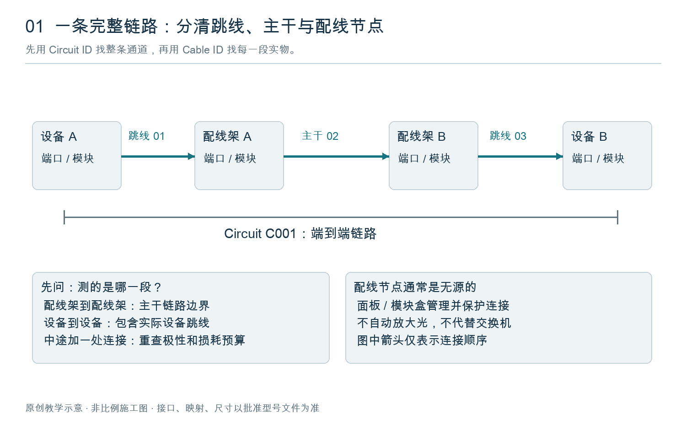

### 1.1 跟着一条线走一遍

常见模块化连接：设备 A 光模块 → 设备跳线 → 配线架 A／模块盒 → 主干光缆 → 配线架 B／模块盒 → 设备跳线 → 设备 B 光模块。也可能设备直接光纤互联，或中间增加获批交叉连接；中间连接点都会影响管理、极性和损耗预算。

**设备跳线 Patch Cord／Jumper：** 两端有连接器，便于设备连接和变更。它并不因“短”就天然适合任意端口。

**主干 Trunk／Backbone：** 连接机柜、区域或配线位置的集合线缆，往往多芯、较长，可能预端接，也可能现场熔接。Trunk 描述用途／结构，OS2／OM4 描述光纤类别，是不同维度。

**配线架 Patch Panel／Enclosure：** 安装适配器、模块盒、熔接盘及理线附件的部件。它通常不放大光、不交换数据。

**配线柜／ODF／Cross-connect Rack：** 集中安装配线架、主干终端与跳线管理器的柜或架；ODF 的具体形态因产品而异，不能仅凭中文名称认定尺寸或结构。

### 1.2 实训任务

师傅给新人一条 Circuit ID。新人沿图找出每段 Cable ID、两端端口及中间节点，写出有多少个实际连接对。**严禁靠拉一下线、看哪里动来寻线。** 沿标签、记录和获批识别工具核对。

**合格表现：** 能区分“这根线坏了”和“这条完整通道有问题”；知道设备间一个 Circuit 可能由多根 Cable 组成。

## 第 2 课　光纤怎么分类：先读标签，再看颜色

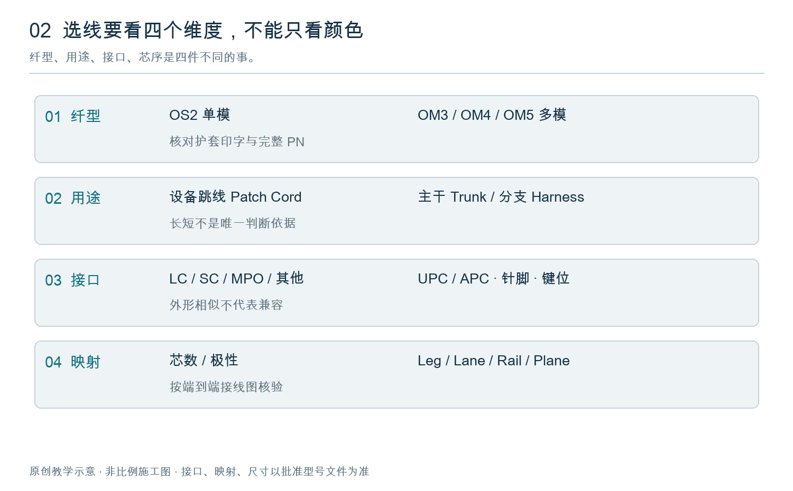

### 2.1 单模和多模

**单模 Single-mode：** 数据中心常见 OS2。常用简写为 9/125 μm，但单模的模式场直径与玻璃纤芯几何直径不是同一指标。新人采购和领料应识别类别及 PN，不凭“9 μm”自行匹配设备。常见黄色护套只是识别线索。

**多模 Multimode：** OM3／OM4／OM5 常见 50/125 μm；OM1 是较老的 62.5/125 μm 类别，OM2 为 50/125 μm。OM3 常见水绿色；OM4 可见水绿色或紫色；OM5 常见黄绿色。外铠、室外和定制护套可能用其他颜色。

单模也用于机柜间短距离；多模能达到多远取决于光模块标准、速率、类别和完整通道。不要背“单模只能长距离、多模只能短距离”，也不要把 OM5 当成无条件比 OM4 跑得更快。

Corning 官方资料列出了 OS2 与 OM3／OM4／OM5 产品，以及其特定产品的护套颜色；颜色不能替代标签和规格核验。[Corning 光纤资料](https://www.corning.com/optical-communications/in/en/home/products/fiber/optical-fiber-resource-center/spec-sheets.html)；[组件规格示例](https://www.corning.com/catalog/coc/documents/generic-specifications/PGS098.pdf)

### 2.2 再认四种结构

- **Simplex 单芯／Duplex 双芯：** 描述纤芯或连接组合；双芯常用于一发一收，但具体光学方案可能使用单芯双向、波分或并行多芯。
- **Ribbon 带状／Rollable Ribbon 可卷曲带状：** 为多芯组织形式。剥缆和弯曲方法按具体结构，不能将带状纤维扭成麻花。
- **Armored 铠装：** 增加机械保护；金属铠装的接地联结需按设计处理。铠装不代表可踩、可折、可不做弯曲保护。
- **Bend-insensitive 抗弯：** 降低某些弯曲条件下的附加损耗；整根线缆仍有机械和光学弯曲限制，不能打死折。

### 2.3 新人领料读出八项

PN、长度、OS2／OM 类别、两端接口、UPC／APC、芯数／分支、极性／映射、适用环境等级。两根线接口一样但其中一项不同，先核验再领用。

**小练习：** 黄色 LC 线不一定能接现场任何黄色 LC 线。还需核对端面研磨、单模应用、损耗及设备兼容。北美项目的 OFNP／OFNR 等标识另按项目空间要求识别；“低烟无卤 LSZH”不是这些列名的自动替代。

## 第 3 课　接头识别、拿法与插拔

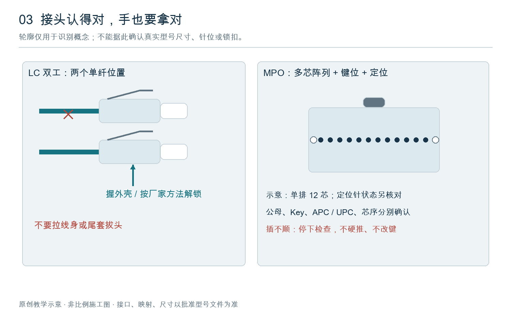

### 3.1 接头名称不要混用

**LC：** 小型单纤接口，常成双工组合。**SC：** 较大的单纤推拉接口，现场配线和仪表也会遇到。LC／SC 是连接器形态，不能由此判定单模或多模。

**MPO：** 多芯连接器家族。**MTP：** US Conec 的商标产品，属于 MPO 家族；不能把名称相近视为所有产品可直接互配。核对芯数、排列、键位、针脚及研磨形式。

**MPO 公头 Male／Pinned：** 有定位针；**母头 Female／Unpinned：** 无定位针。配对需按产品要求匹配；两公头强插会损坏，两母头也不能因为可放进适配器就认定正常。不要自行拔针改型。

**UPC／APC：** 端面研磨形式；APC 有角度。两者不混接。APC 并非只用于单模：某些 NVIDIA 高速多模组件也使用 MPO/APC，按具体 PN 判断。[NVIDIA 100G-PAM4 线缆范围](https://docs.nvidia.com/networking/display/400g100gpam4ovdev/NVIDIA-Supplied-Single-mode-and-Multimode-Crossover-Fiber-Cables)

### 3.2 正确插接的六步

1. 读出线号、端口、PN、分支，与同伴复核。
2. 确认光源安全状态，检查两侧端面；需要清洁时清洁并复检。
3. 手握连接器外壳／厂家指定操作部位，线身自然放松。
4. 对准键位与方向，沿插入轴线平稳插入，按说明确认锁止；阻力异常立即停止。
5. 整理应力释放和弯曲区，接头不承重，不用弯折尾套来“省空间”。
6. 核查链接身份、状态和记录，不仅看指示灯。

拔出时先解锁，操作外壳／拉环；不拉纤缆。密集端口使用批准的专用工具，不能拿尖嘴钳夹连接器或纤缆硬拔。拔下后及时保护两端，再按测试流程处理。

### 3.3 清洁工具怎么动手

**清洁前：** 在安全状态下检测，选择与 LC／MPO、针脚和研磨形式匹配的工具；不要把普通棉签塞进光口。测试参考线也要检查，不能用脏参考线测试干净主干。

**插口型清洁器：** 对准接口轻插至厂家指定位置，保持轴向，按该工具说明完成行程；不能歪着撬动、反复用力按压。LC 与 MPO 清洁头不能互代。

**带式／盒式清洁器：** 先露出新鲜清洁面，按接头和工具说明保持正确接触姿态、方向与行程；不要在脏区域来回擦。APC 接头的接触角度、带针 MPO 的工具适配须确认。

**顽固污染：** 仅在厂家允许时采用匹配的湿后干清洁方法；溶剂不直接灌入光模块，不留液体，不用嘴吹。发现划痕、破损或多次正确清洁仍失败，应隔离组件而非无限擦拭。

**清洁后：** 必须复检，合格才连接；端面图按端口 ID 保存。防尘帽不承担清洁功能，也不能把落地的帽直接装回。

## 第 4 课　机柜、配线架、模块盒与交叉连接

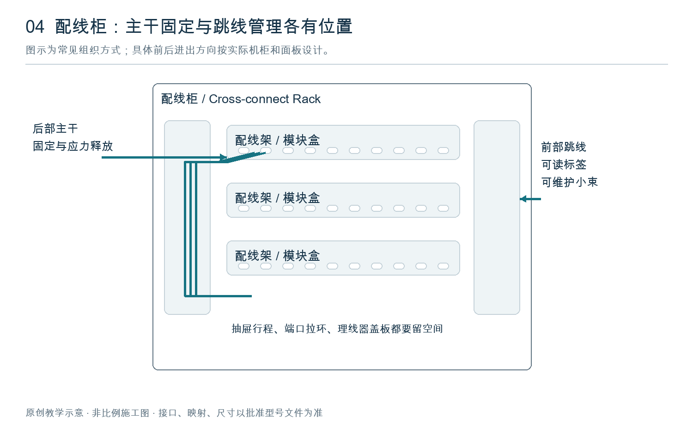

### 4.1 柜与架分别起什么作用

服务器柜、网络柜、配线柜的重载能力、深度和维护需求不同。19 英寸指安装体系相关尺寸，不是所有柜体外宽；1U 为 1.75 英寸即 44.45 mm。OCP 系统可能使用 OU，须看原厂安装体系。不要数错孔、混用螺丝或把较浅配线架当设备承重导轨。

**Adapter Panel 适配器板：** 承载直通对接适配器，本身不自动将 12 芯变成 6 路业务。

**Cassette 模块盒：** 可能将 MPO 转接为多个 LC，也可能内部有特定 shuffle 映射或熔接结构。外形相同不能代替内部映射确认。

**Splice Tray 熔接盘：** 保护熔接点和裸纤余长；不应拿来塞预端接的大接头。

### 4.2 前后分工

常见做法是后部固定主干和分支过渡件，前部管理可变更跳线；具体面向依项目布置。抽屉式模块要给随动部分留足厂家规定的行程；固定点设在批准支架，不能把本应移动的段绑死。

交叉连接区由跳线完成电路调配，主干通常保持稳定。交叉连接增加灵活性，同时增加连接点和维护需求，需在光预算内。这里的 Cross-connect 不等于极性“交叉”。

### 4.3 安装验收

核对设备位、模块方向、面板标签和空位盖板；后部主干有独立应力释放；前部没有横穿大片端口的跳线墙；抽屉按厂家方法打开后，后部线缆不被拉直、不碰滑轨。首次安装做离线样板验证。

### 4.4 芯数、连接器数、业务数怎么数

**教学例：** 一条 144 芯主干，如果全部按每组 12 芯配置，需要 12 组 12 芯接口；若采用两芯一条的传统双工业务，理论最多可组成 72 对，但仍需扣除预留、不可用芯并核对模块盒。用于并行光、breakout 或 shuffle 时，业务数改按实际有效芯和映射计算。

一个“12 芯外壳”不一定实际装满 12 芯，某些并行光组件可能只装或使用其中部分芯；不能把“12 个 LC 孔”误算成 12 个双工端口。下单前逐层列：主干芯数 → 接口数量 → 模块盒输出 → 实际业务链路。

标签建议保留层级：`Rack / Panel / Cassette / Port / Fiber`。不能只写“第 3 口”，让接班人员猜是哪个模块上的第 3 口。

## 第 5 课　A/B 到底是什么意思：双芯极性与 MPO 映射

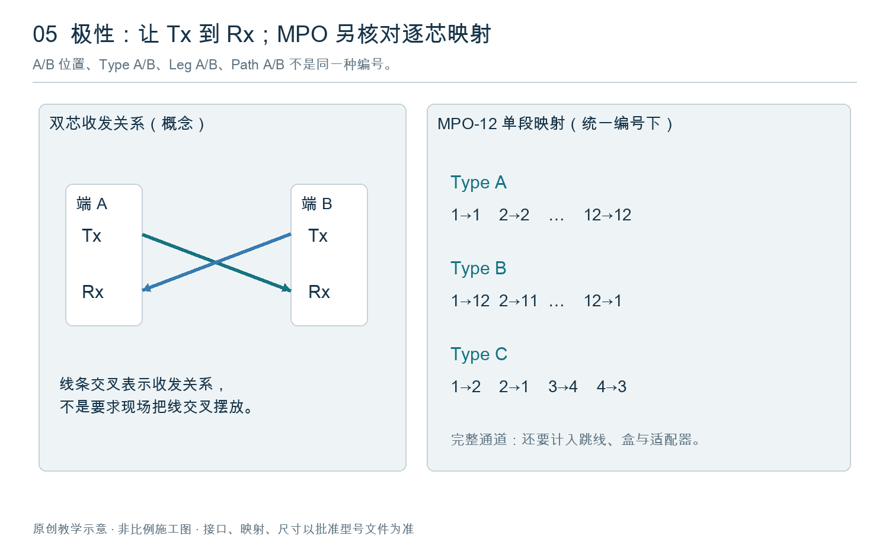

### 5.1 现场听到 A/B，先问是哪一种

可能是双工接头 A／B 位置、A-A／A-B 跳线、MPO Type A／B、Y 线 Leg A／B，或两条物理路由 Path A／B。五种含义不能替换使用。

普通双纤双向通信通常要求本端 Tx 到远端 Rx、远端 Tx 到本端 Rx。图中交叉线表示端到端收发关系，不是要求现场把两根纤缆物理交叉摆放。

### 5.2 MPO-12 三种基本映射

在统一的厂家连接器位置编号下：Type A 为 1→1、2→2……；Type B 为 1→12、2→11……；Type C 为相邻对互换，如 1→2、2→1、3→4、4→3。这里描述一段线的映射；完整通道还包括跳线、适配器和模块盒。

以上仅是常见 MPO-12 基础教学；不把该图自动用于 MPO-16、多排连接器或自定义 Shuffle。看端面与看背面会产生镜像，读图时必须确认观察方向。[Fluke MPO-12 极性基础](https://regression.flukenetworks.com/blog/cabling-chronicles/101-series-12-fiber-mpo-polarity)

### 5.3 极性排错实操

找出两端光模块需要的通道映射 → 对照每个段的厂家图 → 用适用测试仪记录逐芯连通关系 → 标出第一处不一致 → 按工单更换正确组件 → 重做极性和插损测试。

不能看到没 Link 就盲目换 A／B。可转换极性的连接器也只能按厂家方式、批准方案操作并更新台账；不可改键、锉壳或自行拆定位针。

## 第 6 课　Y 形分支线：为什么形状相同也不一定能用

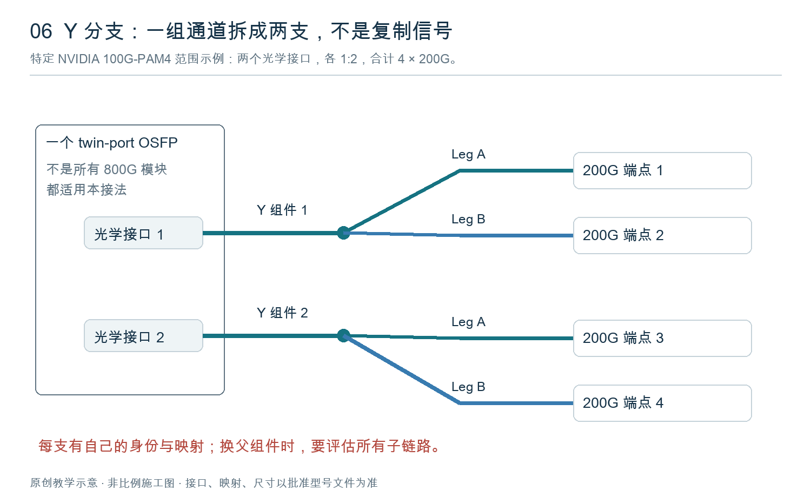

### 6.1 三类“分光／分支”要分清

- **Fan-out／Breakout Harness：** 将不同纤芯／通道引向不同端点，常见 MPO 到多个 LC 或 MPO 分支。通常不复制同一业务信号。
- **Optical Power Splitter：** 将光功率按一定比例分配，常见于 PON 等场景。不是拿来把任意交换机口变成两个独立口的工具。
- **Y 外形组件：** 仅说明外观；必须查 PN、接线图、光学及设备端口模式才能确定功能。

### 6.2 NVIDIA 具体技术范围的例子

在其 100G-PAM4／NDR 相关文档的示例中，一个 twin-port OSFP 模块有两个光学接口；每个接口通过相应 1:2 分支纤连接两个 200G 端点，两根这样的组件合计四个 200G 端点。图06据此画出结构关系，未给出真实 lane 编号或 PN；不得把它套用为所有“800G 转 2×400G”的接法。[NVIDIA 官方分支说明](https://docs.nvidia.com/networking/display/400g100gpam4ovdev/NVIDIA-Supplied-Single-mode-and-Multimode-Crossover-Fiber-Cables)

### 6.3 Y 线怎么装

先确认根部接谁、Leg A／B 接谁，以及分支长度是否能自然到达；根部与过渡件按说明支撑；两支分别沿各自通道铺开，分叉处保持厂家允许形状。不能把短支硬拽到远端，也不能将分叉点拉成紧绷的三角形。

标签同时记录父组件 ID 和子链路 ID；测试逐支执行。换父组件时评估全部子链路，不能以“一支有故障”为由认为另一支不受影响。未使用分支按批准配置封帽、标识、固定，不悬空挂在接头上。

**判断题：** 一对 LC 的 WDM 模块能否加普通 Y 线拆成多个速率更低的独立口？不能仅凭外形如此拆分；需要对应设备与光学方案明确支持。[NVIDIA 连接器与分支概念](https://networking-docs.nvidia.com/cablemanagfaq/cable-and-connector-definitions)

## 第 7 课　Shuffle：光通道重排，不是普通延长线

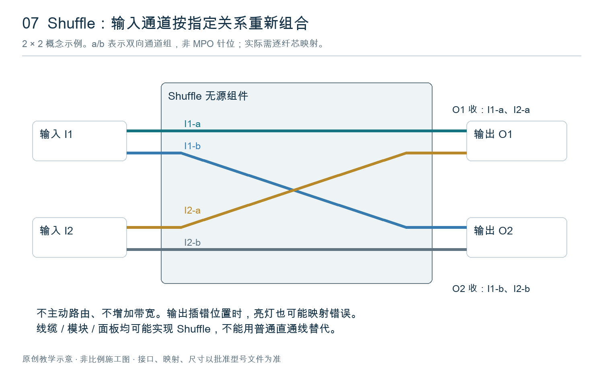

### 7.1 它在做什么

Shuffle 可做在线缆、模块或面板里，按规定把输入端不同通道分配到输出端。它本身是无源连接映射，不会运行路由、不主动选择最优路径，也不产生额外带宽。与普通 trunk 比，关键区别在于**内部映射需要显式管理**。

CommScope 2026 年公开说明涉及将光通道分散至多个网络平面的 shuffle 方案，并列出 cable／module／panel 等实现。是否带来可用性与性能收益，还取决于网卡、交换机及软件架构是否支持。[CommScope Shuffle 说明](https://www.commscope.com/blog/2026/shuffling-into-the-future/)

### 7.2 图07的教学映射

输入 I1 的通道组 a 到 O1、组 b 到 O2；输入 I2 的组 a 到 O1、组 b 到 O2。图里的 a／b 表示一组完整双向通道概念，不是具体 MPO 针位；真正工程文件要列每条纤芯、方向和 lane。

因此“两个口都亮”并不能证明 shuffle 正确；O1／O2 互换可能仍有连通却落入错误 Plane。不能用直通延长线替代，也不能拆盒自行重排。

### 7.3 安装与验收七步

1. 核对 Shuffle PN、SN、内部映射图和适用设备配置。
2. 建立 `Shuffle-ID → Input → Group/Lane/Fiber → Output → Switch/Port/Plane` 台账。
3. 按厂家方向和支撑方法安装；根部、分支和拉环分别留空间。
4. 分端口、分支贴标，图纸和实物使用同一套命名。
5. 用适用工具验证全部映射和损耗，不能只测平均值。
6. 有源拓扑与 Rail／Plane 对比，验证每条预期链路。
7. 执行网络工程师批准的多路径／多平面 RDMA 测试。

Corning 也提供 shuffle cable／被动连接盒类方案；并无一个可跨厂商、跨代际通用的“shuttle 接法”。[Corning AI 布线扩展方案](https://www.corning.com/optical-communications/in/en/home/solutions/glassworks-ai/scalability.html)

## 第 8 课　桥架与槽道怎么走线

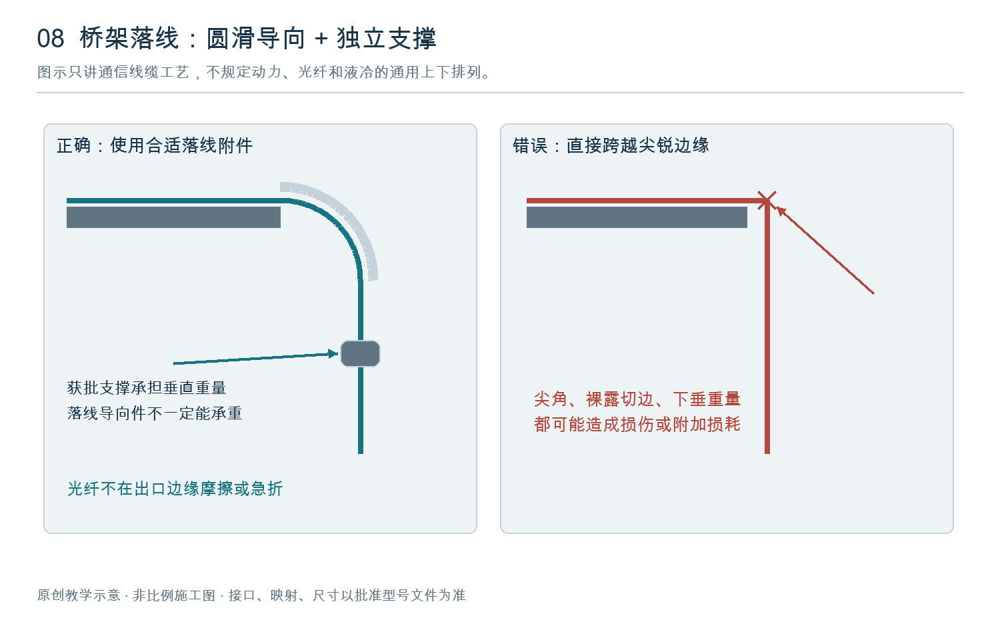

### 8.1 认识现场实物

**Ladder Rack／Runway：** 梯形路径，具体适用线缆和支撑方式依系统说明。**Basket Tray：** 网格桥架，注意接缝、切口和出口保护。**Fiber Raceway：** 光纤专用槽道，常有弯头、三通、变径、盖板和落线附件。承载、填充和转弯半径均应满足安装对象。

桥架有位置不等于可放线；先确认验收状态、承载与终期容量。光纤不直接跨裸露金属边，也不让网线、DAC 或电源线的重量压在细光纤上。

### 8.2 走线路径的实际动作

1. 沿批准图确认起点、每个转弯、落线点和终点，标记 Route ID。
2. 检查入口护口、弯曲保护和落线附件；缺件先补，不用胶带临时替代结构性保护。
3. 将线缆按目标区域及长度分批摆放；预端接组件先保护接头。
4. 放线人员同步移动，转弯处有人接应；接头不在槽道里被其他线束撞击。
5. 平铺并保持可追溯分组，不相互编织；出线按目标出口取出，不能跨压盖板边。
6. 垂直段由获批支撑接住重量，弯曲保护只负责导向时，不能把它当承重夹。
7. 检查槽道出口比主槽更容易拥堵的部位；盖板应自然闭合，不强压。

### 8.3 三个最常见问题

**尖角转弯：** 更换合适弯头／保护件，依据该 PN 弯曲限制检查。**出口塞满：** 扩充批准出口或改路，不能挤压通过。**A/B 同束：** 按实际故障域图处理，不能靠不同颜色宣称路径独立。

Panduit FiberRunner 官方说明突出平滑支撑、弯曲控制和配套出线附件；本课动作是项目教学流程，尺寸仍以具体系统为准。[Panduit FiberRunner](https://www.panduit.com/en/products/featured-products/fiberrunner-cable-routing-system.html)

## 第 9 课　机柜走线：先到理线器，再到端口

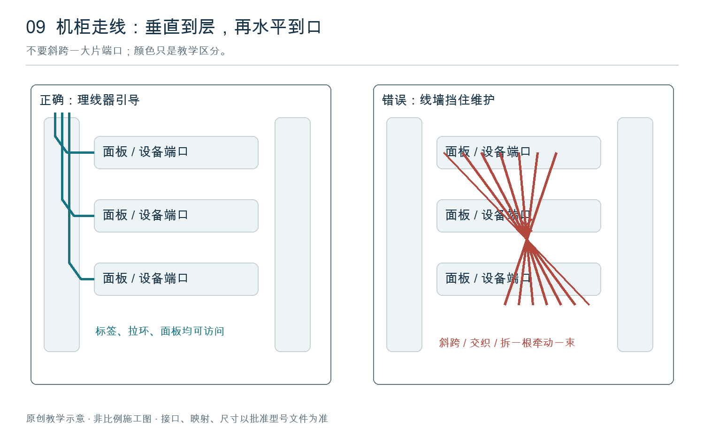

### 9.1 带教师傅先做一条样板

从批准入口进柜 → 沿垂直理线器到目标高度 → 经水平理线器及半径控制件 → 自然接近端口 → 留足插拔及维护所需空间。左右走向、网络分组和理线器选择按样板柜，不统一规定所有机柜“左光右电”。

### 9.2 每条跳线的动作

在插接前估算路线；选批准规格及合适长度；先自然放入路由，再确认两端余量；端口附近不过紧、不急折；完成端面检查后连接；最后整理绑带和标签。不要先插一头，然后拿另一头当牵引点去拽。

水平跳线不要斜跨多排端口；需要跨柜时走批准的跨柜路径，不从机柜门缝或邻柜维护口穿过。不要把光纤绕电源线、母排或液冷管一圈当固定。

### 9.3 前后视图与端口方向

站在机柜后面时，自己的左侧可能对应前视图右侧。机柜、设备和面板编号应作为定位依据；工具或配置显示的端口号还可能是 breakout 逻辑号。师傅让新人从两个观察面定位同一端口，直到能稳定核对。

### 9.4 柜门与维修检查

在获准状态下缓慢关闭柜门，观察线缆是否被推、夹或拉。检查模块拉环、风扇和抽屉是否可达；不为了关门把跳线用力压成直角。若空间不足，复核长度、模块形态和柜体设计。

## 第 10 课　怎么“U 线”：U 形余长与自然弯曲

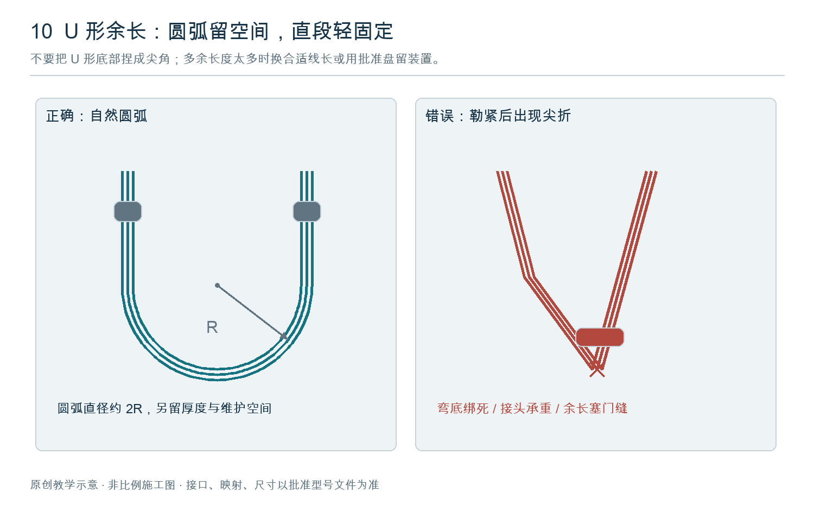

### 10.1 U 形余长的用途

用于在合适的理线区域容纳有限余长，或满足批准的维护行程。U 形不是把线折返压扁，也不是用下垂圈让接头承重；它并非所有机柜的唯一整理方式。较长主干余量使用设计盘留架／盘纤装置，不能全部塞成柜内小 U。

### 10.2 实训动作：一根一根整理

1. 查出该 PN 的最小安装半径、静态半径及连接器附近限制。
2. 选批准理线区，确认宽度、深度、边缘和维护行程。
3. 先把线身顺直消除扭转，两端暂不拉紧。
4. 手托住两条直段，让中间自然成圆弧；围绕合适半径控制件整理，不用手指把底部捏成折痕。
5. 调整 U 的深度和位置，使端口端放松且线圈不落地、不挡门。
6. 在合适直段用绑带轻合，弯底不束成尖角；承重另用获批支撑。
7. 检查从不同角度看都没有扁折；按批准动作验证维护空间。

### 10.3 半径不是直径

**教学假设：** 某跳线静态最小弯曲半径为 30 mm，则做约半圆形回转，圆弧所需直径至少 60 mm，并需额外考虑线缆厚度、量测基准和理线器空间。实际线缆若要求更大半径，应按更大值。不得由本例规定所有线缆 R＝30 mm。

选择半径控制件须核对厂家如何定义半径，不简单拿外观直径推断最小纤芯曲率。绑带距离、U 深度和余长也不设跨产品通用数值。

### 10.4 U 与 8 字的区别

某些长主干临时倒盘可按厂家程序采用大范围 figure-eight，目的是控制扭转；它不是让新人把柜内跳线打成小“8 字结”。预端接 Y／Shuffle、带状结构和高速组件是否允许此方法须核验，不能照搬。

**常见问题：** 3 m 线塞不下就换经过批准且足够的较短线；线短了换长线或改批准路由。不要剪断预端接跳线现场凑长度。

### 10.5 如果现场说的是“捋线／撸线”

这是把线束理顺的口语，不等于把线握紧从头撸到底。先让线缆处于放松状态，托住当前段，打开需要调整的绑带；沿自然路径逐段分离交叉，并把多余长度移到指定盘留区。避免挤压小直径光缆或让整束张力传到已插好的接头。

师傅示范时，一人托线和保护端口附近段，另一人逐段整理；每完成一小段就检查弯曲、分支、标签和支撑。不能戴着脏手套捏接头端面，也不能用梳线板等不适合该结构的工具强拉预端接光纤束。

## 第 11 课　魔术贴怎么用：束拢，不勒紧

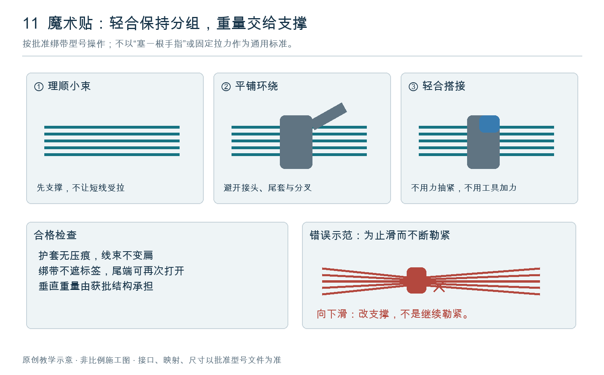

### 11.1 先选对材料

常见名称为 Hook-and-loop Strap／Cable Tie；VELCRO 是品牌名称。选项目批准的通信线缆绑带，核对宽度、长度、环境等级、适用线缆和固定方式。不是所有家用魔术贴都满足机房尤其是空气处理空间要求。

Panduit 提供可释放、可重复使用的绑带及专门的 plenum-rated 型号；某些型号还有特定搭接长度条件，这不等于可把其额定拉力施加在线束上。[Panduit 绑带产品说明](https://distributorportal.panduit.com/content/dam/panduit/en/products/media/1/41/441/8441/111138441.pdf)

### 11.2 手把手七步

1. **分组：** 按路由和维护对象整理小束；避免把互相独立的链路缠绕在一起。
2. **理顺：** 解除交叉，确认没有短线被较长线“吊住”；托住线束重量。
3. **定位：** 选直线段或厂家固定点，避开接头、尾套、分叉、弯底和移动件。
4. **环绕：** 按绑带型号的穿扣／包覆方式绕过线束；平铺、不拧成绳，粗糙边不刮护套。
5. **轻合：** 只让线束保持位置，不用力抽紧、不用工具加力；搭接长度按绑带产品说明。
6. **整理尾端：** 收好可重复打开的尾端，不遮标签和锁扣；需要裁切时将绑带远离线缆再剪，不在线束上用刀。
7. **复查：** 线束未变扁、护套无勒痕、单根线没有被夹成折角；安装后测试无新异常。

### 11.3 怎么判断紧不紧

在离线样板上观察拆开绑带前后线束形状：如果松开时线束明显弹开、护套有压痕或弯曲突然释放，应重做。动作检查不能靠拉动正在运行的光纤。不要把“能塞进一根手指”当统一标准：小线束不适用，而且插入手指可能增加局部挤压。

理想状态是绑带保持外形与归组，重量由理线器／获批应力释放结构承担。绑带用于承重支撑的产品，必须按其额定用途和线缆可承受条件施工，不能将普通松束绑带代替主干悬挂夹。

### 11.4 哪些地方不能绑

不能捆在光模块拉环上；不能束住 MPO 分支根部使其变形；不能跨过转弯把圆弧拉扁；不能绑到液冷软管、阀门或电源连接件；不能把抽屉随动段绑死；不能用一条超长绑带把所有网络连成难以维修的一大束。

魔术贴之间的距离按样板、线缆重量、支撑方式和厂家要求确定。垂直线束仍向下滑时，先改承重和支撑设计，**不通过继续勒紧解决**。Panduit 的布线实践资料也提醒小芯数／带状线缆使用过紧硬扎带会产生压伤风险。[Panduit 机柜光纤布线实践](https://www.panduit.com/content/dam/panduit/en/products/media/5/95/395/3395/53395.pdf)

## 第 12 课　主干光纤敷设：保护头、控制力、留证据

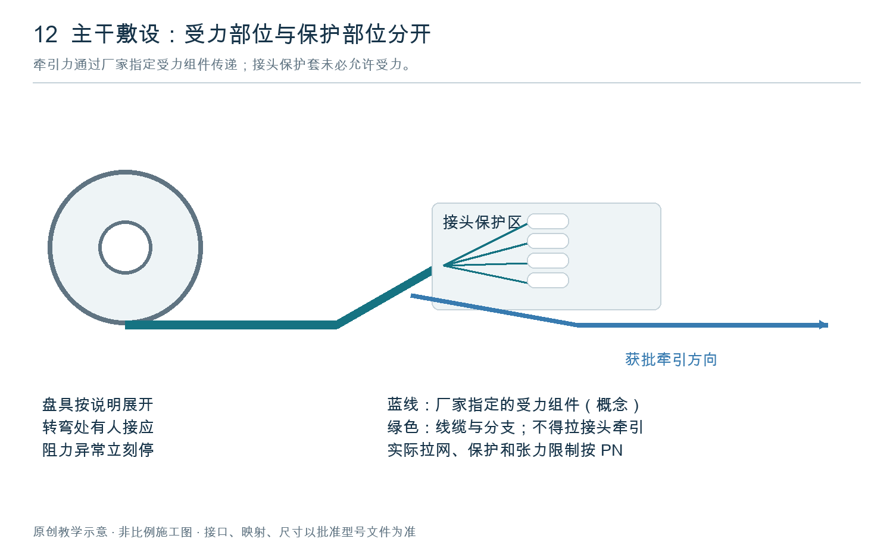

### 12.1 放线前准备

确认路线已验收；实测路径与库存长度；记录 PN／SN／盘号；查最大牵引力、弯曲半径和安装温度；安排放盘、沿线接应和收端人员；检查厂家拉网／牵引组件与接头保护是否配套。

### 12.2 实际敷设

线盘按厂家允许方式展开，避免从盘边不断抽圈引入扭转。预端接头放入保护套，牵引力通过厂家指定的强度构件或拉网传递，不通过光接头、分支腿或尾套传递；保护套本身不一定允许受力。

牵引人员与转弯接应人员保持通信；阻力异常先停，检查卡点，不猛拽。机械牵引按计划监测张力；不能以“手拉的”保证不超限。Y／Shuffle 预端接头需额外核对可通过空间和保护方式。

完成后检查护套、分支、受力件和两端标签；按计划做铺设后测试，并与铺设前结果对应。备用芯纳入项目要求的覆盖范围。

### 12.3 主干余长如何存放

按设计位置存放在盘留架、盘纤装置或适用保护空间；保持端口、门、抽屉和散热可用。记录余长位置，禁止将几十米余长吊在配线架接头上，也不把整束折叠后塞进顶部槽道。

**故障预防：** 线缆运到现场前合格，并不证明经过牵引、转弯和理线后仍合格；敷设前后记录能帮助区分运输、施工和连接问题。

## 第 13 课　配线架和抽屉：如何跳线、增线、拆线

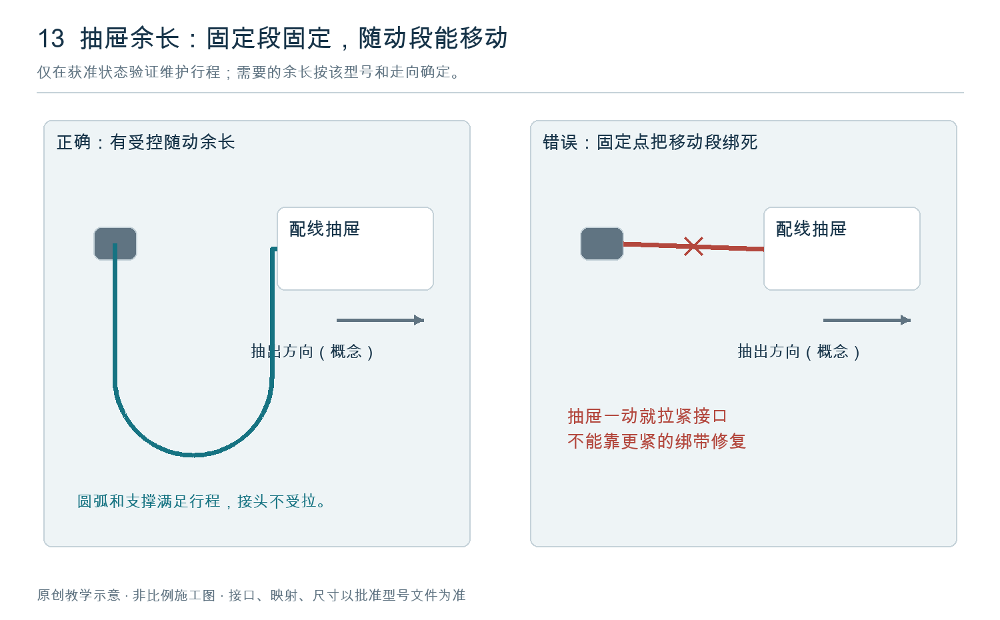

### 13.1 新增一条跳线

领取工作包 → 查源端／目的端及完整通道 → 核对跳线和端面 → 两人读回端口 → 布路由与余长 → 插接 → 轻合绑带 → 测试 → 更新标签和台账。端口不够必须走变更，不能拔掉“看起来没流量”的线。

### 13.2 抽屉式配线架的动作

先阅读该型号说明并明确哪些部分随动；检查后部应力释放；在允许状态缓慢移动抽屉，观察后部余长变化；到指定行程无接头受力、无折弯、无擦轨才算通过。不同型号需要的余长不同，不规定所有抽屉统一留 30 cm。

Panduit 某些安装文件对特定支架和走向分别规定余长，这说明必须查具体型号，而非全机房套一个数。[Panduit FS137 安装说明](https://www.panduit.com/content/dam/panduit/en/products/media/7/17/617/3617/106583617.pdf)

### 13.3 从密集线束里拆一根线

确认工单和两端身份，先给目标线做临时识别；托住相邻线束，逐段打开可重复绑带；从外层向内层分离，遇到交织先理清路径；必要时分段释放，不从闭合绑带和其他接头中硬抽。

目标线拆除后恢复相邻线的支撑、余长和标签，检查受扰动邻线的状态。不能把旧跳线当牵引绳强拖新跳线穿过已满的线束。临时标签在正式记录完成后按项目要求处理，避免出现两个冲突线号。

## 第 14 课　测试：用什么仪表、测哪里、怎么看结果

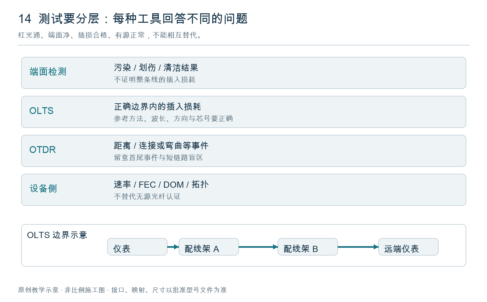

### 14.1 五种检查，各自解决一个问题

- **视频端面检测：** 看污染、划伤及端面区域判定；不能证明整条线路损耗合格。
- **VFL 红光笔：** 离线识别、连续性和部分故障辅助定位；不能证明高速性能，不直视光口。
- **OLTS 光损耗测试：** 测端到端插入损耗，配合所需极性、长度等认证；MPO／Shuffle 需要适用的逐芯映射能力。
- **OTDR：** 根据回波观察距离和事件，辅助定位故障；不替代 OLTS 通道插损认证。
- **设备侧检查：** 速率、FEC、DOM、错误、flap 和拓扑；用来确认真实运行，不代替无源认证。

### 14.2 OLTS 实操流程

1. 明确测试边界：配线架到配线架，还是包含设备跳线的最终通道。
2. 根据合同、纤型、连接器和应用选择限值与参考方法，不混用。
3. 仪表按说明预热；检查校准状态；选择正确波长、方向和多模发射条件。
4. 检查测试参考线 TRC 及测试口，必要时清洁后复检。
5. 按仪表向导建立参考并验证参考线，记录参考方法及时间。
6. 接入被测链路，录入正确 Cable／Circuit／Fiber ID，逐芯、逐方向按计划测试。
7. 保存原始数据、限值、余量和失败记录；不要只拍 PASS 屏幕。
8. 参考条件改变、参考线更换或从影响参考的接口拔出时，按仪表说明重新建立／验证参考。

Fluke 的参考设置说明强调方法和参考线状态会影响结果；具体步骤使用当前仪表手册，不把某型号的按键流程套到另一台仪表。[Fluke 设置参考说明](https://regression.flukenetworks.com/blog/cabling-chronicles/101-series-set-your-reference-wizard)

### 14.3 读懂 dB 与 dBm

**dB 是比值／损耗；dBm 是相对于 1 mW 的绝对光功率。** 例如同一参考体系下发送参考功率 −3.0 dBm、接收 −4.2 dBm，则差值为 1.2 dB。这个算例不代表允许损耗，也不代表直接相减任意两台设备的 DOM 就能完成认证。

**教学限值例：** 若批准限值为 1.5 dB、测试为 1.2 dB，则余量 0.3 dB；若为 1.7 dB 则失败。实际 PASS 还取决于正确的边界、波长、极性、参考和不确定度处理。

### 14.4 OTDR 实操重点

按纤型、距离、连接器及事件间距选参数；使用适合的 launch／receive fiber，检查首尾事件能否分辨；双向评估按合同执行。短机房链路若脉宽过大，多个连接点会落入盲区；报告无异常不一定说明测试设置合适。

OTDR 单向某熔接事件可能出现表观“增益”，与 OLTS 全链路负损耗不是同一件事。后者要核验参考、光源稳定性和仪表不确定度，不能宣称无源光纤把信号放大了。

### 14.5 复测规则

清洁／重插涉及哪条链路，就按计划复测该链路；更换 Y／Shuffle 父组件影响多条子链路，应覆盖全部受影响分支。主干重拉或新增连接点需重新核对预算及相应全部芯。测试后再大幅理线，应评估机械变化并复验。

## 第 15 课　换线 SOP 与十二个排障案例

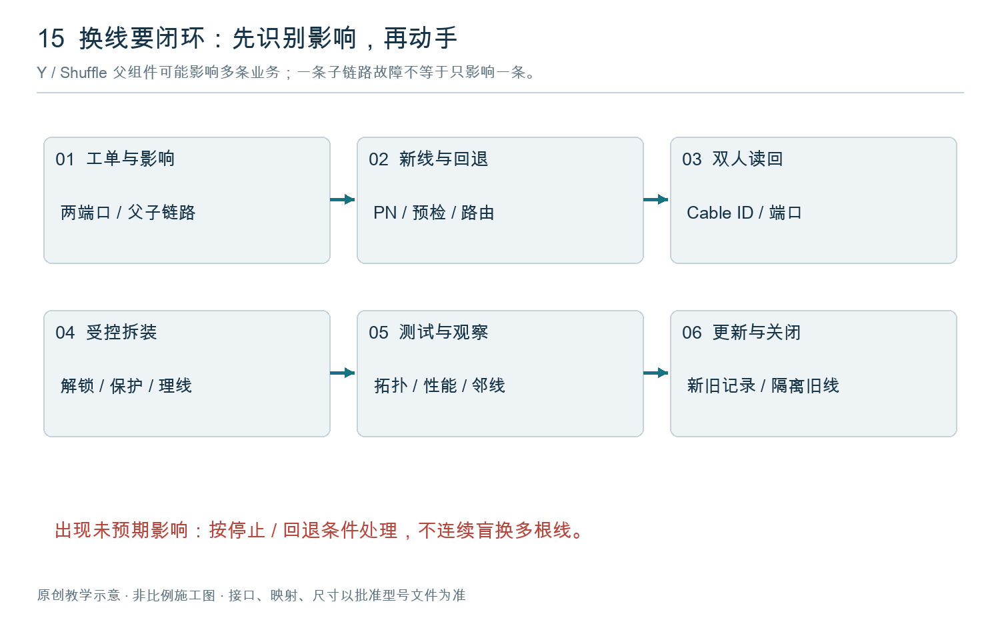

### 15.1 换一条生产跳线的标准顺序

1. **确认影响：** 工单、服务、两端口和分支；包括 Y／Shuffle 共用组件的全部子链路。
2. **准备回退：** 旧状态、配置、PN、路径、测试基线及获批回退方案；损坏的旧线不应被默认作为可用回退材料。
3. **准备新线：** 正确 PN／长度／极性／等级；预先检查、贴临时身份标识和完成要求的测试。
4. **批准窗口：** 网络团队确认业务排空／停用动作；布线员不自行关闭端口或假设冗余有效。
5. **双人读回：** 一人操作，一人按 P2P 核对；先前照片作辅助，不能替代当前身份确认。
6. **拆旧布新：** 解锁拔出，保护端面，逐段打开绑带，避免扰动邻线；按批准路由放新线。
7. **检查连接：** 端面合格、方向／分支正确、锁止、无应力，恢复理线。
8. **验证与观察：** 无源测试按变更范围执行；网络团队核对拓扑、速率、错误增量及业务恢复。
9. **达不到预期：** 按停止／回退条件处理，不无限换线试错。
10. **关闭工单：** 更新新旧 Cable ID／PN／SN、报告及时间，旧线隔离或按项目处置。

### 案例 01：新拆封跳线，插上却没有 Link

**场景：** PN 与端口看似正确。**排查：** 先核对端口模式和两端身份，再安全检查端面、极性及实际光学兼容。新包装不代表端面一定洁净。**处置：** 发现污染就按流程清洁复检，再做相应测试；若仍不通继续排查，不直接判定模块坏。**训练考点：** 学员能先查证据而非随机换料。

### 案例 02：理线前正常，绑完后误码增加

**场景：** 新增绑带后出现异常。**排查：** 对比变更前后错误增量，检查是否勒痕、弯底被拉扁或邻线被牵动；不得对在运链路随意拉拽。**处置：** 经工单释放不当束缚，改善支撑，再复测。**预防：** 先支撑承重，再轻合绑带；测试最终整理状态。

### 案例 03：机柜门打开正常，关闭后掉线

**排查：** 门压接头、尾套或 U 形线圈；确认门关闭时各点状态。**处置：** 改批准路由／长度／配件，必要时提交空间冲突 RFI。**合格证据：** 在允许操作条件下验证完整门行程与链路状态。不要用力关门后继续观察“会不会好”。

### 案例 04：抽屉拉出来时一排链路中断

**排查：** 后部随动段被绑死、主干无应力释放、支架固定位置错误。**处置：** 停止抽动，按厂家说明恢复固定与移动段关系，检查受力连接并复测受影响范围。**预防：** 离线样板先做完整行程验收。

### 案例 05：Y 线只有 Leg A 通，Leg B 不通

**排查：** 分支标签与 P2P、端口 split 模式、两支光学兼容、污染／损坏和芯序。**处置：** 针对确认的问题整改；换父组件要评估两支。**禁止：** 把 A/B 任意互换后不记录，只追求两盏灯亮。

### 案例 06：Shuffle 全部亮灯，但集群拓扑不对

**排查：** 比较 Shuffle-ID、端点及 Plane，检查输出腿是否就近插错。**处置：** 按批准映射修正，验证全体受影响子链路及有源拓扑。**预防：** 映射测试和拓扑比对单独签字，不能由 Link Up 代替。

### 案例 07：LC 外形完全一样，替换后不通

**排查：** 单模／多模、UPC／APC、波长与光学标准、单双纤方案。**处置：** 用 PN／标签确认正确替代件；如果发生不兼容端面接触，按流程检查两侧损伤。**预防：** 领料读出八项，不凭颜色。

### 案例 08：MPO-12 测了两芯，业务仍不稳定

**排查：** 实际应用可能需要更多并行芯；检查所有已装芯的极性和损耗及对应有效 lane。**处置：** 按完整覆盖范围重测，修正漏测和错误报告命名。**预防：** 在测试计划明确“一条 Cable 包含多少条 Fiber 结果”。

### 案例 09：整批 OLTS 报告出现明显负损耗

**排查：** 参考方法、参考线状态、光源稳定性、连接改变及测试边界。接近零的小负值还要结合仪表不确定度处理，不能脱离说明一刀切。**处置：** 暂停该批报告签发，重新验证参考，并界定从何时起需要重测。**禁止：** 把负值改成零或直接当作“特别优秀”。[Fluke 负损耗与参考问题](https://www.flukenetworks.com/edocs/white-paper-encircled-flux-solving-the-puzzle-of-repeatable-fiber-loss-testing)

### 案例 10：光纤无源测试都合格，800G 链路仍异常

**排查：** 端口模式、光模块 PN、lane 速率、FEC、固件及实际已测边界是否覆盖最终跳线。**处置：** 网络／OEM 联合分析，在批准窗口做一次一个变量的替换验证。**预防：** 将无源认证与有源验收分别记录。

### 案例 11：旧线在机柜里缠住，拉不出来

**排查：** 路径和相邻线交织、隐藏绑带、穿过错误孔位。**处置：** 逐段释放并支撑邻线；必要时扩大维护窗口。**禁止：** 切断身份不明的线、猛拉或用旧线硬拖新线。**预防：** 初装时分组不编织，单根应可维护。

### 案例 12：主干可用，但换一根跳线后插损超限

**排查：** 新跳线端面、研磨／介质／极性、连接对数量变化及参考边界；清洁后再定位损耗。**教学数据：** 同一批准测试边界下，原 1.1 dB、换线后 1.8 dB、限值 1.5 dB，应记录失败；不能用“长度差不多”放行。**处置：** 定位并消除新增损耗，完整复测；保留原始前后报告。

**案例说明：** 以上为教学模拟场景，不是宣称某个品牌或客户发生过这些事故。现象只提供排查方向，根因必须由现场证据确认。

## 第 16 课　带教实训、检查卡与考核

### 16.1 四个离线实训工位

**工位 A：认料与识图。** 提供 OS2／OM 多种样品、LC／MPO、正确与错误 PN、模拟 P2P；学员说明每件用途和不能替代的原因。

**工位 B：走线与绑线。** 使用批准样板理线器、圆弧保护件和魔术贴；完成入口、垂直、水平、U 形余长及标签。评估拆换一条线是否会牵动其他线。

**工位 C：清洁与测试。** 在安全离线状态演示端面检查、必要清洁、复检、参考设置、逐芯／极性测试和报告命名；污染样件单独管理，不污染正式参考线。

**工位 D：换线与排障。** 用模拟工单处理三种预设问题，如错误分支、绑带过紧、参考错误。学员完成影响确认、双人读回、操作、验证与记录。

### 16.2 一条线完工前的十问

1. PN、长度、纤型、接头、极性与批准表相符吗？
2. 两端端口和子分支由第二人复核了吗？
3. 是否走在正确路由，未穿门缝或借用管路？
4. 接头和分支根部是否完全不承担线束重量？
5. 转弯和 U 形底部是否满足该线缆实际限制？
6. 魔术贴是否轻合、无压痕、不遮标识？
7. 门、抽屉、模块维护范围是否可用？
8. 端面是否检查合格，开放端是否受到保护？
9. 测试是否覆盖正确边界、所有应测芯和分支？
10. 实物线号、P2P、照片、测试报告是否一致？

### 16.3 四张现场记录卡

**认料卡：** Cable ID／PN／长度／纤型／两端接口／研磨／芯数／极性／分支／环境等级／资料来源／核验人。

**理线卡：** Route ID／柜位／入口与出口／支撑及半径控制件／U 形位置／绑带型号／维护行程检查／前后照片／检查人。

**换线卡：** 工单／父子链路范围／窗口／新旧 PN 与 ID／动作时间／操作者与复核者／前后状态与报告／回退结果／台账更新。

**故障卡：** 现象／首次时间／最近改动／受影响范围／证据／单步验证动作／结果／确认根因或尚未确认／整改／复验／预防措施。

### 16.4 新人考试答案要点

- 魔术贴越紧越好？**错误。** 束拢与承重分工明确，不压迫线缆。
- 只看护套颜色能选线？**不能。** 必须查标签、PN 和完整参数。
- 有红光通过就合格？**不能。** 还需极性、插损及适用有源测试。
- 所有 APC 都是单模？**错误。** 某些高速多模组件也采用 APC。
- Y 线能复制任意网络端口？**不能。** 对应的 lane、光学和端口模式必须支持。
- Shuffle 无源所以可随便替换？**错误。** 映射是设计的一部分。
- 抽屉能关上就代表余长合格？**错误。** 还需完整维护行程与受力检查。
- 现场没线号，拉一下找另一头？**禁止。** 停止并用记录及批准方法识别。

**建议合格条件：** 认料和端点零错误；无安全越权；走线与标签满足样板；测试方法正确；记录完整。技能熟练后才追求速度。

## 第 17 课　贴标签：每个线号都要能追到实物和记录

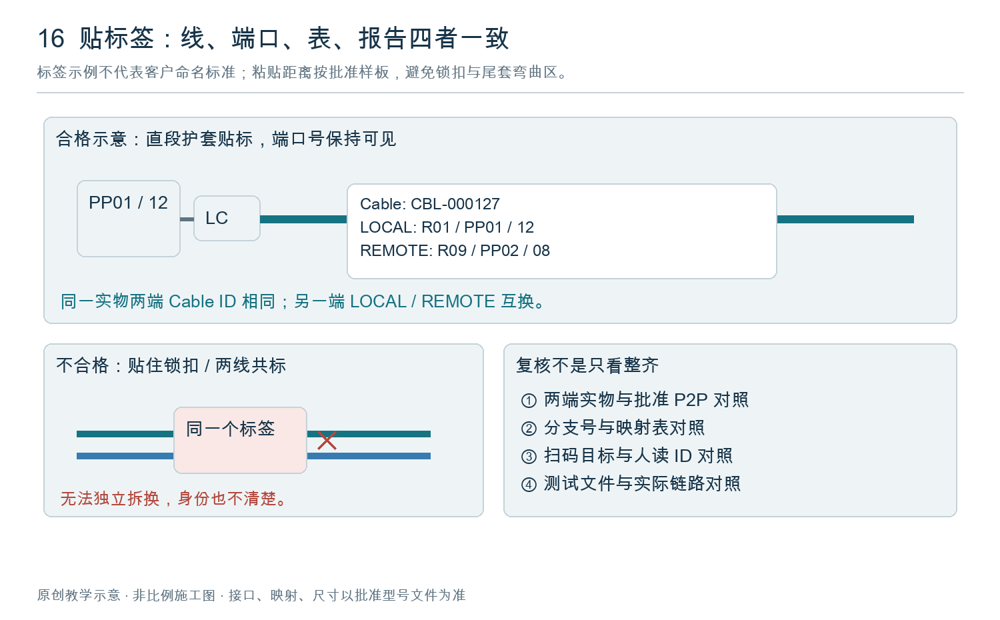

### 17.1 开工条件与样板

领班先批准一条完整链路的标签样板，包括命名、字段、材料、尺寸、字体、朝向、粘贴位置和扫描方式。现场保留样板照片。安装人员从同一版端口对端表（P2P）打印，不凭口头指令编线号。

**建议项目规则：** 每段实物用唯一 Cable ID，两端保持相同；多段组成一条通道时另设 Circuit ID；主干的分支使用父 ID 加 Leg／子 ID。A/B、Rail、Plane 按图纸分别标明，不把字母 A 自动理解成冗余 A 路。

标签示例（仅为培训命名）：`Cable: CBL-000127`；`LOCAL: R01 / PP01 / 12`；`REMOTE: R09 / PP02 / 08`。另一端 Cable 不变，LOCAL 与 REMOTE 对调。分支示例 `CBL-000128-L01`，必须与该 PN 的映射表一致。二维码可以辅助查询，同时保留人能读的 ID。

### 17.2 贴标八步法

1. **认线再取标签。** 读出 Cable ID、PN、两端位置和分支号；每次处理一根或一个可清楚隔离的小组，防止一摞标签错位。
2. **选材。** 按实际外径、护套、使用环境和厂家适用范围选择自覆膜、旗形或其他批准标签。极细跳线不能随便套用粗主干的标签；预端接线不能为了穿热缩标识剪掉接头。
3. **准备表面。** 找到直段外护套，按材料说明清洁并干燥；不要把清洁液带入接口，不使用可能伤护套的溶剂。
4. **摆位置。** 标签避开连接器、锁扣、拉环、尾套弯曲区、散纤区、分支根部和束带。手能操作锁扣，眼能读标签，抽屉运动时不会卡住。距接头的尺寸由样板确定，不统一规定“几厘米”。
5. **贴自覆膜标签。** 先定位印字区，再沿线身轻贴透明覆盖区，压平标签本身的接合面；不旋拧线身来贴标，不把细纤勒成细腰。覆膜覆盖印字但不遮挡读取。
6. **贴旗形标签。** 使用适用的旗形产品，按折线对齐粘合；旗面置于可读且不勾挂的位置。不得拿普通标签随意折成大旗、跨接两根线或卡住邻近解锁拉片。
7. **复核。** 第二人读回实物 ID 和端口；核对两端、父子分支及 P2P，再测试扫码结果是否指向正确对象。只证明“条码能扫”不够。
8. **收尾。** 更正时先识别线缆，再按批准方法去除旧标、补新标；不在薄纤旁用刀刮。同步更新记录，保留变更痕迹，禁止新旧有效标签并存。

标签选型应按材料和线径匹配；可参照 [Brady 线缆标识选型指南](https://www.bradyid.com/resources/guides/how-to-select-a-wire-marker)。本课命名和位置检查是建议项目规则，不是引用该厂商统一命名规范。

### 17.3 验收、返工与证据

**逐条合格：** 线、端口、表、测试报告四者同号；两端及要求标识的分支齐全；位置可读；无翘边、遮字、重号、错号；不妨碍插拔和弯曲。建议施工方全数自检，第二人全数复核身份；业主抽查比例在 ITP 中约定，抽查不能代替施工方自检。

**直接退回：** 实物对端不符、分支标反、重复 Cable ID、报告对应不明。先隔离受影响批次并查清错位范围；不能为了让报告好看，把正确实物标签改成错误报告名称。

**留证：** 柜位全景、两端能同时看清端口号与线号的近照、标签打印版本、复核人、对应测试文件。密集端口无法一张拍清时，用连续编号照片建立关联。

## 第 18 课　卡 click：插入、锁止、解锁和验收

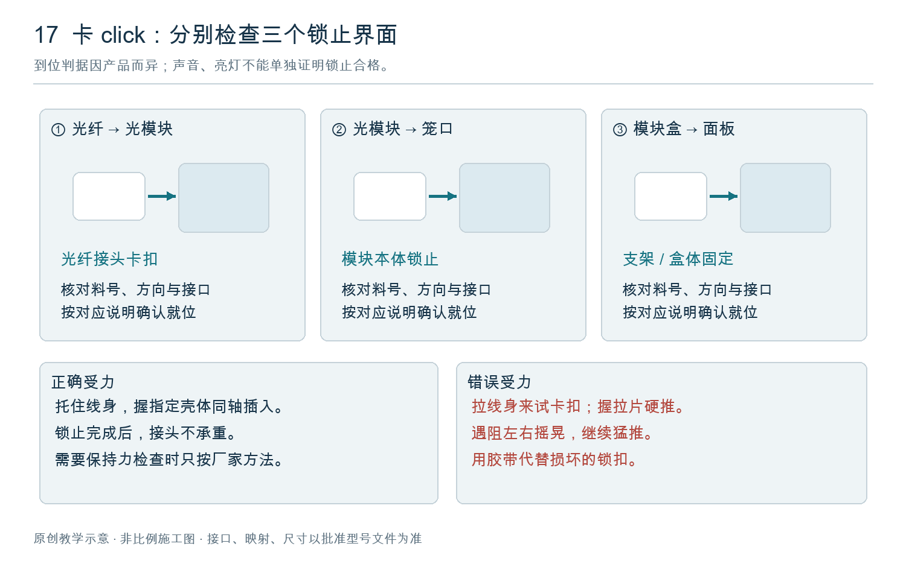

### 18.1 先分清是哪一个卡扣

- **光纤连接器与适配器／光模块：** 如 LC、MPO。核对研磨、针脚、键位和接口规格；不是外形能插入就兼容。
- **光模块／DAC／AOC 插头与设备笼口：** 核对模块型号、设备支持和拔出机构；光纤接头已经锁住，不代表模块本体已经锁住。
- **模块盒、配线架模块或线缆固定夹与支架：** 核对支架型号、定位销、锁扣或螺钉。面板固定不牢时，插线动作可能把模块整体推回去。

**click 只是可能出现的声音提示。** 不同产品声音、行程和锁止指示不同；不能统一要求必须听到一声，也不能听到一声就签合格。最终按该接口的就位与锁止判据检查。

### 18.2 插入六步法

1. **确认授权和端口。** 双人读回柜位、设备、端口、线号和分支；认清正视或背视方向。附近生产口不顺手拔动。
2. **检查。** 检查壳体、卡扣、笼口和污染；光纤端面按第 3、14 课检查—必要清洁—复检。不能肉眼直视可能带光的端口，也不以无可见红光判断安全。
3. **建立余长与支撑。** 线缆自然到位，手松开后不靠插头承重。把拉环、解锁片和标签从夹缝中理出来。
4. **对正。** 按键位同轴插入，握厂家指定的壳体受力部位；不握纤维、尾套或解锁拉片硬推，不左右摇着找角度。阻力异常立即停。
5. **确认锁止。** 检查厂家规定的到位位置、锁扣／指示和间隙。若厂家明确要求保持力检查，按其方法对指定外壳操作；不得通过拉线身做“拉一拉试试”，不得自定拉力。不要因没有声音就继续猛推。
6. **放手后复检。** 看线身回弹是否牵动接头，确认尾套弯曲、旁边端口、门与抽屉行程，再做适用链路测试。亮灯和链路 UP 是补充证据，不能代替机械检查及光学验收。

NVIDIA 的线缆管理指南强调，模块插入时握持连接器并对正，拔出拉片用于移除而不是插入；具体动作仍按所用硬件手册执行。[NVIDIA Cable Management Guidelines](https://docs.nvidia.com/nvidia-cable-management-guidelines-and-faq.pdf)

### 18.3 解锁、缺陷与重测

先完成维护授权和链路确认，托住线缆，再按该 PN 的卡扣或拉片机构解锁，握指定壳体同轴移出。遇阻不增加拉力；检查是否尚未解锁、标签卡住、相邻线束束缚或支架变形。多层拉片不可误拉邻口。

**退回条件：** 卡扣缺失／断裂、假插到位、壳体倾斜、明显异常间隙、模块随配线动作移动、接头承重、拉片被绑住。不能用胶带或扎带代替接口锁扣。涉及在运设备时，由授权人员按窗口纠正。

**验收留证：** 端口与 Cable ID、实际接口类型、就位检查结果、异常处理、检查人和时间；照片提供外观证据，现场功能性锁止检查仍须记录。重插后重做受影响边界的端面检查、适用光学及链路验证；不要反复插拔直到偶然 UP。

## 第 19 课　展线：先把线放对，再把线送上路由

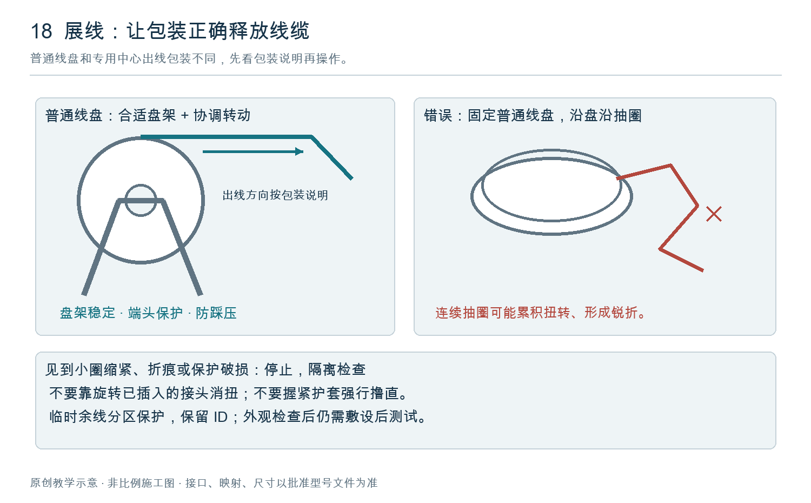

### 19.1 展线和拉线的区别

**展线（Payoff／Unreeling）** 是让线缆从线盘、包装或盘圈中有序释放；**拉线（Pulling）** 是沿批准路由牵引和送线。错误展线可能在上桥架前就制造扭转、锐折和护套损伤。不能认为“还没用力拉”就不会伤线。

### 19.2 作业前布置

选择清洁平整、有隔离措施的展线区，不能堵通道或在液冷施工、金属切割区散放接头。线盘架、轴和制动装置按盘重与尺寸选型，并防止倾倒或失控转动。两端帽和预端接牵引保护袋保持完好。

根据 P2P 和路线先决定哪端先走、A/B 或 L01 等分支朝哪柜、长短分支留在哪侧、盘尾是否足够到端接位置。临时标签必须绑在批准位置，不能靠护套颜色记忆。先检查厂家包装方法：线盘、专用出线盒、圈装线的展开方式并不相同。

### 19.3 展线七步法

1. 核对线盘／箱号、Cable ID、PN、长度、序号和外观；将出厂及进场测试与该实物关联。
2. 线盘按厂家指定方向在合适支架上放线，转动与送线协调。**普通盘绕线不得把固定线盘平放后，从盘沿连续抽圈；** 设计为中心出线的专用包装按其说明使用，不混淆两者。
3. 开始时低速试放短段；安排一人管盘、一人接线，确认没有过度扭转、跳盘或保护袋拖地。
4. 送线人员托住线身并把线缆送入导向件；不让走动的人、车轮、梯脚踩压，不从裸露锐边跨过去。
5. 临时余线置于批准的保护区域，用满足半径的宽松盘圈；需要八字展放时使用厂家允许的方法并留足场地，不把八字交点压成结。
6. 多根并行时分槽或分区摆放并保持临时 ID，松散成组，避免交叉串套。不得用旋拧接头、拽散纤或强行“撸直”来消除扭结。
7. 完成一段即检查护套、接头保护、线号及剩余长度，协调送入路由；端头暂不连接时继续保护并固定在安全位置。

### 19.4 停工、验收和记录

见到打结、锐折、盘圈突然缩紧、护套起皱／发白、保护套脱落、连接器拖地或盘架移动，立即停。解除外力后识别受损范围；不要把明显折痕压平后继续交付。可疑组件隔离，由质量负责人结合厂家处置意见及复测决定更换或放行。

**合格判据：** 放线方法符合包装说明；端头方向正确；无观察到的机械损伤；临时 ID 可追溯；余线受保护；未侵犯最小弯曲半径。外观合格仍需后续敷设后测试。

**记录：** 盘／箱序号、起终端方向、送线方式、开盘检查、损伤位置及照片、现场负责人、送线前后状态。临时余线没有独立 Cable ID 时至少关联盘号与工作包，不留下“无名的一卷”。

## 第 20 课　端接：预端接、光纤熔接与铜缆分别训练

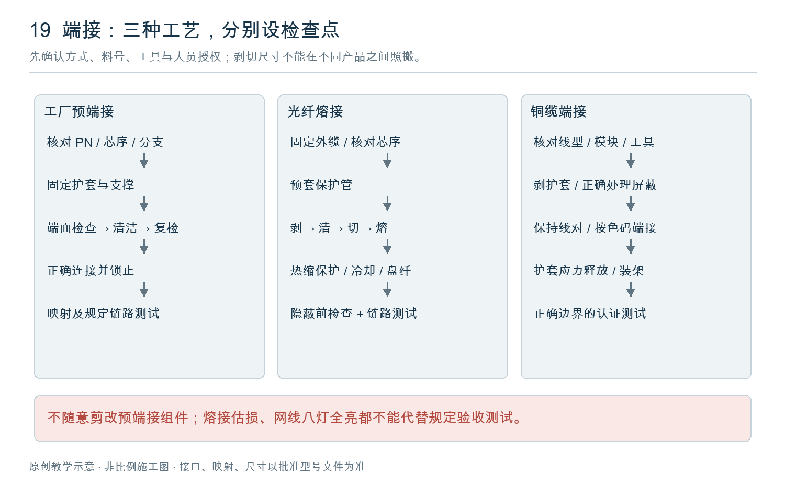

### 20.1 先决定端接方式，工具不能混用

**工厂预端接组件：** 现场主要完成安装固定、映射核对、清洁和连接，不随意剪短、拆散、重做接头或修改极性。Y、Shuffle 等组件改动可能改变多个通道。

**现场光纤端接：** 包括尾纤熔接、熔接型连接器、机械型现场连接器等，各自需要批准的组件、培训和专用工艺。下面的熔接步骤不能直接当作机械接头安装说明。

**铜缆端接：** 按设计选模块插座或允许的现场插头；核对类别、屏蔽、导体线径、实心／绞合和工具适配。工厂跳线不因为“水晶头都是八针”就能任意现场重压。

每一类型先做离线首件，检查并测试合格后批准样板。更换连接器 PN、线型、工具或工艺时重新确认首件。

### 20.2 光纤熔接的完整工序

1. **准备。** 核对主干芯序、尾纤类型、盒号和熔接表；确认链路安全隔离。准备经检查的熔接机、切割刀、剥纤器、匹配保护套管和纤屑容器。戴适用护目装备，工位禁止饮食，碎纤直接收集，不能用手扫。
2. **固定外缆。** 按盒体说明固定护套及加强构件并安排开剥长度；压力由规定固定件承受，不压在裸纤或接续点上。开剥检查束管和纤维有无伤痕。
3. **配对和套管。** 按熔接表逐芯确认身份，按工艺预套保护管，防止熔接后才发现漏套。不要把颜色相同但属于不同束管的纤芯混在一起。
4. **剥、清、切。** 按工具规定剥除涂覆层，用适配耗材清洁后精密切割；新切端避免触碰或污染。剥纤、切割长度用对应工装／量规确认，不套用全项目统一数值。
5. **熔接。** 选择相符的纤型程序，按设备说明完成校准／电弧检查、对准和熔接；异常切面或熔接缺陷按工艺重做。机器的估算损耗仅用于过程判断，不能替代链路测试。
6. **保护。** 对中保护套管并用匹配程序加热，冷却后确认无异常，再按厂家方法放入接续槽。不得把仍软热的接续点硬压进卡槽。
7. **盘纤。** 按托盘指定路由和半径逐芯收容，保持芯序；槽盖、转轴及合盖处不夹纤，托盘堆叠不压套管。拍下可辨认的盘纤及芯序记录后封闭。
8. **测试与交接。** 完成所有要求芯的连通、映射及插损测试，合同要求时加 OTDR 等测试；关联盒号、纤芯和文件。按测试方案解释双向事件结果，不能把单向 OTDR 的表观增益当作零损耗的证据。

热缩保护与托盘需要兼容；可参考 [Corning 接续保护件](https://ecatalog.corning.com/optical-communications/US/en/Fiber-Optic-Accessories/Splice-Protectors/p/splice-protectors)。本课是工序检查框架，实际剥切长度和设备程序必须配套所用产品工艺卡。

### 20.3 铜缆模块／插头的操作检查

1. **选件与断开。** 核对批准接口、线材与工具；端接前隔离设备及 PoE 等电源。检查模块壳体、刀片／压接工具状态。
2. **剥护套。** 按该连接器规定长度处理，不能割伤芯线绝缘、铜导体或需保留的屏蔽。受损段剪除后重新端接，确认仍有足够余长。
3. **处理屏蔽和分隔骨架。** U/UTP、F/UTP、U/FTP、S/FTP 等分别按对应工艺；排流线、铝箔、编织层按要求处理，避免散丝短路。屏蔽连续性不能代替整个系统的接地与等电位设计检查。
4. **保持绞距。** 对绞保持到接近厂家规定的端接位置，避免为了排得整齐先拆散一长段。按 T568A 或 T568B 的批准方案入位；模块色码位置可能不同，不背诵另一品牌槽位来接。
5. **端接。** 使用指定打线／压接／闭合工具与线帽，按顺序完成并修剪至规定位置。免打线模块不随意用冲击工具打；不同插头不混用压钳。
6. **应力释放。** 让外护套进入指定固定区，夹持合格；不能仅夹住八根小线。检查线帽闭合、锁扣完整、无多余铜丝或屏蔽丝。
7. **装架和标识。** 模块固定到位，后方支撑齐全，端口号、线号和 P2P 一致；不得把线束重量挂在 IDC 端接处。
8. **认证测试。** 选择正确类别、测试标准、永久链路／通道或适用 MPTL 边界与适配器，完成批准测试集。通断仪八灯顺序正确不足以证明 Cat 6A 性能；分离线对等问题需要合适测试识别。

Panduit 的一款屏蔽 TG 模块说明分别画出不同屏蔽结构的准备方式，并指定工具及端接动作，说明“所有网线同一种剥法”不可行。[Panduit PN366P 安装说明](https://www.panduit.com/content/dam/panduit/en/products/media/8/68/568/8568/101898568.pdf)

### 20.4 隐蔽前验收与返工

**光纤：** 检查盒内固定、芯序、保护套管、盘纤和合盖夹纤风险，再封盒；芯序错、受伤纤维、保护不完整或测试不合格均不得放行。

**铜缆：** 检查剥线伤痕、线对保持、线帽、外护套应力释放、屏蔽处理及装架；错线、短路、夹伤和认证失败需分析返工。重复端接次数按模块允许范围控制，不能无限次拔出重打。

**返工记录：** 端接人、接口 PN、工具、日期、前后测试、重做原因；重新测试整个受影响的验收链路，而不是只测新做接头的通断。应保留失败报告及关闭记录。

## 第 21 课　拉线：控制整个牵引过程

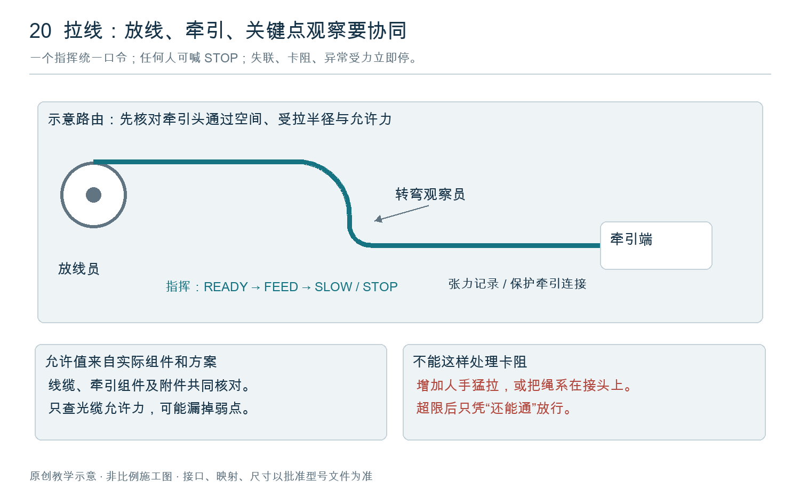

### 21.1 拉线前必须明确的八项内容

1. 路由和长度：起终点、转弯、垂直段、穿越、两端余长及预端接分支尺寸；牵引头能否通过最窄处。
2. 路由状态：桥架或管路验收、锐边清除、出口护口、滚轮／导向件、开放口防坠与适用防火封堵计划。
3. **允许牵引力：** 查线缆、预端接牵引组件、绳索／连接件等本次适用限值；系统按适用最弱限制控制，并记录 N／lbf 单位。不能把破断强度作为工作允许值。
4. **弯曲限制：** 区分受拉时与敷设后半径；牵引头或保护套可能要求更大转弯空间。弯头数量、累计阻力、侧向压力和垂直重量由批准方案评估；无法满足时分段或改路由。
5. 方法：手拉还是获批机械牵引；牵引网套、加强构件连接方式、转接件及是否允许防扭连接均按组件说明。
6. 仪器与限值：适用的张力测量和记录方式、量程及校验状态、报警／停止阈值；没有读数时不能在验收单写“峰值未超限”。
7. 人员：一名指挥，放线员、牵引员、转弯／入口观察员；复杂点增加人员。开工前测试通信。
8. 停止和回退：口令、卡阻处置、超限隔离、生产邻线保护、受损品标识与更换流程。

**厂家实例的用法：** Corning 某 Pretium EDGE 预端接组件安装文件对其牵引套规定手工牵引并禁止使用润滑剂。它不能被推广成所有产品都相同，但足以说明不能把普通光缆拉法直接套到预端接组件。[Corning 特定组件安装说明](https://www.corning.com/catalog/coc/documents/standard-recommended-procedures/S46998-A0007-P080_BEN.pdf)

### 21.2 现场口令与操作

**双语口令：** “准备／READY”“送线／FEED”“慢行／SLOW”“停止／STOP”。建议班组规则：任何人发现异常都能喊停，只有指挥在排除问题并获得各点确认后发出恢复口令。失去通信即停。

1. 拉前核对 ID、保护套、牵引连接和测试基线。预端接组件由规定牵引部位承受拉力，不把绳子系在连接器、尾套、散纤或普通魔术贴上。
2. 短距离试拉，观察盘架、导向、牵引头姿态及读数。观察员确认每个关键点通畅后继续。
3. 牵引与送线协调，匀速前进；放线员控制盘转，不能靠猛拉启动。接头保护始终完整，人员远离绳索回弹线和夹点。
4. 牵引头经过弯口、柜顶入口和落线口时减速，由观察员导引；不拖着连接器在桥架上跳行。
5. 垂直段分段承重，按批准支撑方法转移重量。禁止让上端连接器挂住整条垂直线缆，也不能让安装人员手持重量代替永久支撑。
6. 到位后解除牵引外力，按厂家方法拆牵引保护件；检查外观、分支、标签和长度，保留必要的包装／防护件供后续使用。
7. 完成规定支撑、半径控制和余长整理，再做敷设后测试。不得先测 PASS，随后重拉重绑却沿用旧结果。

### 21.3 必须立即停下的情况

张力超出停止值或突然异常上升、导向件移位、牵引头卡住、线盘失控、保护袋破损、可见锐折、路由不符、邻近在运线被拖动、失去通信。不能用“再来两个人拉”解决阻力异常。

停后先使系统安全并卸除不当受力，定位原因，评估是否改变牵引方法／分段路径。超限即开不符合项；后续测试 PASS 不能单独消除已知机械超限，需要厂家或授权工程师书面处置依据。

### 21.4 验收与拉线记录单

**合格：** 批准路由、牵引方式与限制有依据；记录完整；无未关闭超限或损伤；支撑与半径合格；两端及所有适用分支测试覆盖完整；ID 与报告一致。

**记录字段：** 工作包／Cable ID／PN／盘号／路由；限值来源和单位；牵引方法及连接件；仪器编号与校验状态；起止时间／峰值与记录文件或批准的过程见证；关键转弯观察员；异常与处置；拉前和拉后报告；操作者／QC／放行人。

**示例算式仅供培训：** 假设组件允许值为 200 N、某连接件工作允许值为 150 N，方案不能仍以 200 N 为上限；停止阈值还应按批准方案预留控制余量。本例不提供实际施工参数。

## 第 22 课　五项工序的联合验收、案例与班组考核

### 22.1 建议采用的过程检查计划（ITP）

以下为建议企业控制要求，项目经理和质量负责人批准后执行；不是宣称北美所有客户采用同一验收比例。**H（Hold）为未签字不得进入下一工序的停检点，W（Witness）为按约定提前通知的见证点。** W 的缺席放行方式必须写在项目 ITP 中。

- **H1 开工样板：** 标签、连接器、展线、端接和拉线方案首件批准。责任：领班准备，QC 核验，项目约定批准人放行。证据：样板照片、料号与工艺版本。
- **H2 拉前检查：** 路由、牵引保护、允许值、人员和测试基线齐全。责任：领班与 QC。没有批准限值或方法时不得起拉。
- **W1 展线及牵引：** 观察展线方向、保护、各转弯和张力记录。隐蔽过程不能仅用结束时整齐的照片代替。
- **H3 隐蔽／封闭前：** 端接、盒内盘纤、屏蔽处理和后部应力释放可检查且合格，记录完成再关盖。
- **H4 链路验收：** 标签及映射、锁止、敷设后测试、抽屉／门行程和记录一致。未授权生产操作不得为了验收擅自拔插。
- **H5 移交：** 不符合项关闭，竣工 P2P、照片、测试原始文件和变更台账齐全；按照客户流程移交。

建议所有 Cable ID 都有工序状态：待作业／施工中／待检／不合格／复验合格／移交。不能以“已经插好”直接改成“验收合格”。每条建议全数核查身份、工艺外观及规定测试；过程见证覆盖率与客户抽验按批准 ITP 执行。

### 22.2 五个模拟故障案例

### 案例 13　标签都能扫描，远端却接错

**场景：** 同一批 24 条跳线打印完成，工人按顺序拿标，其中两条互换。两条线都通过光学测试，但目的端口与 P2P 不一致。

**动作：** 冻结该批次；从独立的批准 P2P 对照实际端点和测试身份，逐条复核，生产环境不得凭拉动线身寻找远端。查明是标错还是接错后按授权纠正，同时核实报告归属并重测受影响链路。

**验收：** 批次复核无残留错位，四者一致，双人签字。**预防：** 一根一核、两端读回，不能用“扫描成功”代替端点核验。

### 案例 14　听到了 click，关门后链路波动

**场景：** 光纤接头卡住了，但模块本体未完全锁入笼口，且跳线余长不足。关门动作把线拉紧。该现象也可能有其他原因，需检查证据确认。

**动作：** 暂停门动作，在授权窗口分别检查模块到笼口、光纤到模块两个界面，以及门边受力点。修复锁止与走线，按受影响边界清洁、重测并检查适用错误计数。

**验收：** 门在规定行程内不碰压线，接口不承重，机械检查和适用测试均合格。不能用胶带把模块粘牢。

### 案例 15　展线越拉越拧，末端出现小圈

**场景：** 普通线盘平放，工人沿盘沿连续抽线，送到机柜时多出扭转和缩小的圈。

**动作：** 停线并解除牵引，检查包装说明与损伤；未受损部分按批准方法重新放线，可疑锐折段隔离。不能握紧护套一路撸直，更不能靠旋转已经插入的连接器消扭。

**验收：** 正确展放、损伤处置明确，敷设后相关测试合格。**预防：** 开盘首段由师傅检查，专用中心出线包装与普通线盘分开培训。

### 案例 16　八灯全亮，Cat 6A 认证却失败

**场景：** 现场模块端接前过度拆绞，或线对分配错误；简单通断未发现性能问题。

**动作：** 先确认测试边界、适配器和配置正确，再分析线序及近端串扰等失败项目、检查端接。按所用模块工艺重做，达到重复端接限制的模块更换；若仍失败，检查其余链路段，不能盲目归咎接头。

**验收：** 完整规定认证测试 PASS，原失败文件保留并关联整改。**预防：** 批量端接前首件认证，禁止为了好看大段拆绞。

### 案例 17　拉后能通，但牵引曾超限

**场景：** 卡在转弯后多人加力，记录显示超出批准停止值；拉后连通正常。

**动作：** 隔离并登记不符合项，保留张力记录和卡阻位置，检查牵引附件及组件损伤；由厂家或授权工程师决定补充检查、接受或更换。不能删除峰值，也不能以 VFL 有光销项。

**验收：** 有明确书面处置、规定复验及批准关闭记录。**预防：** 卡阻即停，校核转弯和牵引头通过空间，事先明确停止阈值。

以上均为教学模拟，不代表 NVIDIA、Dell、Oracle 或其他客户的实际事故。

### 22.3 五张可直接复制的工序检查卡

**L 标签卡：** 日期____ 工作包____ Cable ID____ P2P 版本____ 标签材料／尺寸____ 两端与分支核对____ 可读／不遮锁扣____ 扫码目标____ 照片____ 操作者____ 复核者____ 结果及返工单____。

**C 锁止卡：** 端口____ 接口／模块 PN____ 光纤界面检查____ 模块笼口检查____ 支架检查或不适用原因____ 端面报告____ 就位判据文件____ 无受力／拉片可操作____ 测试文件____ 检查人____ 结果____。

**P 展线卡：** 盘号____ ID____ 包装形式____ 开盘方向____ 分支目的端____ 展线设备____ 外观／保护____ 临时余线区____ 异常____ 操作者____ 见证人____。

**T 端接卡：** ID／芯号／端口____ 方式____ 线与接头 PN____ 工艺版本____ 工具____ 固定／应力释放____ 芯序／线对____ 保护与收容____ 隐蔽前照片____ 首件／复验文件____ 操作者____ 放行人____。

**R 拉线卡：** ID____ 路由____ 允许值及出处____ 停止阈值____ 单位____ 受拉半径及牵引头要求____ 方法____ 仪器／校验____ 峰值或批准见证记录____ 异常____ 前后测试____ 指挥____ QC____ 放行____。

各卡“不适用”必须写明原因；“没有检查”不得填“不适用”。数值字段按项目文件填写，不用本册图中的示例数值代替。

### 22.4 新增五站考核与判分

**离线实训：** ①打印并贴两端标签，故意放入一个错号让学员识别；②对样板分别确认两个锁止界面并正确解锁；③正确展开一个普通线盘并辨认错误抽圈；④按已授权技能完成一个端接首件与测试；⑤模拟牵引过程中遇到卡阻，执行停工和记录。

**建议通过条件：** 五站均按步骤完成、能够解释停止条件、记录可追溯。错接或错标未发现、拉纤维检查锁止、卡阻继续加力、未隔离就端接、用通断代替认证测试，均判该站未通过；复训后重考。未经专业训练的新工不安排独立熔接或关键在运网络操作。

## 第 23 课　从领料到移交：连续施工流程与完整示例

### 23.1 先把每条线的施工顺序排出来

**推荐主流程：** 工作包交底 → 认料及进场检查 → 建立临时 ID → 展线 → 拉线／敷设 → 永久支撑及粗理线 → 端接或插接 → U 形余长及绑线 → 正式标签核对 → 完工检查 → 规定测试 → 整改复验 → 竣工移交。

这不是要求所有产品机械地采用相同顺序。工厂预端接组件无需现场制作接头；现场熔接须先固定外缆再处理纤芯；某些配线架必须先完成后部施工再装前部跳线。开工前按实际组件调整工序并批准。身份标识全程存在，清洁和锁止发生在每次实际连接时，最终测试安排在会改变链路状态的施工完成之后。

**每次交接的读回口令：** “工作包____，Cable ID____，由____到____，已完成____，尚未完成____，异常单____。”接班人员对照实物确认，不只签收数量。

### 23.2 展线工作流：让下一岗位拿到可识别、未受损的线

**输入：** 最新 P2P、批准路由、物料清单、包装说明及展线区域。**负责人：** 领班核对方向，放线员操作，接线员保护端头。

1. 对照 PN、长度、芯数、极性和两端结构领料，建立盘号与 Cable ID 的对应关系。
2. 挂临时身份标识，确定哪个端头先送出。Y 形组件逐一读出 Leg 号与目标位置，防止主干就位后分支长度不够。
3. 检查盘架和包装释放方式，试放短段，师傅确认没有扭转与保护损坏后继续。
4. 送线到受保护的路由入口；需要暂停时松弛盘留、保护端头并隔离通行。
5. 交给拉线班组时共同检查身份、端头方向、护套和保护组件，记录异常。

**注意：** 不为赶进度把多条未编号的线同时展开；不让连接器在地上拖；扭结不靠拉直消除。详细停工判据见第 19 课。

**示例：** 两条外观相同的分支组件一条用于 Rail 1、一条用于 Rail 2。展线时分别建立 ID 和分区，按批准表标识各 Leg。分组颜色只能辅助，不能代替文字身份和实际映射核对。

### 23.3 贴标工作流：临时身份和正式标签分别管理

**输入：** 批准命名规则、P2P、标签样板及适配外径的标签材料。

1. 展线前用临时 ID 保持身份；临时标识不得妨碍牵引保护和通过空间。
2. 最终敷设后确认实际路由及两端位置，按批准数据制作正式标签，一条一核。
3. 在允许的直段位置贴标，避免尾套、锁扣、分叉、绑带和抽屉运动区；按样板统一可读方向。
4. 第二人从端口读向线号，再从线号查 P2P 与远端；标签内容、分支映射与实际连接全部一致才签字。
5. 测试人员从实物读取 ID 建立测试记录；移除已失效临时标识，避免冲突，完成照片和台账。

**示例：** 近端标签写 `CBL-000127 / LOCAL R01-PP01-12 / REMOTE R09-PP02-08`。远端同一 Cable ID，LOCAL 与 REMOTE 对调。若实物插在远端 09 口，先登记偏差并澄清；不能把 REMOTE 改成 09 就当作变更已批准。

### 23.4 拉线工作流：把受力控制留在过程记录中

**输入：** 验收合格路由、拉线方案、实际组件允许值及拉前基线。**职责：** 指挥统一调度，各关键转弯安排观察。

1. 拉前共同检查牵引连接、保护套、导向件、通信和适用张力记录方式。
2. 先试拉再连续送线；观察员确认每一关键位置通过，卡阻或异常受力即停。
3. 垂直段及时使用批准支撑转移重量；不能让接头或普通松束魔术贴承重。
4. 到位后卸除牵引力、检查保护与损伤，核对长度及身份，再完成永久支撑。
5. 保存过程记录，按方案做拉后检查与测试；超限或已知损伤先按不符合项处理。

**示例：** 一个预端接牵引头无法通过槽道转弯。正确处理是停下核对通过空间、弯曲限制及替代路径，由授权人员批准调整。禁止拆掉厂家保护袋、直接拽连接器穿过，也不能以多人加力解决。

### 23.5 端接与插接工作流：固定好线，再处理接续点

1. 明确采用工厂预端接、现场熔接还是铜缆模块工艺，核对人员技能、工具和配套料号。
2. 先固定护套及适用承力构件，保留工艺余长；再进行剥、清、切、接等适用步骤。
3. 按芯序／线对与端口表逐项操作，禁止为接得快擅自更改分支或极性。
4. 现场端接在封闭前检查内部固定、接续保护、盘纤或屏蔽处理；预端接接口连接前检查端面并按需清洁复检。
5. 插接核对两个独立界面：线头到模块、模块到笼口；完成锁止检查后，确认接头不受线束重量或回弹拉力。
6. 留下首件、隐蔽前检查和端接记录，交给理线及测试工序。

**示例：** 某光纤盒熔接完成且机器显示低估算损耗，但保护套管未落入指定槽位，盖板会压住纤芯。此时不能封盒；先重做收容与检查，再执行规定链路测试。

### 23.6 绑线工作流：先承重、再分组、最后轻合

1. 确认固定支撑已完成；一人托住当前线段，另一人逐段打开需要调整的绑带。
2. 按路由、维护对象和批准的网络隔离要求分组；检查短线是否被长线带着受力。
3. 用手托理，解除交叉和串套；不握紧整束一路撸，不用不适配的梳线工具强拉预端接分支。
4. 在直段或规定固定点使用获批魔术贴，平整环绕、轻合搭接，不能扭成细绳或使用工具抽紧。
5. 收尾不挡标签、拉片和检修口；分组后仍应能逐段释放一条目标线。
6. 检查护套无勒痕、束形不扁、转弯未拉直、分支根部未被挤压，最后执行规定测试。

**注意：** 固定间距取决于批准样板和支撑方式；把所有项目统一规定成一个间距会遗漏线重和结构差异。线束下滑时补查承重设计，不继续勒紧。

**示例：** 垂直主干持续下滑，工人连续增加魔术贴仍不稳定。检查发现重量由普通束带承担。整改应采用适用的永久支撑，把重量转移后再松束整理，并检查原夹持位置是否已损伤。

### 23.7 U 线工作流：余长有位置、转弯有空间、维护有行程

**U 形余长的目的：** 提供规定的维护活动空间并收容适量余长；不是每条线都必须做同样大小的 U，也不是越长越好。

1. 对照柜内样板确定入口、固定点、活动段和盘留区，区分随抽屉运动的线与固定主干。
2. 用线缆自然松弛路径估算所需长度；跳线明显过长或不足时更换适配长度，不靠硬塞或拉紧解决。
3. 托住两侧，形成宽缓的 U；底部圆弧用适配理线器支撑，按该线缆的适用最小半径检查。
4. 理顺 U 两侧的交叉，余长移到规定区域；不能在底部套一条绑带把圆弧捏成尖角，也不能把分支根部当折返点。
5. 先临时轻合，在批准作业状态下缓慢检查门、抽屉或维护组件的规定行程；全过程观察弯曲、擦碰和接头受力。
6. 合格后完成最终绑线、标签和照片；出现干涉先改路径或长度，不剪改预端接组件。

**培训尺寸示例：** 假设某组件在本次状态下最小弯曲半径为 30 mm，理想半圆的中心线路径直径为 60 mm。实际安装还要考虑线缆外径、整束最内侧路径、理线器形状和维护空间；“外观宽度 60 mm”不能直接证明合格。本例不是选定任何实际组件的限值。

**示例：** 抽屉关闭时 U 形整齐，拉到规定维护位置时尾套被拉直。判定活动余长或路径不合格；重新分配固定段与活动段或更换批准长度，并在完整行程内复查，随后重测受影响链路。

### 23.8 测试工作流：先定义边界，再谈 PASS

**开测前必须填写：** 实物 ID、测试起终点、纤型／铜缆类别、连接器或适配器、批准标准与版本、限值、波长与方向等适用设置、芯数及映射、仪器序号和校准状态、参考方法、文件命名方式。没有批准限值时，可保存调查数据，但不能据此签正式验收。

1. 确认敷设、端接、绑线和余长已完成；检查身份和机械工艺，不把测试当作掩盖已知机械缺陷的手段。
2. 光纤按批准方案检查端面、准备参考线、建立并验证参考，按要求波长和方向覆盖所有应测纤芯与分支；铜缆选择正确测试边界和适配器，执行完整认证测试集。
3. 测量前从实物核对 ID，记录每芯／端口结果及对应限值。Shuffle 与 Y 组件按厂家映射逐项对应，不能只看总芯数相同。
4. 保存原始仪表文件、报告、设置和失败记录；异常先检查身份、测试参考及方法，再根据证据定位被测链路。
5. 返工后重测受影响的验收边界；涉及公共模块、公共主干或参考设置问题时，由测试负责人确定扩大复验范围。
6. 进行适用设备侧验证：端口身份、速率、拓扑及规定错误指标；无源 PASS 和链路 UP 分别记录。
7. 核对实物 ID、P2P、照片和报告完全一致，关闭不符合项，再签移交。

**插损判读示例：** 假设某芯某方向在批准测试设置下的允许插损为 1.50 dB，测得 1.20 dB，则余量为 0.30 dB；测得 1.70 dB 则超限 0.20 dB。这里只演示运算，最终判定还要覆盖其他波长、方向、芯及规定测试项目，不能用平均值掩盖单芯失败。

**异常示例：** 多芯主干只有一芯失败，不能删除该芯后出全 PASS 报告。先确认测试连接、参考和映射，按批准方法排查污染、弯曲或接续事件，保留失败及复验记录。

### 23.9 一个完整工作包示例

**任务假设：** 安装一条批准的 12 芯 OS2 预端接主干 `TRK-0001`，连接 R01 的 PP01 与 R09 的 PP02；具体端口、接口、极性、路由及限值由工作包给定。本例不是指定真实项目方案。

- **领料交底：** 核对主干 PN、长度、出厂记录，明确 12 芯映射及是否有备用芯；不把“12 芯”直接等同于某种任意高速端口配置。
- **展线贴临标：** 两端关联同一 `TRK-0001`，保持厂家分支标识，按包装说明放线并保护连接器。
- **拉线：** 路由及拉前检查签字，按批准方法施工，记录张力或批准的过程见证，转弯观察员报告异常即停。
- **固定整理：** 主干支撑到位，余长进入指定区域；检查内侧弯曲，魔术贴仅承担批准用途。
- **连接：** 按端口及映射检查清洁后连接，确认锁止、无受力及维护行程，贴正式两端标签。
- **测试：** 依批准边界完成所有应测芯、波长和方向的测试。用 `TRK-0001-F01` 等约定子标识保存结果；实际 Fiber ID 格式以客户要求为准。
- **整改交付：** 例如 F07 首测失败，确认污染后按流程清洁、复检和复测，保留前后结果并关闭记录；移交竣工 P2P、照片、测试原始文件及签字卡。

**领班收工口令：** “数量清楚，身份清楚，未完工项清楚，异常清楚。”当天没有完成测试的链路保留“待测”状态，不能先报验收完成。

## 第 24 课　系统选型、预制批次与扩容交付

### 24.1 从“买一根线”改为核对完整连接系统

参考文件第 32—37 页强调主干、机箱、模块和跳线的配套关系。本课把这一思路落实为施工输入：**系统连接图、逐芯映射图、损耗预算及准确 BOM 必须能够互相对应。**

系统连接图应标明每段 Cable ID、每个连接界面、模块盒或面板、设备端口；映射图说明 Tx／Rx 或 lane 到对端的实际路径；损耗预算按适用波长和厂家规格计入线缆、连接界面、熔接及设计余量。简单的发射功率减接收灵敏度不能代替高速应用的完整光学通道约束，应采用具体接口规定的限值。

**举例：** 增加一个交叉连接点，不只是多领一根跳线。必须复核新增接口损耗、极性组合、端口命名、测试边界、面板空间和运维路径，再批准施工。

### 24.2 Base-8、Base-12、Base-16：先看应用，再选体系

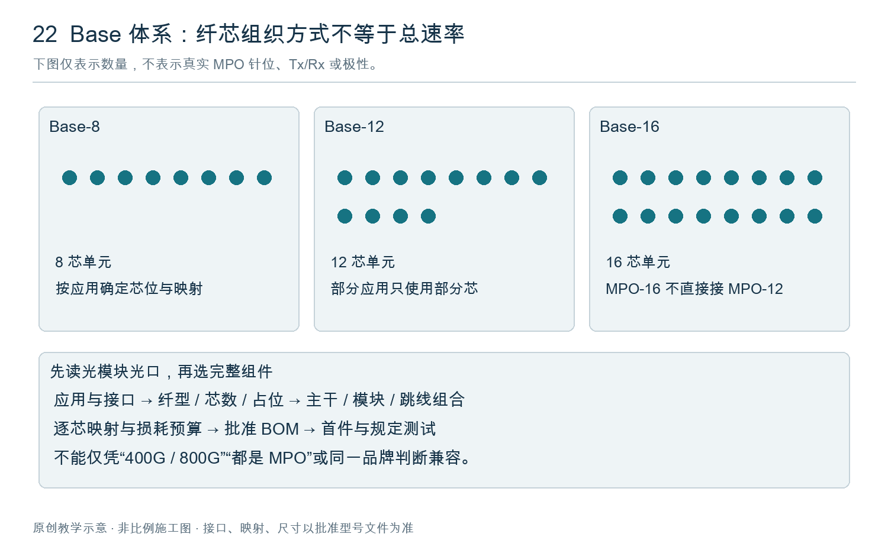

Base 描述按纤芯数量组织的配线体系，不能直接用总速率推导。**先核对具体光模块光口及应用，再选配套组件。**

- **Base-8：** 按 8 芯单元组织；对于使用 4 Tx 加 4 Rx 的并行光应用，可按对应映射配套。实际连接器占位和纤芯位置查料号图。
- **Base-12：** 按 12 芯单元组织；在相应模块与极性条件下可用于 6 组双纤连接。某些 8 芯应用在 12 位置接口中仅使用部分位置，不能凭外壳推定所有芯均参与传输。
- **Base-16：** 按 16 芯单元组织；可服务适配的 8 Tx 加 8 Rx 并行应用。MPO-16 的机械键位等与 MPO-12 有区别，不能直接互插；跨体系需批准的转换组件并核实映射。

同为 400G 或 800G，可能采用不同光口、波长和并行方式；不能统一订成某一种 Base。双纤波分方案也说明了“速率越高必然纤芯越多”并不成立。上述内容参考 [Panduit Base-16 应用指南，2024](https://www.panduit.com/content/dam/panduit/en/products/media/1/31/231/9231/111309231.pdf)，适用型号必须再由项目确认。

**新人练习：** 采购单只有“800G MPO 线 30 m”。补齐模块 PN、两端接口、纤型、芯数及占位、针脚、键位、研磨、极性、主干及分支长度、护套等级、允许损耗和测试要求；资料不足时提交询问，不从库存挑外形相似的线。

### 24.3 Corning、Panduit 及跨品牌组件的核验方法

**Corning 机箱示例：** EDGE8-01U-SP 的快速指南给出指定的主干停放、跳线路由及机箱管理位置。现场按该机箱料号的说明确认支撑和操作空间；不能把其位置或托盘动作套到其他机箱。[Corning EDGE8 1U 快速指南](https://www.corning.com/catalog/coc/documents/standard-recommended-procedures/003-998-QSG-AEN.pdf)

**Panduit 与其他平台：** 拿到实际机箱、模块和连接组件的安装文件，核对前后操作方式、可调机构、锁定和备件。如果某型号允许调整极性或针型，只能按已批准的变更及厂家方法操作，调整后更新映射并复测；不能以“这个品牌有可调产品”推断所有连接器都可调。

**跨品牌核验五项：** 机械能否正确对接；光学参数与纤型是否匹配；整链映射是否正确；维护工具和拆换空间是否适用；系统保修与责任是否明确。每项核验要关联准确 PN。机械可插、同系列名称或“Universal”字样，都不足以证明整链兼容。

### 24.4 首配清洁流程的特殊情况怎样管理

本册默认采用检查、必要清洁、复检、连接的流程。Corning 对适用 CleanAdvantage 产品说明了首次配接前可省去现场显微检查和清洁的流程，依靠工厂处理与非接触防尘帽保护。[Corning CleanAdvantage 官方说明](https://www.corning.com/data-center/worldwide/en/home/knowledge-center/meet-cleanadvantage-technology.html)

**本册建议的执行条件：** 项目确认准确产品适用，包装与端帽状态符合要求，确属第一次配接，且受控工艺与 ITP 已接受该流程。白色帽本身不是充分证据。班组记录 PN、首次状态和采用的工艺依据；对端接口也要执行其适用检查要求。

条件无法确认、曾暴露或重插、疑似污染、测试异常时，回到适用的检查与清洁排查流程；不能在失败后继续以“出厂预清洁”作为放行理由。项目要求首配端面证据时，先完成工艺协调，不由工人自行删掉检查项。首配流程不同不减少敷设、极性及适用测试要求。

### 24.5 预制区和束组批次管理

在第 19、21 课操作前增加批次卡：工作包 → 束组编号 → Cable ID 列表 → 敷设次序 → 去向及网络平面 → 检查状态。束组只是施工组织单元，不能代替单根身份。

1. 按实际料号、长度和目的地配料，检查较短分支能够到达规定位置。
2. 建立临时身份，保持端头保护；按包装允许的方法逐条展开并承托。
3. 需要成束时平行整理、松束固定，避免接头碰撞；逐根保护和牵引方式不得因成束而改变。
4. 按路由和厂家工艺决定敷设顺序，避免先安装的束组挡住后续通道；不能统一规定所有机柜都从下往上插。
5. 一批完成后核对数量、ID、暂存位置及检查状态，未检与合格物料分开管理。

NVIDIA 的 Stage 指南包含按部署组织放线、处理余长和束组的做法，可用于理解预制与敷设衔接；其特定步骤应与实际产品和项目方法对齐。[NVIDIA Stage 指南](https://docs.nvidia.com/dgx-superpod/design-guide-cabling-data-centers/latest/stage.html)

### 24.6 扩容前检查：同时核对空间、连接和维护

**模拟任务：** 原有一排机柜新增一组 Leaf 上联，现有槽道直段看似还有空位，但弯头和落线口拥塞。

先按真实外径、成束形状、连接器通过空间、支撑承载及终态数量复核各段；不能只数线根数，也不能只计算面积占比。再确认新连接的端口、主干可用芯、映射和损耗预算，检查是否破坏批准的故障域。需要时做最拥塞位置的离线实尺寸样板，验证盖板、半径和单根拆换。

方案可能是增加批准路由、更换适配长度、调整配线位置或使用获批组件，均先评估并完成变更。完成后更新路由容量、可用芯及端口、标签和测试库。参考文件中的 40%／60% 占用建议不能直接成为本项目或所有桥架的限值。

### 24.7 分层验收与数字化移交

**第一层材料：** BOM、PN、长度、批次、保护和批准替代料相符。

**第二层安装：** 路由、支撑、半径、端接、锁止、标签、维护行程及适用防火封堵记录合格。

**第三层无源链路或组件：** 对光纤、普通铜缆、高速直连组件分别执行适用方案。OTDR 是否要求及测试方向写入计划，不能把每种介质都填写为“OLTS PASS”。

**第四层设备与网络：** 由授权网络人员核验端口、速率、适用 FEC、拓扑及运行指标；故障切换或负载演练按获批测试方案和窗口执行，布线人员不得为证明冗余擅自断链。

**第五层运维交接：** 运维能从端口查到对端、路由、PN、测试、余长位置及变更；备件与安装系统匹配；不符合项和未完事项按项目流程处理。

**建议新增台账字段：** Parent Circuit ID、Cable ID、Fiber／Leg ID、Route／Bundle ID、状态、原测试文件、复验版本、变更号、旧线处置、适用备件 PN。条码扫描后不仅显示编号，还应能核对对象与当前批准连接关系。

**身份维护规则：** 拆除对象保留历史，按流程释放端口；新组件按项目规则建立新身份或完整的更换版本关系。不要删除旧失败记录和序列号。预留暗纤、备用线可按批准方案安装和停放，但必须保护端头并记录状态，不能作为无人管理的散线。

## 第 25 课　读懂产品资料：从康宁中文目录到现场工作包

### 25.1 学习资料怎么分层使用

[康宁中文数据中心资料入口](https://www.corning.com/data-center/cn/zh/home.html)适合认识产品体系和应用场景；产品速查手册适合找到候选产品；准确料号的数据表、安装说明及项目批准文件才用于制定施工参数。网页仍可访问，不代表其中的全部速率示例、料号和认证适用于本次采购。

**阅读顺序：** 网络应用需求 → 设备光口规格 → 布线系统图 → 产品族 → 准确 PN → 安装及测试方法 → 项目批准工作包。安装人员拿到只有品牌、颜色和大致长度的领料单，应补齐信息后再领料。

**资料版本卡：** 厂家____ 文件名／编号____ 版本／日期____ 核查日期____ 适用 PN____ 安装区域____ 项目批准号____ 被替代文件____。中文资料用于培训时，保留与北美实际料号对应的英文术语和正式文件。

### 25.2 四种无源部件的作用不能混淆

- **适配器面板（Adapter Panel）：** 提供接口固定和对准位置。普通直通面板本身不完成有源信号转换；应查键位、针脚配合、接口和端口方向。
- **模块盒（Cassette）：** 内部可能将多芯接口分配到多个双纤接口，也可能采用其他批准映射。必须读取前后端口对应表，不能因为前面是 LC 就推定后端纤芯顺序。
- **分支线束（Harness）：** 把同一组件的纤芯引到多个接口；分支长短、编号和映射是设计参数。它不能把任意一个光口自动变成多个可独立工作的网络端口。
- **Shuffle：** 按固定方案重排多个输入／输出通道。它与普通分支线束用途不同，必须核对完整映射；不会自行放大光或修正设备配置。

**操作练习：** 拿到一个 MPO-LC 模块，学员在不拆壳的条件下用标签和厂家图确认输入接口、输出口数、芯序及对应测试方法；缺少映射图时标为“待核验”，不猜接。

### 25.3 长度定义：同样写 30 m，测量起终点可能不同

常见定义包括连接器到连接器、分支点到分支点、主干段长度和分支腿长度。主干总长、分支腿长度及牵引保护组件外形分别影响安装。

康宁《数据中心主要产品速查手册》LAN-1273-ZH 第 11 页中的特定 EDGE8 主干以分支点之间的长度说明订货长度，并另列分支长度；这一规则不能推广到所有线缆。[康宁中文产品速查手册](https://www.corning.com/catalog/coc/documents/selection-guides/LAN-1273-ZH.pdf)

**测量步骤：** 在实测路由上标出两端分支点 → 测量主干实际路径 → 分别测各分支点到目标接口路径 → 加入批准的维护余长 → 按该 PN 定义选择订货长度 → 检查余长位置与通过空间。

**模拟例：** 某料号图注明长度不含分支腿，现场却用设备端口到端口距离作为主干订货长度。到货后主干可能偏长，分支还可能因端口分布而不够用。整改应重新对齐测量基准及分支路径，不能将多余线挤进机箱后部。

### 25.4 容量计算：槽位、接口、纤芯、链路、可用端口分别计数

**机械容量：** 机箱能放多少模块／面板。**光纤容量：** 配套组件实际容纳多少芯。**应用容量：** 目标光口使用这些芯能形成多少条符合映射和损耗要求的链路。**可运维容量：** 满配后是否仍能读取标签、操作锁扣和抽拉托盘。

**教学计算：** 假设批准机箱有 12 个模块位，每个模块提供 6 个 LC 双工适配器位置，则前端共有 72 个双工位置，涉及 144 个纤芯位置。它不等于任何应用下都有 72 条可用高速链路：还要核对后端主干、映射、模块、纤芯占用、备用规划和设备端口。

**样板验收：** 不只放一个模块展示。按批准代表性密度装入主干、模块、跳线和标签，验证最内侧接头、最短分支和最后一个插入位置；能装进去但不能维护，应返回设计优化。

### 25.5 护套、阻燃标识与区域适用性

光纤类别描述传输介质，护套及相关标识描述另一组性能。OS2 或 OM4 本身不能证明室内外、潮湿、空气处理空间或其他区域适用性；铠装结构也不等于允许无限弯折或挤压。

**北美项目核对流程：** 查看实际安装环境与批准设计 → 核对所需认证和标识 → 查准确 PN 数据表及实物护套印字 → 确认项目接收后领用。LSZH 的低烟无卤属性不能单独当作 OFNP 等适用列名的替代证据。康宁资料按室内、室内外和不同护套／阻燃类别区分产品，说明这些字段需要独立检查。[康宁室内光缆资料](https://www.corning.com/optical-communications/worldwide/en/home/products/fiber-optic-cable/indoor-cables.html)

**模拟例：** 供应商提出“同样是 OM4，换另一种护套更便宜”。先按替代料流程审查区域适用性、机械参数、接口和系统责任，未批准前不能混入合格库存。判定当地安装合规性由对应授权人员完成。

### 25.6 高密度配线柜从空柜到满配的操作顺序

1. **柜体与机箱。** 检查固定、进线位置、后部承力点、机箱方向及适用接地要求；把标签卡和模块编号先与图纸对上。
2. **主干进入。** 核对进线侧、牵引保护和分支到达长度，在厂家规定位置固定；不得把接口当作垂直主干吊点。
3. **分支停放。** 未连接分支保持防护，停在适用的 parking／管理位置，不能悬在抽屉轨道上。
4. **模块与面板。** 根据具体型号的可达方向和安装顺序装入，逐个确认就位，再按映射连接。不要套用一条“永远从下往上”的规则。
5. **前部跳线。** 按维护对象分组，路由不遮挡邻模块拆装；有可调极性的组件保持批准状态并记录。
6. **活动段。** 分清固定主干、固定跳线及随托盘运动的部分，检查全维护行程。发现夹纤或受力先停，不用盖板把线压进去。
7. **满配复查。** 在批准样板上演示取出一条目标跳线、读取内层标签、操作锁扣和恢复走线；不要求在生产柜无工单演练。
8. **最终测试。** 整理完成后按批准边界测试；如果之后又改变模块或线缆路径，评估并复验受影响对象。

### 25.7 直连、互连与交叉连接：根据维护需求选

**直连（Direct Connect）：** 两设备之间直接连接。**互连（Interconnect）：** 设备通过跳线接入配线设施及固定主干。**交叉连接（Cross-connect）：** 在集中管理的配线位置通过跳线组织不同固定链路之间的连接。具体节点和术语使用以系统图为准。

康宁的中文脊叶布线文章介绍网络架构与配线方式之间的关系，可用于理解为何需要在设备关系和实际路由之间增加管理设计。[康宁脊叶网络架构下的布线系统](https://www.corning.com/data-center/cn/zh/home/knowledge-center/cabling-the-spine-and-leaf-network-switch-fabric.html)

**决策练习：** 某区域常有设备迁移，拟增加集中交叉连接。设计人员评估维护方便程度，同时重新计算连接损耗、跳线空间、端口映射、测试边界及故障域。施工人员按最终方案执行，不能为了少接几个头随意绕过配线节点，也不能自行增加转接点。

## 第 26 课　测试进阶：解释结果、控制误差、验证整改

### 26.1 先分清三个容易混淆的光学数值

**插入损耗 IL：** 描述链路传输功率的损失，通常按 dB 表示，在相同测量条件下越小越好。**回波损耗 RL／光回波损耗 ORL：** 描述入射功率与返回功率的关系，常用正 dB，数值大表示返回比例小。**反射率 Reflectance：** 常用负 dB，越负表示反射比例越小。单个接口事件与整条链路 ORL 的测量范围不同，不能直接互换比较。

例如反射率 −50 dB 比 −20 dB 表示更小的反射；不能看到“−50 数字小”就判它更差。实际是否合格还要对照对应项目和仪器字段。[Fluke 插损、回波损耗和反射率说明](https://www.flukenetworks.com/blog/cabling-chronicles/return-loss-and-reflectance-fine-points)

**绝对光功率 dBm：** 与上述 dB 损耗不同。设备 DOM 显示接收功率落在范围内，不等于无源链路的插损、反射和映射全部通过验收；DOM 精度及监测方式还取决于模块。

### 26.2 多模测试为什么需要受控发射条件

多模光纤测试结果会受进入光纤的光能分布影响。Encircled Flux（EF，环形通量）用于描述和控制适用多模测试的发射条件，帮助提高测量可重复性；不能只看仪器波长相同就认为测试条件相同。弯曲不敏感多模光纤也需要正确测试配置。[Fluke 多模与 EF 测试资料](https://www.flukenetworks.com/content/white-paper-ins-and-outs-testing-bend-insensitive-multimode-fiber-bimmf-need-encircled-flux)

**班组操作：** 使用仪器认可的光源、EF 组件和参考线组合 → 核对方向、型号及状态 → 检查端面 → 按对应说明设参考并验证 → 记录实际组合 → 测试链路。不要随便换一根外观相同的普通跳线，也不要用自行盘绕来代替规定的 EF 方案。

**模拟例：** 两个班组测同一条 OM4，一组 PASS、一组 FAIL。先保存两组数据，对照边界、波长、限值、参考方法、发射条件及参考线状态；统一为正确方案后复测。不能取较好的一组作为正式结果，也不能未经证据直接判主干损坏。

### 26.3 测试参考线与 OTDR 发射／接收光纤不是同一概念

**OLTS 的测试参考线 TRC** 参与参考和插损测量；其端面质量、适配关系及验证状态影响结果。**OTDR 的发射和接收光纤** 用于帮助观察被测链路首尾接口等事件；长度、纤型与设置必须符合仪器和链路要求。不能因为都叫“测试线”就混用。

OTDR 有事件盲区等限制，短链路和间距很近的连接点尤其需要选择合适脉宽、量程及测试配置。较长脉冲并不总能给出更适合短机房链路的结果。[Fluke OLTS 与 OTDR 测试策略](https://www.flukenetworks.com/edocs/olts-otdr-complete-testing-strategy)

**检查顺序：** 文件 ID 与链路一致 → 发射／接收光纤信息正确 → 首尾边界能识别 → 设置与长度匹配 → 事件位置与施工节点相符 → 按批准方案分析方向与事件结果。看不到边界时先修正测法，不把一张自动 PASS 截图直接作为完整证据。

### 26.4 故障定位顺序：先核对，再隔离，最后换件

1. **保存状态。** 记录工单、ID、时间、近期施工、原始失败报告和设备计数；不要先清零再找证据。
2. **核对设计。** 确认端口、PN、映射、配置及测试限值；先排除测错对象和方法不符。
3. **查测试系统。** 核验参考、测试线、适配器与端面，避免把测试工具缺陷当作被测线缺陷。
4. **查物理工艺。** 查看弯曲、压痕、受力、锁止及活动件干涉；在授权条件下进行检查与动作。
5. **分段定位。** 按批准可拆界面逐段测试，用适用仪器缩小位置；每次改变一个因素并保存结果。
6. **整改复验。** 清洁、换件或重做端接后验证原因是否消除，重测受影响边界，再更新记录。

**两个常见陷阱：** OTDR 某事件出现表观“增益”，不代表无源接头放大了光，应按规定双向分析；弯曲不敏感光纤也不允许折死、勒压或超过厂家机械限制。

### 26.5 预算余量怎样用于施工检查

**教学例，全部数值是假设：** 批准的某链路可用损耗上限为 1.50 dB，设计把光纤估算为 0.10 dB，四个连接界面各按 0.20 dB，预留工程余量 0.30 dB，则合计 1.20 dB。若新增两个相同预算的界面，合计成为 1.60 dB，原方案不能直接放行。

这里的 0.20 dB 不是通用连接器限值。实际预算必须使用适用料号及应用文件；模块规格可能已经包含内部光路和接口，须明确计算边界，避免重复计数或漏算。最终认证限值由项目测试方案规定，不自行在仪器里扣除或增加“经验余量”。

**现场动作：** 新增模块、跳线或交叉连接 → 标出新界面 → 更新损耗及映射 → 设计批准 → 施工 → 重新测试。不能拿改动前的报告证明改动后合格。

### 26.6 三个综合训练任务

**任务 A：目录到领料。** 给出不完整的主干订货信息，要求学员指出长度基准、分支、护套、针型、极性和测试字段的缺项；输出一张待澄清清单，不凭空补参数。

**任务 B：密度到维护。** 在离线配线箱样板上放入批准组件和代表性线束，故意制造一处标签被挡、一处分支受力和一处抽屉夹线；学员指出问题、整改并演示检查。

**任务 C：报告到根因。** 提供同一链路不同参考配置的两份测试报告及工序记录，要求先提出验证计划，再决定是否换件。合格答案必须保留失败证据，说明重测范围与关闭条件。

## 厂家资料学习路线与本版修订｜V1.4

**初学者：** 先读入门导读及第 1—7 课，再从康宁中文入口认识产品名称；回到实物，逐项核对“它是什么、接在哪里、怎样识别”。

**施工人员：** 第 8—13、17—23 课配合实际 PN 安装说明，先做样板，再做批量。第 25 课用于把产品资料变成可执行工作包。

**测试与质量人员：** 第 14、22、26 课配合仪器说明和项目 ITP，核对测量边界、配置、记录和返工闭环。

**领班与管理人员：** 第 24—25 课及主手册用于容量、物料、变更和交付控制；不能把网页产品密度或宣传中的速度优势直接设为个人施工考核指标。

**本次资料核查日期：2026-09-28。** 新增第 25—26 课，并将产品资料的长度、容量、区域适用性，以及测试的 EF、参考线和反射判读落实为现场练习。引用来源紧邻对应内容；中文产品目录用于识图和选型线索，采购与施工仍以北美项目批准料号的有效文件为准。

## 本次参考文件整合说明｜V1.3

参考资料为编者提供的《AI 数据中心结构化布线施工管理规范》，文件名 `ai-datacenter-cabling-standard-2.pdf`，39 页，文件内标注 V1.2、2026-09-27。本次读取全文，并核对了系统组成、预端接及 Base 体系等重点页面。参考文件作为内容输入，其项目建议不自动成为本册强制标准。

- **第 2、19、24、29、31 页：** 吸收端到端可追溯、分层验收及培训目标，扩展本册入门导读和第 24 课；不将“5 分钟查询”等示例写成统一门槛。
- **第 20、32—37 页：** 补入预制批次、系统 BOM、Base 体系、跨品牌核验及扩容工作流；关键产品事实回查相应厂家原文。
- **第 15 页绑带尺度：** 不采用“能插入一指”的统一判据，沿用第 11 课的无压痕、无变形、支撑分工和适用产品说明。
- **第 8 页占用建议：** 保留为容量规划思路；实际限值须结合槽道结构、线缆、负载、法规及批准设计确定。
- **第 23 页铜缆测试：** 按实际永久链路、通道或适用 MPTL 等边界选方案，不能把所有安装形态都强制转成永久链路测试。
- **第 34 页首配流程：** 核对 Corning 原文后补充特定产品的首次配接条件，统一说明本册常规检查流程的适用边界。
- **第 16 页损耗预算：** 强調使用实际应用通道限值、准确组件损耗和工程余量；简化的功率相减式不单独作为高速链路验收依据。
- **第 36 页 Base-16：** 补充 MPO-16 不能直接接 MPO-12 及转换要求；应用并不限于单一 SR8 名称，必须按实际光模块光口确认。

本次保留 SHENGDONG WU 编者介绍和既有施工细则，不将参考文件中的通用案例记为编者亲历项目。技术补充的官网来源列于相应段落；实际开工仍须冻结项目受控文件版本。

## 本册官方资料与使用说明

本册动作顺序、模拟案例、图解和检查卡为培训编排；产品定义及技术事实参考下列官方资料。这里不复刻厂家内部施工标准。主手册第 23 章仍用于冻结项目数值、型号和验收条件。

- [Corning 光纤资料](https://www.corning.com/optical-communications/in/en/home/products/fiber/optical-fiber-resource-center/spec-sheets.html)：纤型资料及部分中文产品说明。
- [Corning 组件规格](https://www.corning.com/catalog/coc/documents/generic-specifications/PGS098.pdf)：特定组件的类别及颜色示例。
- [NVIDIA 100G-PAM4 光纤及分支](https://docs.nvidia.com/networking/display/400g100gpam4ovdev/NVIDIA-Supplied-Single-mode-and-Multimode-Crossover-Fiber-Cables)：本文 Y 形例子的适用范围；不是所有后续产品的通用规格。
- [NVIDIA 线缆与连接器定义](https://networking-docs.nvidia.com/cablemanagfaq/cable-and-connector-definitions)：使用其基础概念时注意旧代际限制，实际设备按最新适用安装包。
- [Fluke MPO-12 极性基础](https://regression.flukenetworks.com/blog/cabling-chronicles/101-series-12-fiber-mpo-polarity)：单排 12 芯基础示例。
- [CommScope Shuffle，2026-02-19](https://www.commscope.com/blog/2026/shuffling-into-the-future/)：通道重排概念。
- [Corning AI 扩展布线](https://www.corning.com/optical-communications/in/en/home/solutions/glassworks-ai/scalability.html)：shuffle 类方案。
- [Panduit FiberRunner](https://www.panduit.com/en/products/featured-products/fiberrunner-cable-routing-system.html)：槽道与半径控制。
- [Panduit Hook-and-loop 绑带](https://distributorportal.panduit.com/content/dam/panduit/en/products/media/1/41/441/8441/111138441.pdf)：绑带类型、用途和环境适用性。
- [Panduit 光纤机柜布线实践](https://www.panduit.com/content/dam/panduit/en/products/media/5/95/395/3395/53395.pdf)：束缚与压伤注意事项。
- [Panduit FS137](https://www.panduit.com/content/dam/panduit/en/products/media/7/17/617/3617/106583617.pdf)：特定支架固定及抽屉余长。
- [Fluke 参考设置](https://regression.flukenetworks.com/blog/cabling-chronicles/101-series-set-your-reference-wizard)：OLTS 参考与 TRC。
- [Fluke 测试可重复性与参考](https://www.flukenetworks.com/edocs/white-paper-encircled-flux-solving-the-puzzle-of-repeatable-fiber-loss-testing)：参考不当引起的结果偏差。

**带教顺序：** 先做第 1—7 课认物与映射，再做第 8—13 课动手工艺，接着做第 17—21 课五项工序与首件验收，最后做第 14—16 课测试、排障和授权，并用第 22 课完成工序联合考核。
